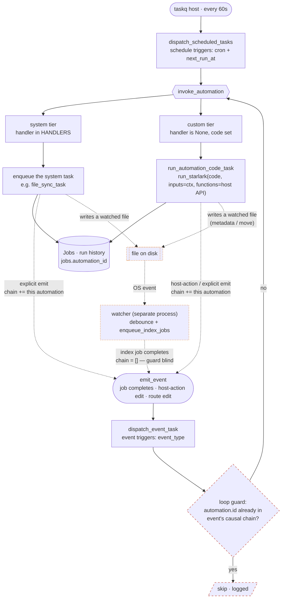

# Automations — Scheduled & Event-Driven Background Behavior (Architecture)

## Overview



The dashed red **loop guard** node (and the chain-accumulating feedback edges) breaks
in-process event cycles; the orange **watcher** path is a *second* loop class the
in-memory chain can't bound — a write to a watched file re-enters via the OS in a
separate process, so `media_indexed` arrives with an empty chain, handled instead by
the watcher self-write suppression. Both are described in *Loop guard* below. The trigger model is fixed at import time only in that
**action *types*** (system handlers, the event catalog) are code; the
**schedule/subscription *rows*** are fully runtime-editable with no consumer restart.

## Data model (`yaffo/db/models.py`)

### `Automation` — the definition
| column | meaning |
|---|---|
| `slug` | stable unique id (`file_sync`, or slugified for custom) |
| `name`, `description` | display |
| `is_system` | ships with the app; route-locked against edit/delete (themes pattern) |
| `enabled` | master switch |
| `handler` | **system**: key into `background_tasks.registry.HANDLERS`; **custom**: `NULL` |
| `published_code` | **custom**: the **live** Starlark the dispatchers run; **system**: `NULL` |
| `working_code` | **custom**: the in-progress draft the builder edits before publishing; **system**: `NULL` |
| `config` | **system**: JSON of runtime-tunable settings (e.g. `{"threshold": 0.95}`); **custom**: `NULL`. Schema declared in `background_tasks/automation_config.py`, edited via the Configure modal |
| `status` | generation lifecycle for custom (`IN_PROGRESS/READY/FAILED/ACCEPTED`); system rows are `READY` |

`published_code` vs `working_code` is a page-style published/working split: the
executor only ever runs `published_code`, so a draft can't fire until it's
published (copy `working_code → published_code`, status `ACCEPTED`).

Relationships: `triggers` (cascade), `jobs` (run history — see below), `messages`
(the builder chat — `Conversation` rows via `conversations.automation_id`, which is
nullable and shared with the page builder's `version_id`).

### `AutomationTrigger` — when it runs
One automation → many triggers, so it can run on a schedule *and* react to events.
- `trigger_type` = `schedule` | `event`, plus a per-trigger `enabled`.
- **schedule**: `cron` (5-field) + the dispatcher bookkeeping `next_run_at` / `last_run_at`.
- **event**: `event_type` (from the `EVENTS` catalog) + `config` (JSON: filters / args).

### Runs reuse `Job`
There is **no `automation_runs` table**. A run is a `Job` tagged with
`jobs.automation_id` (`ON DELETE SET NULL`), so the existing job status / progress
/ UI machinery *is* the run history. `Automation.jobs` ↔ `Job.automation`.

- **Schedule-driven system** automations record via their concrete tasks (e.g.
  file_sync's import/index Jobs are tagged with `automation_id`).
- **Event-driven system** automations (`auto_assign_faces`, `export_photo_tag`,
  `assign_location_name`) record via `background_tasks/automation_runs.py`
  `record_run`: a RUNNING Job (named by slug) is opened, the handler's work runs and
  returns a one-line summary, then the Job is finalised to COMPLETED (summary in
  `job_data.output`) or FAILED (the work's exception captured, not re-raised). So an
  event-triggered run now shows up in the detail page's run history like a scheduled
  one.
- **Custom** automations record via the same module's `run_and_record`: a RUNNING
  Job is opened, the sandboxed code runs, then the Job is finalised to
  COMPLETED/FAILED with the captured print `output` in `job_data` (and `error` on
  failure). The sandbox returns failures as data, so a bad script becomes a FAILED
  Job, not an exception.

Both `record_run` and `run_and_record` share `_open_run_job` and, like the custom
path, **never hand their Jobs to `complete_job_task`** — so an automation run emits
no job-completion event (and can't feed a trigger loop). Domain events an automation
*chooses* to emit (e.g. `assign_location_name` emitting `media_modified` so
`export_photo_tag` writes the file) are explicit `emit_event` calls inside the work,
independent of the run's Job.

Schema lives in `yaffo/scripts/init_db.py` (no migrations — edit + reseed; the
`file_sync` system automation + its hourly schedule trigger, the
`auto_assign_faces` automation + its `media_indexed` event trigger, the
`duplicate_scan` automation + its daily schedule trigger, and the
`export_photo_tag` automation + its `media_modified` event trigger, are seeded
there).

## Schedule path (poll)

`tasks/dispatcher.py::dispatch_scheduled_tasks` is the **single** registered
periodic task — `@task_queue.periodic_task(crontab(minute='*'))`. The task-queue
host enqueues it once per minute (`taskq/host.py` `_tick_periodic`, with a
single-fire-per-minute guard). Each tick it loads enabled schedule triggers on
enabled automations and, per trigger:

- `next_run_at is None` (freshly enabled) → initialise to the next slot, **don't**
  fire this tick.
- `next_run_at <= now` → fire via `invoke_automation`, stamp `last_run_at`,
  advance `next_run_at = compute_next_run(cron, now)`.

Cron math is `croniter` (`background_tasks/schedule.py`: `compute_next_run`,
`is_valid_cron`).

**Why `next_run_at`, not exact cron-matching:** the dispatcher runs in a *worker*
after a queue hop, so `now` is the execution time, with latency. Keying off
`next_run_at <= now` gives **catch-up** (a due trigger still fires on the first
tick after its slot) and **no double-fire** (the slot advances once fired). This
is the cost of the dispatcher pattern vs a scheduler that evaluates the cron
expression exactly once per minute and so could match the wall clock statelessly.

## Event path (push)

The push twin of the schedule dispatcher.

1. **Emit.** `events.emit_event(event_type, payload)` enqueues one
   `dispatch_event_task`. Emission is wired into `tasks/complete_job.py`: after a
   job is committed `COMPLETED`, `emit_job_completed_event` maps `job.name →
   event_type` (`JOB_EVENT_MAP`) and emits with the resolved `media_item_ids`.
   **Granularity is per-job-completion** (one emission point, ~1 event per job) —
   chosen over per-photo to avoid fan-out storms on bulk imports.
2. **Dispatch.** `tasks/dispatch_event.py::dispatch_event_task(event_type,
   payload)` matches enabled `event` triggers by `event_type` on enabled
   automations and calls `invoke_automation` with an `EventContext`.

`EventContext` (`background_tasks/events.py`) is the typed payload handed to a
run: `event_type`, `job_id`, `media_item_ids`, and `groups` (related-media groupings —
one list of media ids per duplicate set for `duplicates_found`, each ordered
earliest-indexed first; empty for events without groupings). It threads through to
the Starlark `ctx` (so a script reads `ctx["groups"]`) via `dispatch_event_task` →
`invoke_automation`'s serialized payload → `executor.context_globals`.

Event catalog (fixed, in `models.py`): `media_imported`, `media_indexed`,
`duplicates_found`, `media_modified`, `media_labeled` (`EVENTS`).

**`media_labeled` is emitted from `classify_labels_automation_task`** after a batch
is labelled — for the photos that received at least one label. Like
`assign_location_name` emits its event from inside the run, but **after `record_run`
commits** (classify's `replace_photo_labels` defers its commit to `record_run`), so a
subscriber reading `media_labels` sees the new rows. Fires for both the
`media_indexed`-driven run and the Settings "re-classify all" backfill; a run that
labels nothing emits nothing.

**`duplicates_found` is emitted directly from `find_duplicates_task`** (not via
`JOB_EVENT_MAP`/`complete_job_task`, which a find_duplicates job never reaches): the
task already holds the duplicate groups as file paths, so it resolves them to photo
ids (`_resolve_group_photo_ids` — paths stay out of the sandbox) and emits both the
flattened `media_item_ids` and the per-set `groups` with the keeper first. Fires for both
the scheduled `duplicate_scan` and the manual Remove Duplicates tool.

**Not all events come from job completion.** `media_modified` is emitted
*synchronously from routes* (not via `JOB_EVENT_MAP`) when a user edits a photo's
people/location: face assign (`routes/faces.py`), person rename + face removal
(`routes/people.py`), and location bulk-update (`routes/locations.py`) each call
`emit_event(EVENT_MEDIA_MODIFIED, {"media_item_ids": [...]})` after their commit. These
are UI edits, not bulk jobs, so per-edit granularity is fine (no fan-out storm).

## Tier routing (`background_tasks/automation_dispatch.py`)

Both dispatchers funnel through `invoke_automation(automation, context) -> bool`:

- **system** — `automation.handler` is in `HANDLERS` → call the registered handler
  (which enqueues the concrete task, e.g. `file_sync_task`).
- **custom** — `handler is None` and `published_code` set → enqueue
  `run_automation_code_task` with the automation id + serialised context.
- **misconfigured** — neither → log and return `False` (so the schedule dispatcher
  won't stamp `last_run_at`).

### The handler registry (`background_tasks/registry.py`)
`HANDLERS: dict[str, (Automation, EventContext|None) -> None]`, populated by
`@register_handler(key)` at task-definition time. The registry imports **no task
code**; handlers self-register when their task module loads, and dispatchers read
`HANDLERS` at call time. This is what keeps the task ↔ dispatcher mapping free of
import-order cycles. The schedule dispatcher passes `context=None`; the event
dispatcher passes the `EventContext`.

## The sandbox (`yaffo/background_tasks/automation_sandbox/`)

Custom automation `code` is **Starlark** (Python-like, deterministic, hermetic:
no I/O, no imports, no `while`/recursion) run via the `starlark-pyo3` binding.

```
automation_sandbox/
  starlark_runner.py   generic hermetic wrapper: run_starlark(code, *, inputs, functions)
  automation_host.py   the host API exposed to scripts (the only host surface)
  executor.py          run_automation(session, automation, context)
```

- **`run_starlark(code, *, inputs, functions, filename) -> StarlarkResult`** —
  evaluates a snippet in a fresh sandbox. `inputs` are injected as module globals;
  `functions` are host callables; the result `value` is the trailing expression.
  `print(...)` is captured into `output` (not stdout). **Failures are returned as
  data** (`success=False, error=…`) — it never raises `StarlarkError`, so the
  worker treats a bad AI script as a value, not a crash.
- **`automation_host.py`** — the host API declared **once** in `HOST_API`
  (`HostFunction` specs) and read in three places that can't diverge:
  `build_host_functions(session)` (the live, session-bound callables),
  `build_recording_host_functions(session)` (the test/preview variant — see below),
  and `render_host_api()` (agent-facing docs for the system prompt). Add a
  capability = add one `HostFunction`. Each spec carries `impl` (takes the session
  first; delegates DB work to `db/repositories`), a `description` + `example`,
  `mutating` (state-changing → recorded-but-skipped in a test), and
  `summarize(args, session)` (a friendly one-line action for the test UI, resolving
  ids to file/person names via `automation_sandbox/labels.py`). The **`name`,
  `signature`, and `returns` are introspected from `impl`** (its `__name__`, its
  params minus the leading `session`, and its return annotation), so the advertised
  docs can't drift from the function — annotate the impl (`-> None` reads as
  "Nothing.", `-> Any` as "varies", else the type) and put the return *shape* in the
  description. Current surface:

  | function | kind | does |
  |---|---|---|
  | `data_query(query)` | read | `data_query_repository.resolve_query`; `media_items` rows are enriched with `media_dir_id` + `relative_path` (see *Media dirs*). Sources are every exposed table — incl. `classification_labels` + `media_labels` (the auto-classifier's labels, read-only; stitch to media items client-side on `media_labels.media_item_id` / `.label_id`) |
  | `report_progress(completed, total)` | run control | update this run's Job `task_count`/`completed_count` → live percent + "N of TOTAL processed" in the run history |
  | `face_similarity(media_item_id, person_id)` | read | per-face similarity to a person (`domain/compare_utils`) |
  | `match_people(media_item_id)` | read | per-face similarity to all known people |
  | `tag_media_items(tags)` | mutating (batch) | add `Tag`s in one write — `[{media_item_id, name, value?}]` |
  | `assign_faces(assignments)` | mutating (batch) | link faces to people in one write — `[{face_id, person_id}]` (skips unknown people / already-assigned) |
  | `move_media_items(moves)` | mutating (batch) | move photos in one transaction — `[{media_item_id, media_dir_id, target_path}]` |
  | `rename_files(renames)` | mutating (batch) | rename files in one transaction — `[{media_item_id, new_name}]` |
  | `delete_media_items(media_item_ids)` | mutating (batch) | trash each file (send2trash) + remove the photo and its faces/tags/labels from the index, in one transaction — `[id, ...]` |

  **Writes are batch-only.** Every mutating host function takes a list and persists the
  whole set in one commit (`media_repository.add_tags` / `.delete_media_items`,
  `person_repository.bulk_link_faces_to_people`, and a single commit for the file
  moves/renames); there are no single-item write functions (`move_photo` / `rename_file`
  remain as internal per-item helpers, not host-exposed). `delete_media_items` sends each
  file to the OS trash (recoverable) before removing the photo and its faces/tags/labels
  from the index. The system prompt's
  `<batching>` section tells the model to collect its writes into a list and call a
  batch function once — short, batched writes keep the SQLite write lock from being
  taken per item.

  **Run dependency injection.** Each `HostFunction` declares what its impl receives as
  its injected first arg via `injects` (default `"session"`). `report_progress` uses
  `injects="progress"`, so the binding hands it the run's `ProgressReporter` instead of
  the session. `run_and_record` constructs that one reporter (`ProgressReporter(session,
  job.id)`) and threads it through `run_automation → build_host_functions(session,
  progress)` — no global/contextvar. In a test/preview there's no Job, so `progress` is
  `None` and `report_progress` is a recorded no-op. The system prompt's `<progress>`
  section tells the model to call `report_progress(done, total)` while looping.

  The actions live in `automation_actions.py`; the read comparisons in
  `automation_compare.py`; both keep all `session.query/add/commit` in
  `db/repositories`. **Host functions return string-keyed dicts / lists of them**:
  the `starlark-pyo3` binding coerces returned dict *keys* to strings, so ids are
  values, not keys (e.g. `match_people` → `[{face_id, matches:[{person_id,
  person_name, score}]}]`). The binding also marshals returns via JSON, which can't
  encode the DB types some rows carry (dates like `people.birthdate`, `Decimal`), so
  `_bind` runs every host return through `_json_safe` (dates → ISO strings, Decimal →
  float). The agent's preview tool does the same at its own JSON boundary
  (`data_query_tool._json_default`).
- **`executor.run_automation(session, automation, context)`** — runs
  `automation.published_code` with `inputs={"ctx": …}` (the trigger context:
  `event_type`/`job_id`/`media_item_ids`, empty for a schedule) and
  `functions=build_host_functions(session)`. Returns the `StarlarkResult`.
- **`tasks/run_automation.py::run_automation_code_task`** — the registered
  task wrapping the executor (loads the automation, rebuilds the `EventContext`,
  records the run as a Job via `run_and_record`).

The sandbox parses authored code with the **extended Starlark dialect**, so
scripts may use top-level `for`/`if`/f-strings/lambda while staying hermetic
(`load` is inert with no file loader; still no `while`/recursion/I/O).

## Test / preview harness (`automation_sandbox/preview.py`)

A **dry run** that shows what a script *would* do without doing it. `Test`
re-runs the last-selected file/folder; `Test on a folder…` / `Test on a file…`
open the native picker (`select_folder?mode=folder|file`, see `utils/file_system.py`)
and run against the indexed photos at/under that path
(`media_repository.get_media_item_ids_under_path`). The route is `POST
.../<slug>/test-files` → `preview_automation(session, automation, media_item_ids)`.

- **Nothing changes.** `preview_automation` runs the code with
  `build_recording_host_functions`: every host call is appended to a `HostCall`
  list; **reads still execute** (so the script sees live data), **mutating actions
  are recorded but not performed**. No `Job` is opened.
- **The result is a named DTO** `TestRunResult` (success, `code_source`
  working/published, `context`, `actions`, `output`, `value`, `error`). Each action
  carries a friendly `summary` (via `summarize_call`) plus the raw `name`/`args`.
- **UI** (`static/utilities/automations.js` + the code panel in
  `automations.html`): renders a meta line (`Testing on folder: … / Ran published
  code · N photos`), then an **Actions table** — consecutive runs of the same
  action collapse to one row with a `× N` count, and `Show details` reveals the
  raw calls. All built with safe DOM construction (no innerHTML injection).

## Media dirs (script-facing paths)

Scripts never see absolute paths. Each configured media dir has a stable **uuid4**
guid, stored in the `media_dirs` setting as `[{id, path}]` (helpers in
`utils/settings.py`: `get_media_dir_entries`, `media_dir_by_id`, `add_media_dir`,
`remove_media_dir`; the add-media-dir route assigns the guid; legacy string entries
are migrated by `scripts/backfill_media_dir_ids.py`). The automation `data_query`
wrapper enriches photo rows with `media_dir_id` + `relative_path`
(`automation_sandbox/media_dirs.py::enrich_photo_rows`, derived from
`full_file_path`, which stays server-side); the shared `resolve_query` (page
builder) is untouched. `move_media_items` addresses each destination by `media_dir_id` +
`target_path` and **refuses any target that resolves outside that media dir** (and
no-ops when a photo is already at its target), so a script can organise within or move
between media dirs but can't write elsewhere.

## The builder (AI chat + publish + UI)

Custom automations are authored by an AI chat that writes their Starlark, mirroring
the theme builder: async via the task queue, durable on the automation, browser observes by
polling. Reuses the shared agent/model infrastructure in `yaffo/site_agents` (the
package — formerly `page_builder` — that the page and theme builders also use).

- **Persistence** (`db/repositories/automation_repository.py`): `add_message`
  (Conversation rows via `automation_id`), `set_status`, `write_working_code`,
  **`publish`** (working → published, `ACCEPTED`), `discard_draft`, `get_status`.
- **Tools** — `write_automation_code`
  (`site_agents/tool_providers/automation_tool.py`): parse-checks via
  `validate_starlark` and persists into `working_code`, returning syntax errors to
  the model to retry. And **`add_automation_trigger` / `remove_automation_trigger`**
  (`automation_trigger_tool.py`): the model decides *when* the automation runs (the
  twin of write-code's *what*), managing `schedule` triggers (cron, validated with
  `is_valid_cron` — the server stays the trust boundary, as in the UI) and `event`
  triggers (an `EVENTS` key). Both tools address a trigger by the same shape —
  `trigger_type` + its cron/event_type — so the model removes one the way it adds it
  (no ids to track). All slug-scoped, persisting via
  `automation_repository.{add,remove}_{schedule,event}_trigger` (the add helpers are
  shared with the trigger-edit route, so creation lives in one place); add is
  idempotent and remove-of-absent is reported, not an error. The detail page reloads
  when the generation finishes, so the trigger changes show up then. The system
  prompt's `<triggers>` section tells the model to set up the triggers that fit the
  request.
- **Prompts** — `prompt_generator/automation_system_prompt.py` (stable: language
  rules, the `ctx` contract, the host API via `render_host_api()`, data sources via
  `FIELDS_BY_SOURCE` (incl. the FK join map from `source_catalog.relationship_summary()`,
  derived from the models), the `EVENTS` catalog — all *derived*, none restated — plus
  a `<scoping>` section (event runs filter `data_query` to `ctx['media_item_ids']`, never
  sweep the library; library-wide only on a schedule), a `<batching>` section (collect
  writes, call one batch function — no per-item write loops), and a `<progress>`
  section (call `report_progress` while looping)) +
  `automation_user_prompt.py` (volatile: request + current code).
- **Agent + task** — `agent.create_automation_builder_agent` (data-query +
  write-code + add-trigger tools); `tasks/generate_automation.py::generate_automation_task` runs
  it, persisting the conversation and driving `IN_PROGRESS → READY/FAILED`, with
  cooperative cancel via `get_automation_status`.

### UI (`/utilities/automations`)
A first-class **utility** (not a top-level page). The Automations panel is the
*second* stacked nav in the shared utilities sidebar
(`templates/utilities/_base.html`), populated on every utilities page by
`automations_sidebar_context()` (each utilities route spreads it — deliberately not
a context processor). The detail (triggers, published code, chat, publish/discard,
enable/delete) renders in `utility_content` (`templates/utilities/automations.html`).
Routes: `routes/utilities/automations.py` at `/utilities/automations/...` (endpoint
names kept as `automations_*`). The "New automation" modal lives in `_base.html`
and is wired by `static/utilities/_base.js` (deferred to `DOMContentLoaded` since
`modal.js` loads later in the body), so New works from any utilities page.

**Trigger editing** is the HTMX server-rendered-fragment pattern (the one in
`CLAUDE.md`): the `templates/utilities/automations_triggers.html` fragment is
``d on first page render and re-rendered in place by the single
`automations_triggers` endpoint (`POST .../<slug>/triggers`), which dispatches on
an `action` from `hx-vals` (`save_schedule` / `add_event` / `remove` / `toggle`).
`save_schedule` adds or edits in place — an `edit_trigger_id` form field (empty =
add) tells the route which; a saved schedule leaves `next_run_at` NULL so the
dispatcher (re)initialises it from the cron on the next tick (its "freshly enabled"
path). Trigger edits are allowed on **system** automations too — a schedule is
runtime state (the dispatcher reads rows live), so users can reschedule built-ins
like `file_sync`, even though the automation's code/identity stays route-locked.

**Capturing a cron** is the one place that breaks from server-rendered HTMX: the
cron editor is a client-side component (`static/components/cron_builder.{js,css}`,
mounted by `<div data-cron-builder>`) because a per-keystroke/per-dropdown server
round-trip is the wrong fit for an interactive widget (cf. react-js-cron). It
offers a preset list + a Period-driven single-value builder (Hourly/Daily/Weekly/
Monthly) + an Advanced raw-cron escape hatch, composes one 5-field cron into a
hidden `cron` input, and live-previews it via `describeCron` (which also fills the
`data-cron` text on existing rows). The server stays the trust boundary: the
`save_schedule` action only validates the submitted `cron` with `is_valid_cron`
before persisting (`automations_validate_cron` also gates the Save button live for
the Advanced field) — no cron-building logic lives in Python. The component
re-inits itself on load and on `htmx:afterSwap`, so it survives the fragment
re-render.

**Trigger editing lives on its own screen** (`GET .../<slug>/triggers/edit`,
`automations_triggers_edit.html`) to keep the detail page uncluttered — the detail
header links to it via **Edit triggers**. **Name + description** are editable for
custom automations through an **Edit details** modal (`render_modal`, `POST
.../<slug>/details`); the slug stays fixed on rename. The detail page also hosts
the **Test** panel (above) and the published `code`.

## Built-ins

### `file_sync`

`tasks/file_sync.py` — a system automation (`handler='file_sync'`, seeded
disabled, hourly). Its handler `enqueue_file_sync` enqueues `file_sync_task`
(wrapped in `@task_queue.lock_task('file-sync')` so slow scans can't overlap), which
runs `utils/file_sync.run_file_sync`: the same disk↔index reconcile as the manual
index-photos button (`scan_media_dirs` + `perform_sync` are shared with the
route), so its import/index Jobs show up in the UI exactly like a hand-triggered
sync — tagged with `automation_id` as the run history.

### `auto_assign_faces`

`tasks/auto_assign_faces_automation.py` — a system automation
(`handler='auto_assign_faces'`, seeded disabled with a `media_indexed` **event**
trigger). On each indexed batch its handler `enqueue_auto_assign_faces` enqueues
`auto_assign_faces_automation_task(automation_id, media_item_ids)`, which for every
detected face computes `calculate_face_similarity` against all known people and
links the face to the **one** person clearing the configured threshold — a face
with zero or several strong matches is left unassigned. The threshold is the lone
**configurable** setting: stored in `config["threshold"]`, declared in
`automation_config.AUTOMATION_CONFIG`, edited via the **Configure** modal on the
detail page. (Was a Starlark seed example before it was promoted. It also replaced
the old manual "Auto-Assign People" utility page — that page, its route, and its
`auto_assign_faces` batch task were removed in favour of this automation.)

### `duplicate_scan`

`tasks/duplicate_scan.py` — a system automation (`handler='duplicate_scan'`, seeded
disabled with a **daily** `0 3 * * *` schedule trigger). Its handler
`enqueue_duplicate_scan` enqueues `duplicate_scan_task`, which opens a
`find_duplicates` Job over **every indexed photo** (`media_repository.get_all_media_item_paths`),
tags it with `automation_id`, and hands it to the existing `find_duplicates_task`
— the exact perceptual-hash scan the manual **Remove Duplicates** tool runs, so its
results show up there identically. Same shape as `file_sync`: a lightweight handler
→ task → reuse of an existing job. (`_open_scan_job` is the testable core; a schedule
run passes `context=None`, which the handler ignores — a full-library scan has no
event subjects.)

### `export_photo_tag`

`tasks/export_photo_tag.py` — a system automation (`handler='export_photo_tag'`,
seeded disabled with a `media_modified` **event** trigger). When a photo's people
or location change in the UI, its handler `enqueue_export_photo_tag` enqueues
`export_photo_tag_task(automation_id, media_item_ids)`, which writes the photo's tags
back into the **file's** metadata via `utils.write_metadata.write_photo_metadata`
(the same writer the old manual "Sync Metadata" utility used). Two independent
**config** toggles decide what's written: `export_location_tag_enabled` (the
photo's `location_name`) and `export_people_tag_enabled` (names of people linked to
the photo's faces, deduped + sorted); with neither enabled the run is a no-op, and
photos whose file is missing are skipped. `_export_tags` is the testable core. This
is the event-driven replacement for the deleted Sync Metadata page — instead of a
batch button, the on-disk file stays in sync as you tag.

**Known gaps (pick up later):**
- **Backfill is manual, scoped by Run-now.** Events only name the photos they
  concern, so existing photos aren't touched until you re-edit them — but **Run on a
  folder…/file…** (see *Run-now* below) now re-runs the handler for real over a
  picked path's photos, so you can apply it to existing files without re-editing.
- **Format is dispatched by file *extension*** (`write_metadata.py`), so a WebP
  file mislabeled `.jpg` takes the JPEG path. exiftool usually copes, but
  detecting the real format (magic bytes / exiftool) would be more robust.
- **Verify with** `inv tags <path>` (or `python -m scripts.print_photo_tags
  [--all] <path>`) — prints the `XMP:PersonInImage` / `XMP:Location` the handler
  writes, via the bundled exiftool.

### `assign_location_name`

`tasks/assign_location_name_automation.py` — a system automation
(`handler='assign_location_name'`, seeded disabled with a `media_indexed` **event**
trigger). On each indexed batch its handler `enqueue_assign_location_name` enqueues
`assign_location_name_automation_task(automation_id, media_item_ids)`, which gives each
GPS-tagged photo a `location_name` via two strategies tried cheapest-first per
photo: **(1) reuse** the name of the closest already-named photo within
`nearby_radius_meters` (`media_repository.get_named_coordinates` +
`utils/geo.haversine_meters`), then **(2) reverse-geocode** the coordinates via
`utils/reverse_geocode.reverse_geocode` (the same Nominatim helper the Locations
screen uses — extracted from `routes/locations.py` so both share one
implementation), throttled to ~1 req/sec. A photo named in step 2 joins the reuse
candidates for the rest of the batch, so a cluster of fresh photos costs one online
lookup, not one each. Four **config** fields tune it: `reuse_nearby_enabled`,
`nearby_radius_meters` (default 1000), `reverse_geocode_enabled`, and
`overwrite_existing` (off → photos that already have a name are left alone).
Photos without GPS are skipped. After committing, it **emits `media_modified`** for
the named photos so `export_photo_tag` can write the new location into the file —
a deliberate `media_indexed → assign_location_name → media_modified →
export_photo_tag` chain (not a loop: export_photo_tag emits nothing).
`_assign_location_names` is the testable core (the geocoder is injected).

### `geotag_from_neighbors`

`tasks/geotag_from_neighbors_automation.py` — a system automation
(`handler='geotag_from_neighbors'`, seeded disabled with a `media_indexed` **event**
trigger). On each indexed batch its handler enqueues
`geotag_from_neighbors_automation_task(automation_id, media_item_ids)`, which gives each
GPS-less photo (`media_repository.get_media_items_missing_gps`) the coordinates of the
closest-in-time photo that *does* have GPS — time-correlation geotagging, for the
case of a no-GPS camera shooting alongside a phone on the same outing. Candidates
(`get_gps_timestamps` — every photo with a date + coordinates) are parsed to
datetimes, sorted once, and matched per target with a `bisect` over the sorted times;
the nearest within the configurable window wins. When the matched source already has
a `location_name`, that's copied to the target too (unless the target already has its
own). The lone **config** field `max_minutes` (default 30) bounds the window so
coordinates aren't copied across a long gap. Candidates are frozen at the start of the
run, so a just-geotagged photo is never reused as a source (inferred coordinates can't
chain/drift).
`_geotag_from_neighbors` is the testable core. It writes lat/lon to the **index**
only (it does not emit `media_modified`); pairs naturally with `assign_location_name`
on a later run. **Depends on consistent `date_taken` clocks across photos** — see the
timezone note below.

### Configurable system automations

A system automation can expose runtime-tunable settings without a code change.
`background_tasks/automation_config.py` is the single source of truth: a list of
`ConfigField`s keyed by handler, read in two non-diverging places — the route
(`automations_update_config` validates each field against its `[min, max]` and
writes `Automation.config`; bounds are the trust boundary) and the running task
(reads the live value via `config_value`). The detail page renders a **Configure**
modal (`render_modal`) when the selected automation declares fields. Config is
runtime state the task reads live (like a schedule), so it's editable on system
rows even though their code/identity stays route-locked.

## Seed examples (`scripts/seed_automations.py`)

A dev seeder (run `python -m yaffo.scripts.seed_automations`, idempotent) that
stands in for AI-generated custom automations so the runtime + host API can be
exercised end-to-end without the builder: `log-photos-on-index` /
`log-photos-each-minute` (read-only `data_query`), `organize-by-date` (on
`media_indexed`, collects each row's `media_dir_id` + `YYYY/MM` and batch-`move_media_items`
into Year/Month), `move-duplicates` (on `duplicates_found`, seeded **disabled** since
it moves files — keeps `ctx["groups"][i][0]` and `move_media_items` the rest into a
`_Duplicates` sub-folder), and `file-favorite-kid-photos` (a **no-trigger / Run-now**,
library-wide organize seeded **disabled** — walks people → faces → photos, keeps the
favorites, batch-`move_media_items` each into `<kid>/<year>`; exercises the `favorite`
filter, `report_progress`, and a batched write). (Auto-assign-faces used to be a seed example here; it was promoted
to the `auto_assign_faces` system built-in above. The seeder still deletes the old
`auto-assign-faces` slug so re-running it cleans up any stale custom copy.)

## Key design decisions / invariants

- **One model, two tiers.** System and custom automations share `automations`;
  `is_system` + `handler` vs `code` distinguishes them. System rows carry runtime
  state (enabled, schedule) the way themes can't, so they live in the DB (seeded),
  not a code-only registry.
- **Types fixed, instances dynamic.** Handler keys and the event catalog are code;
  schedule/subscription rows are created/edited/toggled at runtime with no consumer
  restart.
- **Runs are Jobs.** Reusing `Job` (via `jobs.automation_id`) avoids a parallel
  run table and gets the existing progress/UI for free.
- **Failures are data.** The sandbox never raises on bad scripts; the executor and
  dispatchers log and move on.
- **Cycle-break idiom.** Modules that must dispatch tasks but are imported *by*
  tasks (`events.emit_event`, `automation_dispatch.invoke_automation`,
  `index_jobs.enqueue_index_jobs`) import the task **in-function**, matching the
  pre-existing `schedule_job_completion`. The `IndexJobs` DTO was split into
  `utils/index_jobs_dto.py` for the same reason.

## Loop guard

> **Status:** built. Two complementary mechanisms — an in-process causal chain and
> watcher self-write suppression — for the two loop classes below.

### The problem

An automation can both **emit** and **subscribe to** events, so a misconfigured
trigger graph can cycle. Because triggers are runtime-editable on system rows too,
the cases are concrete:

- `classify_labels` given a `media_labeled` trigger → it labels, emits
  `media_labeled`, re-triggers itself → a **tight infinite loop**, and every hop is a
  full CLIP pass over the library (the expensive worst case).
- `assign_location_name` ↔ `export_photo_tag`-style `A → media_modified → B → … → A`
  chains.

**Custom automations are loop participants too — via their host actions, not an
explicit emit.** The mutating host actions (`tag_media_items`, `move_media_items`, `assign_faces`,
`rename_files`, `delete_media_items`) are expected to fire `media_modified` (the same event
the routes already emit for those exact edits). That emission happens *inside the host
action implementation* (`automation_sandbox/automation_actions.py`), which only ever
receives a `session`/reporter — it has no automation id or triggering context in scope.
So a custom automation on `media_modified` that calls `tag_media_items` would re-trigger itself,
and the emit site **cannot be handed the chain explicitly** — it comes "from outside",
below the script.

**There are two loop classes, and they need two different guards:**

1. **In-process event chains** — `emit_event → dispatch_event_task → automation →
   emit_event`, all within the app/worker memory. Bounded by the **causal-chain
   guard** below.
2. **Filesystem-mediated loops via the watcher** — an automation (or a system task
   like `export_photo_tag`) **writes a watched file**; `watcher.py` (a *separate
   process* running watchdog) detects the OS event, debounces, and
   `enqueue_index_jobs`; the index job completes and `complete_job_task` emits
   **`media_indexed`** — which re-triggers automations. The causal chain **cannot
   cross this boundary**: the write leaves the process entirely, comes back as an OS
   event with no metadata, and the re-emit happens in a fresh worker with an empty
   contextvar. Example loop:
   `media_indexed → assign_location_name → media_modified → export_photo_tag →
   [file write] → watcher → index job → media_indexed → …`, where every `media_indexed`
   has `chain=[]`, so the causal-chain guard is blind to it. This class needs the
   **watcher self-write suppression** mechanism below.

### Mechanism 1 (in-process loops): a causal chain carried on each event, set ambiently

Every event carries `origin_automation_ids` — the list of automations that have
already **fired in this causal chain**. The guard, at the single dispatch chokepoint,
skips any automation already in that list. An automation therefore fires **at most
once per causal chain**: no arbitrary depth number, arbitrarily-long *legitimate*
acyclic chains still allowed, and the tight self-loop stops at **zero extra runs**
(the re-dispatch is skipped *before* the expensive handler is invoked — a depth
counter would instead let it run N expensive times).

The chain is **not** stamped at each `emit_event` call (that fails for host-action
emits, which have no ids in scope). Instead it is established **once at the run
boundary** in a `contextvar`, and `emit_event` reads it implicitly — so *any* emit
during the run is stamped automatically, including host-action emits added later,
with zero loop-guard wiring per new action:

```python
# events.py
_event_chain: ContextVar[tuple[int, ...]] = ContextVar("event_chain", default=())

@contextmanager
def event_chain_scope(origin_ids, automation_id):
    token = _event_chain.set(tuple(origin_ids) + (automation_id,))
    try: yield
    finally: _event_chain.reset(token)

def emit_event(event_type, payload):                       # callers unchanged
    payload = {**payload, "origin_automation_ids": list(_event_chain.get())}
    dispatch_event_task(event_type, payload)
```

Flow for the host-action self-loop, now caught:

```
media_modified (chain=[])                  ← e.g. a UI edit (genuine origin)
  └─ custom automation X runs
       run_and_record opens scope → chain=[X]
       script calls tag_media_items() → emit_event(media_modified)  ← stamped [X] ambiently
         └─ dispatch: X.id ∈ [X] → SKIP (logged); X never re-runs
```

Chains accumulate across hops (`A` emits with `received_chain + [A]`), so
`A → e → B → e → A` is caught when `A` recurs (`chain=[A, B]`). contextvars nest with
set/reset tokens, so this is correct in immediate mode (recursive dispatch runs inside
the parent scope) and in spawn workers (each task is its own process).

### Mechanism 2 (watcher loops): suppress self-induced re-index

The causal chain can't cross the filesystem, so the watcher boundary needs its own
guard. The standard pattern for "an app that watches a directory it also writes to":
**record yaffo's own writes and have the watcher ignore the events they cause.**

- **A shared suppression ledger.** When yaffo writes a watched file as part of an
  automation/system action (`export_photo_tag`'s metadata write; any file-writing host
  action — `move_media_items` to a new path, a future content writer), record
  `(path, signature)` in a small **cross-process** store (a DB table, e.g.
  `watcher_suppressions`, since the writer is a worker and the watcher is a separate
  process). `signature` is the post-write `(size, mtime)` (cheap) — or a content hash
  if we want to be airtight.
- **The watcher consumes it.** In `drain_settled` / before `_enqueue`, the watcher
  looks up each settled add path. If the file's *current* signature matches a recorded
  self-write, it **drops the event and deletes the ledger entry** (no re-index, no
  `media_indexed`). A genuine *external* edit (or a user editing the same file right
  after) produces a different signature → not suppressed → indexes normally. So
  suppression is specific to the exact bytes yaffo wrote, not a blanket mute on the
  path.
- **TTL.** Entries expire (≈ 2× `SETTLE_SECONDS`, so ~30–60s) and are swept, so a
  crash between write and detection can't leave a stale entry that suppresses a later
  real edit.

This breaks the `export_photo_tag → file write → watcher → media_indexed` re-entry at
its source: the write yaffo just made is recognised and not treated as a new external
change. Pure in-tree moves already avoid re-index (`move_photo_path` updates the row
in place and emits nothing), so the ledger mainly covers metadata/content writes.

*Lighter alternative considered:* gate `media_indexed` emission on the indexed content
actually changing (skip the emit when an index pass finds the photo's indexed fields
unchanged). More surgical, no cross-process store — but it makes emission per-photo
(today it's per-job) and is sensitive to *which* fields the indexer reads vs. what a
writer touches. The ledger is preferred as the general, write-agnostic guard; the two
are complementary if we want both.

### Implementation

**Mechanism 1 (in-process causal chain):**

1. **`background_tasks/events.py`** — `EventContext.origin_automation_ids:
   list[int] = []`; the `_event_chain` contextvar + `event_chain_scope`; `emit_event`
   stamps the payload from the contextvar. External callers (routes, `complete_job`
   job-completion) are unchanged → empty c
2. hain → genuine origins.
2. **`tasks/dispatch_event.py`** (the guard) — read `origin_automation_ids` from the
   payload into the `EventContext`; in the dispatch loop, `if automation.id in
   context.origin_automation_ids:` log `"loop guard: skipping <slug> (already in
   chain)"` and `continue`. Other subscribers not in the chain still run.
3. **`automation_runs.py`** — `run_and_record` opens `event_chain_scope(context's
   origin or [], automation.id)` around the **custom-code execution**. This single
   line covers every host-action emit (current and future) for free.
4. **The two system emitters** (`assign_location_name`, `classify_labels`) — open the
   same scope around their explicit `emit_event`; their handlers thread the incoming
   `context.origin_automation_ids` across the queue hop into the task.
5. **`automation_dispatch.py`** — carry `origin_automation_ids` into the custom-code
   task payload, so the chain survives the dispatch → `run_automation_code_task` hop.

**Mechanism 2 (watcher self-write suppression):**

1. **Schema + store methods** — a `watcher_suppression` table (`id`, `path`,
   `signature`, `created_at`) in the **queue DB**, declared in `yaffo/taskq/store.py`'s
   `_SCHEMA` (`CREATE TABLE IF NOT EXISTS`, so an existing `queue.db` picks it up on
   next start — no migration), plus `Store.add_suppression` / `consume_suppression`
   (atomic match-and-delete, signature + TTL) / `sweep_suppressions`. The queue DB is
   the natural home: it's already the cross-process store the writer (a worker) and the
   watcher (a separate process) share.
2. **Helper** — `background_tasks/watcher_suppression.py`: `record_self_write` /
   `should_suppress` / `sweep_expired`, keyed on a `"<size>:<mtime_ns>"` signature
   (exact integer compare across processes), TTL `SUPPRESSION_TTL_SECONDS` (120s).
3. **At the write site** — `export_photo_tag._export_tags` calls
   `record_self_write(photo_path)` after each successful `write_photo_metadata`. Future
   file-writing host actions record the same way.
4. **`background_tasks/watcher.py`** — `_filter_self_writes` drops settled adds for
   which `should_suppress` hits (consuming the entry) before `_enqueue`; `sweep_expired`
   runs each poll.

### Tests

In-process chain (immediate mode runs the chain synchronously — loops are directly
testable):
- Self-loop is bounded: an automation subscribed to the event it emits runs exactly
  once.
- Chain propagation: `A → B → A` skips `A` on recurrence; an unrelated subscriber not
  in the chain still runs on the same event.
- Genuine origin: an event emitted with no scope set (empty chain) dispatches to all
  subscribers normally.

Watcher suppression (unit, no real observer):
- A settled add whose `(path, signature)` matches a recorded self-write is dropped and
  the entry consumed; the same path with a *different* signature is **not** dropped.
- Expired entries are swept and no longer suppress.

### Out of scope / known gaps (flag, don't build here)

- **Commit-vs-emit ordering for host actions.** A host mutation commits at
  `run_and_record`'s end, but a mid-script `tag_media_items` emit enqueues immediately. In
  spawn mode the dispatch task runs after the commit (fine); immediate mode needs
  care. This is part of the still-in-flux "how should host actions emit" design; the
  guard doesn't depend on resolving it.
- **Job boundary in general.** The contextvar chain doesn't survive *any* enqueued
  `Job` whose completion emits (the watcher's index job is the one concrete instance,
  handled by Mechanism 2). No other automation enqueues an emitting job today (only
  `file_sync`, schedule-triggered). A fully general fix — chain stored *on the Job* and
  re-established by `complete_job_task` — is noted, not built; Mechanism 2 covers the
  case that actually loops.
- **`find_duplicates`** emits `duplicates_found` outside the handler-context path, so
  with an empty chain. Harmless while `duplicate_scan` is schedule-triggered.

## Dependencies

`croniter` (schedule next-run math) and `starlark-pyo3` (the sandbox) — both in
`setup.py`.

## Deferred (flagged, not built)

- **Hard CPU/time limit.** Starlark blocks `while`, but in this `starlark-pyo3` build
  **recursion is NOT blocked** (verified — a recursive call runs), and a large bounded
  `for` can still burn CPU; the binding exposes no step budget and a thread soft-timeout
  can't kill a runaway eval. Real hardening = subprocess + kill / resource limits before
  exposing arbitrary user scripts. **More pressing now** that mutating actions
  (move/rename/tag/assign/delete) run real file/DB writes on a triggered run. (The other
  containment guarantees — no imports, no I/O, no network, no eval/introspection
  builtins, no attribute-walking to host internals, host surface = injected callables
  only — are pinned by `tests/.../test_starlark_containment.py`.)
- **`media_dir_id` / `relative_path` aren't filterable.** They're enrichment, not
  `FIELDS_BY_SOURCE` columns, so a script can read them on a photo row but can't
  `data_query` *by* them (e.g. "photos in media dir X"). Would need a real filter
  mechanism.
- **Built (was deferred):** trigger-editing UI + cron builder; the test/preview
  harness (mutating actions are recorded-not-performed); **Run now**
  (`automations_run_now`, independent of triggers/enabled) — an automation whose
  **every trigger is an event** (purely photo-driven) gets **Run on a folder…/file…**
  buttons that pick a path and invoke for real over the indexed photos under it
  (`get_media_item_ids_under_path` → `EventContext(event_type="manual", media_item_ids=…)` →
  `invoke_automation`), the live twin of the test-files dry run; an automation with a
  schedule trigger (or no triggers) gets the plain context-less **Run now** instead.
  The choice is the automation's live trigger config (route `_supports_scoped_run`),
  so adding/removing a schedule trigger flips the buttons. And **run history on the
  detail page** — `automation_repository.get_recent_jobs` + the `AutomationRunView`
  view-model render the recent Jobs (system *and* custom runs) as a status/percent/
  summary/time list. The `automations_runs.html` fragment self-polls every 5s
  (`automations_runs` endpoint), so in-progress runs appear and tick toward
  completion (with a live percent) without a reload.
- **More complex use cases** More use cases of the automation feature to stress test the API.
- **~~GPS Parsing from file is probably incorrect~~ (fixed)** The "located to China"
  symptom was a longitude sign bug — exiftool's `-n` reports `EXIF:GPSLongitude` as
  an unsigned magnitude (hemisphere in the `…Ref` tag), so `90° W` was stored as
  `+90` (→ China). Fixed in `utils/index_photos.get_signed_gps_from_exiftool`
  (prefers the signed `Composite:GPS*`, else applies the Ref); existing rows were
  corrected by re-reading the files.
## File map

| Concern | File |
|---|---|
| Models, event catalog, constants | `yaffo/db/models.py` |
| Schema + seed | `yaffo/scripts/init_db.py` |
| Cron math | `yaffo/background_tasks/schedule.py` |
| Schedule dispatcher | `yaffo/background_tasks/tasks/dispatcher.py` |
| Event emit + job→event map + loop-guard chain (`event_chain_scope`) | `yaffo/background_tasks/events.py` |
| Event dispatcher (+ loop-guard skip) | `yaffo/background_tasks/tasks/dispatch_event.py` |
| Loop guard — watcher self-write suppression | `yaffo/background_tasks/watcher_suppression.py`, `Store.{add,consume,sweep}_suppression*` in `yaffo/taskq/store.py`, filter in `yaffo/background_tasks/watcher.py` |
| Emission hook | `yaffo/background_tasks/tasks/complete_job.py` |
| Tier routing | `yaffo/background_tasks/automation_dispatch.py` |
| Handler registry | `yaffo/background_tasks/registry.py` |
| Sandbox runner + executor | `yaffo/background_tasks/automation_sandbox/{starlark_runner,executor}.py` |
| Host API (registry + docs) | `yaffo/background_tasks/automation_sandbox/automation_host.py` |
| Host actions / comparisons / labels | `yaffo/background_tasks/automation_sandbox/{automation_actions,automation_compare,labels}.py` |
| Media-dir guids + row enrichment | `yaffo/utils/settings.py`, `yaffo/background_tasks/automation_sandbox/media_dirs.py`, `scripts/backfill_media_dir_ids.py` |
| Test / preview harness | `yaffo/background_tasks/automation_sandbox/preview.py` (+ `routes` `test-files`, `utils/file_system.py` picker) |
| Executor task | `yaffo/background_tasks/tasks/run_automation.py` |
| Run → Job recording (system `record_run` + custom `run_and_record`) | `yaffo/background_tasks/automation_runs.py` |
| Built-in file_sync | `yaffo/background_tasks/tasks/file_sync.py`, `yaffo/utils/file_sync.py` |
| Built-in auto_assign_faces | `yaffo/background_tasks/tasks/auto_assign_faces_automation.py` |
| Built-in duplicate_scan | `yaffo/background_tasks/tasks/duplicate_scan.py` |
| Built-in export_photo_tag | `yaffo/background_tasks/tasks/export_photo_tag.py` (+ emit hooks in `routes/{faces,people,locations}.py`) |
| Built-in assign_location_name | `yaffo/background_tasks/tasks/assign_location_name_automation.py` (+ `utils/reverse_geocode.py`, `utils/geo.py`, `media_repository.{get_media_items_with_coords,get_named_coordinates}`) |
| Built-in geotag_from_neighbors | `yaffo/background_tasks/tasks/geotag_from_neighbors_automation.py` (+ `media_repository.{get_media_items_missing_gps,get_gps_timestamps}`) |
| Tag inspector (debug) | `scripts/print_photo_tags.py` (`inv tags <path>`) |
| System-automation config schema | `yaffo/background_tasks/automation_config.py` |
| Seed examples | `yaffo/scripts/seed_automations.py` |
| Builder persistence (publish/chat) | `yaffo/db/repositories/automation_repository.py` |
| Builder tools (write-code + add-trigger) | `yaffo/site_agents/tool_providers/{automation_tool,automation_trigger_tool}.py` |
| Builder prompts | `yaffo/site_agents/prompt_generator/automation_{system,user}_prompt.py` |
| Builder agent + task | `yaffo/site_agents/agent.py`, `yaffo/background_tasks/tasks/generate_automation.py` |
| UI routes | `yaffo/routes/utilities/automations.py` (+ `common.automations_sidebar_context`) |
| UI templates / static | `yaffo/templates/utilities/{_base,automations,automations_triggers,automations_triggers_edit}.html`, `yaffo/static/utilities/{_base,automations}.{js,css}` |
| Cron editor component | `yaffo/static/components/cron_builder.{js,css}` |
| Tests | `tests/yaffo/background_tasks/` (incl. `test_automation_{host,actions}`, `test_starlark_{runner,containment}`, `test_preview`, `test_loop_guard`, `test_watcher_suppression`, `test_generate_automation` — tool→progress-label guard), `tests/yaffo/site_agents/tool_providers/test_data_query_tool.py`, `tests/yaffo/routes/test_automations_page.py` |
