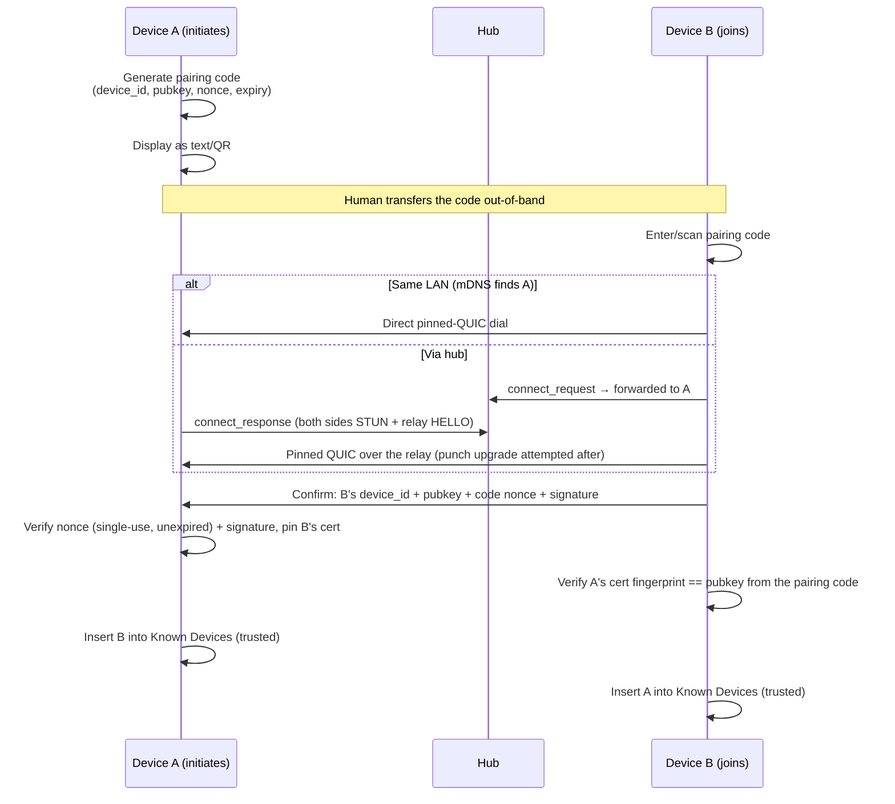

# P2P Device Sharing — Architecture

Yaffo devices share photos **directly with each other**. There is no cloud copy,
no account, and no server that can read a photo. Two devices you own establish
trust once, by hand, and then browse and pull from each other over an encrypted
peer-to-peer connection — across NATs, or over the LAN with no internet at all.

This document describes **how the built system works**. It is a reference, not a
plan; what is deliberately *not* built is listed at the end.

**Built:** the hub (`wss://hub.yaffo.app`), the P2P engine, pairing and device
management, share grants over media dirs / folders / albums, the remote gallery,
background batch transfers with resume, the mDNS LAN path, and albums as a
first-class feature.

**Not built:** the hardening in [Deferred](#deferred--not-built) — timeouts still
carry loopback values, there is no serving-side rate limiting, and the multi-NAT
scenarios have not been re-run against the production hub. Everything is verified
on loopback (two in-process instances) plus route tests; a two-machine LAN run is
still outstanding.

---

## Core principle: identity is a keypair, not an account

There is no CA hierarchy and no username/password. A device's identity is the
fingerprint of a keypair it generates for itself, and trust between two specific
devices is established once, explicitly, by a human — then reused forever after
(Trust On First Use, the model SSH uses for host keys and Syncthing for Device
IDs).

|              | Traditional web server       | This design                           |
|--------------|------------------------------|---------------------------------------|
| Identity     | domain name + CA-signed cert | self-signed cert fingerprint          |
| Trust anchor | browser's CA root store      | one-time human-confirmed pairing code |
| Ongoing auth | cert chain validation        | fingerprint match against known peer  |

Two consequences run through everything below. **The hub is never trusted** — it
forwards ciphertext and plays no part in any trust decision. And **every
cross-device message is independently verifiable**: anything with side effects is
signed by the sender's device key and checked against the pubkey in the
*recipient's own* trust store, never against anything the message carries.

## Concepts

- **Device keypair** — generated on first run (**ECDSA P-256**), used to mint a
  self-signed TLS cert. The private key lives in the OS keychain via `keyring`
  (never in app.db), scoped per install (`p2p_device_key:<data dir>`) so two
  instances on one machine are distinct devices that can pair with each other.
- **Device ID** — a short, human-shareable encoding of the public key's hash.
  Self-authenticating: anyone holding the pubkey can verify the ID matches, which
  is what lets the hub authenticate connections with no registry.
- **Known device** — a paired peer (`known_devices`): pubkey, display name,
  `trust_state` (`trusted` / `revoked`).
- **Pairing code** — a short-lived, single-use payload (text or QR) carrying the
  initiating device's ID, pubkey, a nonce, and an expiry. Entering it on the
  second device *is* the trust anchor.
- **Share grant** — pairing grants access to **nothing**. A grant authorizes one
  peer for one scope: a media dir, a folder within one, or an album.
- **Hub** — the single piece of infrastructure: presence, signaling, a UDP relay,
  and STUN. It never sees keys or photo plaintext.

## Where the code lives

| Area                                                                                          | Path                                                                                           |
|-----------------------------------------------------------------------------------------------|------------------------------------------------------------------------------------------------|
| Engine (identity, pairing, QUIC, STUN, relay codec, signaling, service)                       | [`yaffo/p2p/`](../../yaffo/p2p/__init__.py)                                                    |
| Protocol handlers (`ping`, pairing, `list_shared`, `list_files`, `pull_file`, `pull_preview`) | [`yaffo/p2p/handlers/`](../../yaffo/p2p/handlers/dispatcher.py)                                |
| **Authorization**                                                                             | [`yaffo/p2p/handlers/sharing.py`](../../yaffo/p2p/handlers/sharing.py) — `granted_media_query` |
| Batch transfers                                                                               | [`yaffo/p2p/transfers.py`](../../yaffo/p2p/transfers.py)                                       |
| LAN discovery (mDNS)                                                                          | [`yaffo/p2p/lan_discovery.py`](../../yaffo/p2p/lan_discovery.py)                               |
| Sharing UI + routes                                                                           | [`yaffo/routes/sharing.py`](../../yaffo/routes/sharing.py), `templates/sharing/`               |
| Albums UI + routes                                                                            | [`yaffo/routes/albums.py`](../../yaffo/routes/albums.py), `templates/albums/`                  |
| Hub service                                                                                   | [`hub/`](../../hub/README.md)                                                                  |
| Hub infrastructure (Terraform)                                                                | [`deploy/hub/`](../../deploy/hub/README.md)                                                    |

The engine runs as an **asyncio loop in a daemon thread inside the Flask/waitress
web process** — started by `_run_web`, or by `create_app` when
`YAFFO_P2P_ENABLED=1` (the `inv app-local` dev flow). Routes reach it through
`app.extensions["p2p_service"]`; the loop touches the DB only through short-lived
sessions on its own thread, and never holds a write lock across a network exchange
(see the SQLite conventions). `YAFFO_HUB_URL` and `YAFFO_P2P_PORT` override the
defaults.

Transfer orchestration deliberately does **not** live in `yaffo/taskq`: a worker
process asserting the same device identity would fight the web process's hub
WebSocket.

## Hub

One always-on `e2-micro` with a static IP, one Python process:

- **WebSocket signaling** (`/ws/<device_id>`): presence + opaque JSON forwarding
  between the two devices a message names. An open WebSocket *is* presence — there
  are no address registrations to go stale.
- **UDP relay** on one port: a DERP-style forwarder. Peers announce a session token
  with a `HELLO`; datagrams from a registered address are forwarded verbatim to the
  session's other side. Deliberately *not* TURN — nothing but Yaffo devices talk
  to it.
- **STUN on the relay port**: the relay already sees each peer's NAT-mapped
  address, so it answers Binding Requests itself. No third-party STUN dependency,
  and loopback tests run with no internet.

Hardening in place: **authenticated signaling** (on connect the hub challenges,
then verifies the signature *and* that the claimed `device_id` is the hash of that
pubkey — self-authenticating IDs, so no registry and no ID squatting); **relay
sessions tied to signaling** (the relay only accepts `HELLO`s for tokens the hub
itself just brokered, so random internet UDP cannot create sessions); per-session
TTL and byte caps; systemd, structured logs, `/healthz`, and a relay-bytes counter
(the cost signal).

### Cost

| Component                        | Resource                                    | Monthly                                                           |
|----------------------------------|---------------------------------------------|-------------------------------------------------------------------|
| Hub (signaling + relay + STUN)   | `e2-micro`, always-on, static IP            | $0 if the always-free slot is unclaimed, else ~$6-7               |
| Hub disk                         | 10 GB standard PD                           | ~$0.40                                                            |
| Relay egress                     | only traffic that failed to punch through   | ~$0.50-2 typical; scales with punch failure rate × share volume   |
| Domain + TLS                     | registrar; Let's Encrypt via Caddy          | ~$1-2 / $0                                                        |
| **Total**                        |                                             | **~$2-12/month**                                                  |

Firewall: one TCP port (WSS) + one UDP port (relay + STUN).

## Calls: relay-first, then punch

Every call starts through the hub's relay — which **always works**, because both
sides only ever send *outbound* — and then attempts a hole-punch upgrade to a
direct path. A relayed call is already a fully authenticated, working call;
"direct" is a latency and egress optimization, not a requirement.

The punch is STUN discovery + simultaneous UDP send + dialing the peer-reflexive
address the punch packets *actually arrived from* (not the STUN-advertised one).
It works against ordinary home NATs and fails against endpoint-dependent filtering
(GCP Cloud NAT) — which is why **nothing depends on punching succeeding**.

Interactive request/response calls skip the upgrade wait entirely
(`attempt_upgrade=False`); there is no reason to stall an answer already in hand.
Bulk transfers do the opposite — see [Transfers](#transfers).

**LAN path.** When both devices are on the same network, mDNS finds the peer and
the call dials it directly, with no hub involved at all. Pairing, browsing and
transfers all work with the hub unreachable; the sidebar shows such a peer as
**Local**.

## Pairing

Both checks are end-to-end, inside the QUIC handshake and payload — the hub only
forwards ciphertext. A tampered code (MITM) fails the fingerprint pin before any
payload is sent; a merely *claimed* device_id fails the nonce-signature check
(proof of possession).

**Both devices must be online simultaneously to pair.** This is inherent, not
incidental: the trust exchange is a live pinned-QUIC handshake, the hub forwards
only between currently open WebSockets (it stores nothing), and the code's nonce
lives in memory on A with a short expiry. B could in principle trust A from the
code alone (A's pubkey is in it); it is **A trusting B** that needs the live
exchange, because A verifies B's proof-of-possession before recording trust.
Offline pairing would need hub-side queueing of signed confirms and much longer
code lifetimes — a real design change, deliberately not made. Every pull needs
both devices online anyway (there is no cloud copy by design), and pairing is a
one-time human act with someone looking at both screens.

## Share grants

Pairing establishes identity trust and authorizes **nothing**. A grant row
authorizes one trusted peer for one scope:

- **`media_dir`** — everything under a configured media dir, by its stable GUID.
- **`folder`** — a subtree: media dir + a relative-path prefix.
- **`album`** — a curated album's membership, wherever those photos live.

Grants are revocable, and revoking any grant lives in one place: the sidebar's
"Shared With Others" on the granting device. Revocation is **soft** — it stops
*future* access and cannot claw back files already pulled (the same limitation as
Mylio/Syncthing). It takes effect on the peer's next request, because the serving
device re-decides every time.

## Authorization

**One query decides everything.** `granted_media_query(peer)` returns the media
items that peer's active grants cover — one clause per grant, OR'd together:

| Grant scope   | Clause                                           |
|---------------|--------------------------------------------------|
| `media_dir`   | items whose path is under the dir's root         |
| `folder`      | items whose path is under the granted subtree    |
| `album`       | `MediaItem.id IN (select the album's members)`   |

With **no grants the base query is `false()`** — no items, never "everything".

Everything consults that one set:

- a **listing** serves `granted_media_query ∩ scope ∩ filters`;
- a **pull** or a **preview** filters it to one id (`granted_item`).

Because the listing and the authorization are *the same object*, **a file that
cannot appear in a listing cannot be pulled**. The two cannot drift apart — which
is exactly the bug class that separate per-message scope checks used to invite.

An album grant therefore authorizes exactly its membership: a sibling file in the
same folder as a member is refused. And because membership is resolved at request
time, removing a photo from an album drops it from the peer's next listing.

Enforcement lives entirely on the serving device. The requester's claims are never
trusted; the trust anchor is always the local pairing record.

## Wire protocol

Four signed message types, dispatched over pinned QUIC streams.

| Message          | Names…                                                     | Returns                                                     |
|------------------|------------------------------------------------------------|-------------------------------------------------------------|
| `list_shared`    | nothing                                                    | the scopes this peer holds grants for, with counts          |
| `list_files`     | a **scope**: media dir + relative path, *or* an album id   | one page of manifests + facets                              |
| `pull_file`      | a **`media_item_id`** + offset/length                      | one chunk (base64), with mtime; sha256 on the `eof` chunk   |
| `pull_preview`   | a **`media_item_id`** + max dimension                      | a downscaled JPEG                                           |

**Files are named by id, not by path.** A manifest hands out the *serving*
device's `media_item_id`, and that is what a pull or a preview asks for:

- **No traversal surface.** A path from the wire never reaches the filesystem —
  the server derives the path from its own row.
- **Authorization is a lookup**, not a string-prefix comparison, so it is the same
  check for every scope. An album (a *set* of items that can span media dirs)
  stops being a special case.
- **Paths still travel — as data.** Each manifest carries `media_dir_id` and
  `relative_path` because the *requester* needs them: they decide where a pulled
  file lands and they key the resume sidecar. They are simply not what a request
  is keyed on.

Ids are peer-local handles, **not authority**: knowing one grants nothing. They
are meaningful only for the batch that snapshotted the manifest — a peer that
re-indexes can recycle an id, so a chunk must carry the id that was asked for, and
size/mtime plus the whole-file checksum still gate a resume.

Browse requests **never hash file contents** — hashing a large granted folder
would turn a metadata request into a slow transfer.

## Transfers

A pull is a **background batch**, not a blocking download, orchestrated on the P2P
thread by `TransferManager`.

**One connection per batch.** The batch opens a single call with
`attempt_upgrade=True` and runs every chunk of every file as streams on that
pinned QUIC connection. The punch happens **once per batch**; when it lands, every
subsequent byte moves on the free direct path.

> The earlier design issued each 1 MiB chunk as a standalone
> `attempt_upgrade=False` call, so every chunk paid signaling RTT + STUN + relay
> HELLO + a fresh handshake — and because relay-only calls never punch, **100% of
> transfer bytes rode the hub relay** even when a direct path was available. That
> inverted the intent: relay is the correctness path, direct is the cost path. The
> unit of connection setup is the *session*, not the chunk.

Files are pulled by semaphore-bounded workers (2–3) as concurrent streams on the
shared connection — N streams on one connection punch once and share congestion
control; N connections would not.

**Resume.** Each in-flight file has a `{name}.partial` plus a
`{name}.partial.json` sidecar holding the source, the expected size/mtime from the
manifest, and the verified offset. A size/mtime mismatch on resume **restarts the
file from zero** rather than splicing two versions together; a final-checksum
failure truncates the partial rather than leaving a corpse that fails forever. For
end-to-end integrity without hashing during browse, the serving side hashes the
file *as it streams* and returns the whole-file sha256 on the `eof` chunk, which
the client compares against its own running hash of everything it wrote.

**Relay cost policy: discourage, don't forbid.** Hard-blocking relayed transfers
would strand hard-NAT users, and the design never depends on punching. Instead:
session upgrade makes direct the usual outcome, the LAN path covers the at-home
case, sessions that stay relayed get a client-side throttle plus a soft per-batch
relay budget with an explicit continue-anyway, and the UI labels the path (relay /
direct / local). Relay egress is the only metered cost (base64 JSON inflates a
4 GB video to ~5.3 GB relayed).

Files land as `{DeviceName}/{Album-or-MediaDir-or-Folder}/{relative path}` under
the pulling device's configured download directory. Without a download directory
there is nothing to pull *to*, so the remote gallery offers no selection at all.

## Albums

An album is a curated set of media items (`albums` + `album_items`) — a
first-class feature in its own right, and one of the three grant scopes.

- **Curation UI**: an Albums nav tab — overview tiles (covers), a sidebar, an album
  page with an edit mode (select, remove, set cover, drag-to-reorder), and a
  bulk-add screen that reuses the home page's filter panel.
- **Selection lives in the URL**, like the filters and the page number. "Select all
  N" means the whole *scope* — every member, or every photo matching the filters,
  including rows on pages never rendered — minus anything unticked. It posts as a
  scope, not an enumeration of ids, so adding or removing 500 photos is one
  statement. The same `components/selection_bar` drives the album edit mode, the
  add screen, and the remote gallery (whose per-file "Pull" buttons and "Download
  all" collapsed into one selection).
- **Queryable**: `albums` and `album_items` are `data_query` sources, joined
  client-side on `media_item_id` like people/faces — so Pages and the AI page
  builder target albums with no special-casing.
- **Scriptable**: automations get `create_album` (**idempotent on the name**,
  because automations re-run), `update_album`, `add_to_album`, `remove_from_album`,
  `delete_album`. Reading is `data_query`, not a host call.
- **Shareable**: from the album's own Share action — a *reconcile*, where the
  checked devices **are** the shared devices, so unchecking revokes — or from the
  peer's device page. Both create the same grant.

Albums are what pushed the wire protocol to ids: a path-scoped protocol cannot
express "a set of items that can live in different media dirs" without bolting a
per-file media dir onto every manifest and resolving paths back to items in order
to authorize them.

## Data model

Committed numbered migrations under `yaffo/scripts/db/migrations/`, mirrored in
`yaffo/db/models.py`: **006** creates `known_devices` + `share_grants`; **007**
creates `albums` + `album_items` and adds `share_grants.album_id`.

### `known_devices` — one row per paired peer

| Column         | Type               | Notes                                                               |
|----------------|--------------------|---------------------------------------------------------------------|
| `device_id`    | String, PK         | Hash-derived, self-authenticating                                   |
| `pubkey`       | String             | Base64 SPKI; what signatures and cert pins verify against           |
| `display_name` | String             | Peer-supplied at pairing, locally editable                          |
| `trust_state`  | String             | `trusted` \| `revoked` — the flag every request re-checks           |
| `paired_at`    | DateTime           | —                                                                   |
| `last_seen_at` | DateTime, nullable | Updated on successful exchanges; presence itself is never persisted |
| `revoked_at`   | DateTime, nullable | Audit trail                                                         |

### `share_grants` — one row per (peer, scope) authorization

| Column             | Type                                     | Notes                                                                                                                                                                                          |
|--------------------|------------------------------------------|------------------------------------------------------------------------------------------------------------------------------------------------------------------------------------------------|
| `id`               | Integer, PK                              | —                                                                                                                                                                                              |
| `peer_device_id`   | String, FK → `known_devices.device_id`   | Grants are per-device                                                                                                                                                                          |
| `scope_type`     | String                                 | `media_dir` \| `folder` \| `album`                                                                                                               |
| `media_dir_id`   | String, nullable                       | Media-dir GUID. No DB-level FK possible — the registry lives in the `application_settings` `media_dirs` JSON — so the repository validates it and treats grants on since-removed dirs as inert |
| `relative_path`  | String, nullable                       | `folder` scope only: POSIX-style subtree prefix under the media dir                                                                              |
| `album_id`       | Integer, FK → `albums.id`, nullable    | `album` scope only                                                                                                                               |
| `created_at`     | DateTime                               | —                                                                                                                                                |
| `revoked_at`     | DateTime, nullable                     | Active ⇔ `revoked_at IS NULL`; revoking is an update, not a delete, so the UI can show history                                                    |

Shape rule enforced by the repository: `media_dir` ⇒ `media_dir_id` set; `folder`
⇒ `media_dir_id` + `relative_path` set; `album` ⇒ `album_id` set; the other scope
columns NULL. Granting the same scope twice is a **no-op**, not a second row.

### `albums` / `album_items` — curated collections

| Column                        | Type                                       | Notes                            |
|-------------------------------|--------------------------------------------|----------------------------------|
| `id`                          | Integer, PK                                | —                                |
| `name`                        | String, unique                             | —                                |
| `description`                 | String, nullable                           | —                                |
| `cover_media_item_id`         | Integer, FK → `media_items.id`, nullable   | Falls back to the first member   |
| `created_at` / `updated_at`   | DateTime                                   | —                                |

`album_items`: `album_id` + `media_item_id` (composite PK — a duplicate membership
is impossible at the storage layer, so "add if missing" is an `INSERT OR IGNORE`,
not a read-then-write), `position` (manual order), `added_at`.

### Deliberately *not* in the database

- **Device private key** — the OS keychain via `keyring`.
- **Pending pairing codes** — in-memory in the P2P service; a restart forgets them,
  which is correct for a single-use, short-lived trust anchor.
- **Presence** — the hub's open WebSockets (and mDNS) are the source of truth. Only
  `last_seen_at` is recorded.

## Why the design is what it is (POC findings)

The POC (`p2p-poc/`, GCP results in `p2p-poc/gcp/`) validated this against real
networks — a public-IP VM, a laptop behind home NAT, and two VMs behind
independent Cloud NAT gateways. The findings that still constrain the code:

1. **Relay-first beats a rendezvous directory.** An open WebSocket *is* presence,
   which collapsed the original "rendezvous + STUN + coturn" sketch entirely.
2. **Expect relay fallback on hard NATs.** Punches are blocked by endpoint-dependent
   *filtering* (RFC 4787) on GCP Cloud NAT. Home routers filter less aggressively —
   but the design never depends on punching.
3. **Ed25519 certs break Chrome.** BoringSSL's `signature_algorithms_cert` omits
   `ed25519`, so the handshake dies before any trust decision
   (`ERR_CONNECTION_CLOSED`, no cert warning). Hence P-256, as Syncthing uses.
4. **QUIC/UDP is the transport.** TLS 1.3 is inside the QUIC handshake, so the same
   cert-pinning model carries over, and UDP is what makes punching viable at all.
   ⚠️ Pinning reads `aioquic`'s **private** `protocol._quic.tls._peer_certificate`
   — no public API exists. `aioquic` is pinned to `1.3.0`; the canary test that
   would catch an upgrade breaking this is still owed (see Deferred).
5. **Sign everything with side effects.** An unsigned "you're revoked" would let
   any hub client sabotage other pairings.
6. **Single-shot payloads ride the relay phase only.** A pairing nonce burns on
   first use, so the payload is delivered exactly once and the later direct-upgrade
   probe is always a plain ping.
7. **UDP gives no "connection refused"** — a dead peer is silence. Every dial needs
   a timeout, and punch windows on the two sides must overlap (the callee punches
   longer than the caller asked, because the caller only starts punching after its
   relay phase completes).

## Testing

**Tier 1 (every run):** unit suites (identity, codes, signatures, grant scoping,
trust transitions) plus **two-instance loopback integration tests** with an
in-process hub — real crypto, real QUIC, the real relay flow, no internet.
`tests/yaffo/p2p/` covers pair/call/revoke/re-pair, session reuse (a whole batch =
exactly one hub `connect_request`), resume-mismatch restart, wedged-partial
recovery, the relay budget, and album-grant scoping (a grant serves exactly its
membership; removing an item drops it from the next listing; a sibling file in the
same folder is refused).

**Tier 2/3 (on demand):** the POC's `gcp/` scripts stand up an ephemeral two-NAT
topology — adapt rather than rebuild, and always tear down. Not part of default
CI; run before releases that touch the transport.

**UI:** `yaffo_ui_tests/specs/sharing.yaml` and `albums.yaml` drive two instances
with an unreachable hub, so the LAN path carries everything.

## Deferred / not built

### Hardening — the outstanding work

- **Retune timeouts** (dial, punch windows, relay RTT) against real NAT conditions
  rather than the POC's loopback values; make the punch duration adaptive rather
  than fixed.
- **`aioquic` canary test** for the private `_peer_certificate` access, so an
  upgrade fails loudly instead of silently breaking cert pinning. *This is the one
  item with a silent failure mode.*
- **Serving-side rate limiting** on pairing accepts and pull requests, per peer.
- **Re-run the Tier-2 GCP scenarios** against the production hub: same-LAN,
  independent NATs (punch expected to fail — asserts the relay fallback), and
  revocation mid-session. Chaos cases: hub killed mid-call (paired devices and the
  LAN path unaffected), pairing code expiring mid-flight, resumed transfer across a
  device restart.
- **Two-machine LAN validation** with `zeroconf` packaged, running a real batch.

### Decisions taken deliberately

- **Stream framing** — raw length-prefixed frames replacing base64 JSON, removing
  the ~33% overhead. Worthwhile, but strictly secondary: connection reuse was the
  difference between usable and unusable.
- **Multi-hub / self-hosted hub configuration** — one operated hub, config-overridable
  for dev. Making it a user setting is trivial; documenting hub operation for
  self-hosters is not.
- **Grant expiry and view-only (proxy) serving** — natural extensions of the grant
  row.
- **Library sync / replication** (conflict resolution, partial libraries, automatic
  mirroring) — this is explicit browse-and-pull. Sync is a separate, larger design
  that would build on this transport.
- **Browser/WebRTC peers and standards-compliant TURN** — the relay only ever
  serves Yaffo devices; revisit coturn only if non-Yaffo clients need to
  participate.
- **Hard revocation** — revocation stops future access; already-pulled files are the
  peer's. Same as Mylio/Syncthing.
- **Sharing links** — would require additional infrastructure.
