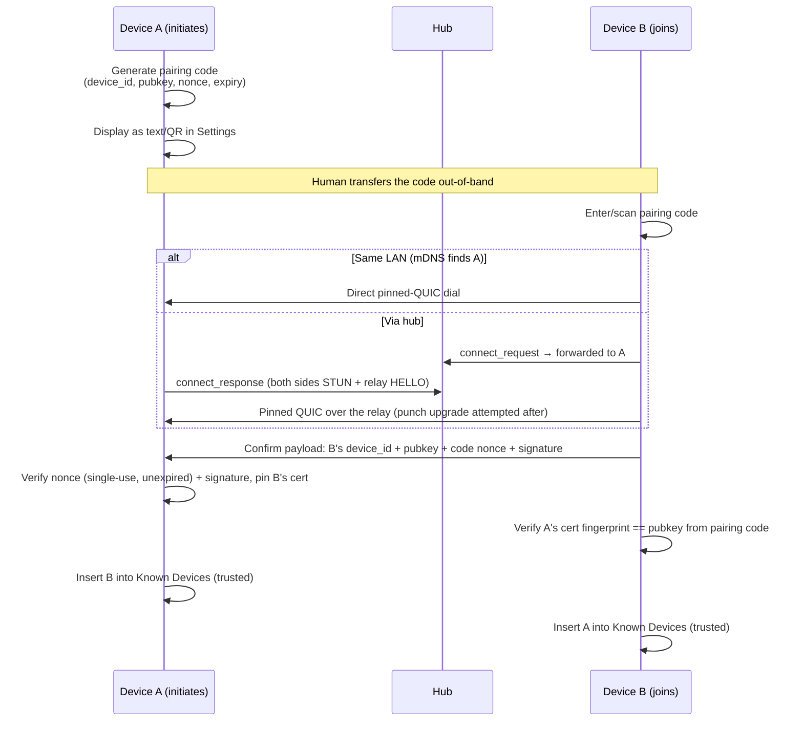

# P2P Device Sharing — Design & Implementation Plan

Status: **Phases 1–5 complete as re-scoped (2026-07-11) — hub deployed and
verified at `wss://hub.yaffo.app`, the p2p engine is ported into
`yaffo/p2p/`, the pairing/device-management UI ships as a dedicated Sharing
nav tab, grant management plus the signed `list_shared` / JSON-chunked
`pull_file` protocol work end to end (browse a peer's shared files, pull one
file with chunk verification and `.partial` resume), and the mDNS LAN path
is implemented. The concept is proven; what remains for real batch use is
Phase 6: transfer sessions that reuse one upgraded QUIC connection (today
every chunk is a standalone relay-only call, so all transfer bytes ride the
hub — the main blocker), batch orchestration with a Download-all action,
sidecar resume manifests, and the relay-bulk cost policy. Albums and
hardening follow as Phases 7–8.**
The original design sketch here was built out as a working proof of concept in
[`p2p-poc/`](../../p2p-poc/README.md), which succeeded end-to-end: pairing,
presence, relay-first calls with hole-punch upgrade, authorized file pulls,
and revocation all work over real networks. This document now records the
validated design, what the POC taught us, and the plan for implementing it in
Yaffo proper.

## Core principle: identity is a keypair, not an account

There is no CA hierarchy and no username/password. A device's identity is the
fingerprint of a keypair it generates for itself, and trust between two
specific devices is established once, explicitly, by a human — then reused
forever after (Trust On First Use, the same model SSH uses for host keys).
This is the same approach Syncthing uses for its Device IDs.

|              | Traditional web server       | This design                           |
|--------------|------------------------------|---------------------------------------|
| Identity     | domain name + CA-signed cert | self-signed cert fingerprint          |
| Trust anchor | browser's CA root store      | one-time human-confirmed pairing code |
| Ongoing auth | cert chain validation        | fingerprint match against known peer  |

## Concepts

- **Device keypair** — generated on first run (**ECDSA P-256**, not Ed25519 —
  see POC learnings below), used to mint a self-signed TLS cert. The private
  key is stored via `keyring`, alongside API keys (see secrets-storage
  convention) — never in the SQLite settings DB.
- **Device ID** — a short, human-shareable encoding of the public key's hash.
  Shown in Settings so a user can visually confirm it during pairing.
  Self-authenticating: anyone holding the pubkey can verify the ID matches,
  which is what lets the hub authenticate connections without any registry.
- **Known Devices** (new table) — paired peers: `device_id`, `display_name`,
  `pubkey`, `trust_state` (`trusted` / `revoked`), `paired_at`, `last_seen_at`.
- **Pairing code** — short-lived, single-use payload (shown as text or QR)
  containing the initiating device's ID, public key, a nonce, and an expiry
  (~5 min). Entering it on the second device *is* the trust anchor — the
  moment a human vouches "this is really my other device." No server ever
  mints or approves this; it's generated and consumed locally.
- **Share grant** (new table) — pairing alone grants access to *nothing*.
  A grant scopes what one specific trusted peer can pull: a media dir, or a
  folder within one. Revocable at any time. See "Share grants" below.
- **Hub** — the one piece of infrastructure: a single always-on box providing
  presence (open WebSocket = online), signaling (opaque JSON forwarding
  between exactly the two devices a message names), a UDP datagram relay,
  and STUN on the relay port. It never sees keys or photo plaintext and
  plays no role in any trust decision.

## What the POC proved (and taught us)

The POC (`p2p-poc/`, with GCP results in `p2p-poc/gcp/`) validated the full
design against real networks — a Cloud Run rendezvous, a public-IP GCE VM,
this laptop behind ordinary home NAT, and two VMs behind independent Cloud
NAT gateways. Findings that now shape the production design:

1. **Relay-first is the right call architecture** (the Tailscale/DERP
   pattern, which replaced the original "rendezvous directory + STUN +
   coturn" sketch). Every call starts through the hub's relay — which always
   works, because both sides only ever send *outbound* — and then attempts a
   hole-punch upgrade to a direct path. A call on the relay path is already a
   fully authenticated, working call; "direct" is a latency/egress
   optimization, not a requirement. This also collapsed presence: an open
   WebSocket *is* presence, so there are no address registrations to go
   stale, and the Cloud Run rendezvous service is retired entirely.
2. **Hole punching works, but expect relay fallback on hard NATs.** The
   punch mechanism (STUN discovery + simultaneous UDP send + dialing the
   peer-reflexive address the punch packets *actually arrived from*, not the
   STUN-advertised one) is implemented and correct. Against GCP Cloud NAT
   specifically, punches are blocked by its endpoint-dependent *filtering*
   (RFC 4787) — evidence in the POC's punch findings. Typical home routers
   filter less aggressively, so real-world punch rates should be much better,
   but the design never depends on punching succeeding.
3. **Ed25519 certs break Chrome; use ECDSA P-256.** Chrome/BoringSSL's
   `signature_algorithms_cert` omits `ed25519`, so the handshake dies before
   any trust decision (`ERR_CONNECTION_CLOSED`, no cert warning). P-256 is
   universally supported and is what Syncthing uses. Same
   pinning-by-public-key-hash mechanism either way.
4. **QUIC/UDP is the device-to-device transport.** TLS 1.3 is built into the
   QUIC handshake, so the identical cert-pinning trust model carries over,
   and UDP is what makes hole punching viable at all. The same pinned
   exchange runs unmodified whether the path is relayed or direct.
   Caveat: pinning currently reads `aioquic`'s private
   `protocol._quic.tls._peer_certificate` — no public API exists. Pin the
   aioquic version and cover this with a test that fails loudly on upgrade.
5. **Every cross-device message must be independently verifiable.** Hub
   signaling carries no authentication of its own, so anything with side
   effects (pull requests, revocation notices) is signed by the sender's
   device key and verified against the pubkey in the *recipient's own* trust
   store — never against anything the message carries. The POC's signed
   revocation notices exist precisely because an unsigned "you're revoked"
   would let any hub client sabotage other pairings.
6. **Single-shot payloads ride the relay phase only.** A pairing confirm's
   nonce burns on first use, so the call flow delivers the payload exactly
   once (during the relay exchange) and the later direct-upgrade probe is
   always a plain ping. Interactive request/response calls skip the upgrade
   wait entirely (`attempt_upgrade=False`) — no reason to stall an answer
   already in hand.
7. **UDP gives no "connection refused"** — a dead peer is silence. Every
   dial needs a timeout, and the POC's 2s loopback value needs retuning for
   real networks. Punch send windows on the two sides must overlap; the
   callee punches longer than the caller asked (grace margin) because the
   caller only starts punching after its relay phase completes.

## Hub design

One small always-on VM (`e2-micro` with a static external IP), one Python
process — the productionized successor to the POC's `hub.py`:

- **WebSocket signaling** (`/ws/<device_id>`): presence + opaque JSON
  forwarding between the two devices a message names. The hub never
  interprets payloads beyond routing.
- **UDP relay** on one port: the POC's DERP-style forwarder — peers announce
  a session token with a `HELLO`, and datagrams from a registered address are
  forwarded verbatim to the session's other side. Deliberately *not* TURN:
  no RFC 8656 allocations or channel framing, because nothing but Yaffo
  devices ever talks to it, and the POC's ~120-line implementation is proven.
- **STUN on the relay port**: the relay already sees each peer's NAT-mapped
  address, so it answers STUN Binding Requests itself — no third-party STUN
  dependency, and loopback tests run with no internet.

### Hardening (new relative to the POC)

- **Authenticated signaling**: on WebSocket connect the hub sends a challenge
  nonce; the device replies with its pubkey and a signature. The hub verifies
  the signature *and* that the claimed `device_id` is the hash of that pubkey
  (self-authenticating IDs — no account registry needed). This stops device-ID
  squatting and spoofed signaling.
- **Relay sessions tied to signaling**: the relay only accepts `HELLO`s for
  tokens the hub itself just brokered (added to a short-TTL allowlist as the
  `connect_request`/`connect_response` pair is forwarded). Random internet
  UDP can't create sessions.
- **Limits**: per-session TTL and byte caps, per-device concurrent-session
  caps, per-IP rate limits on signaling connects and pairing-window traffic.
- **Ops**: systemd unit, structured logs, a `/healthz` endpoint, and a
  counter for relay bytes forwarded (the cost signal — relay egress is the
  only meaningful variable cost).

### Infrastructure & cost

| Component                      | Resource                                         | Monthly cost                                                                     |
|--------------------------------|--------------------------------------------------|----------------------------------------------------------------------------------|
| Hub (signaling + relay + STUN) | `e2-micro`, always-on, static IP attached        | $0 if the billing account's always-free `e2-micro` slot is unclaimed, else ~$6-7 |
| Hub disk                       | 10 GB standard persistent disk                   | ~$0.40                                                                           |
| Relay egress                   | only traffic that failed to punch through        | ~$0.50-2 typical; scales with punch failure rate × share volume                  |
| Domain                         | registrar (`hub.<domain>` A record; see Phase 1) | ~$1-2 (billed yearly, ~$12-20/yr)                                                |
| TLS cert                       | Let's Encrypt via Caddy                          | $0                                                                               |
| **Total**                      |                                                  | **~$2-12/month**                                                                 |

Firewall: one TCP port (WebSocket/HTTPS behind TLS) + one UDP port (relay +
STUN). No Cloud Run, no Firestore, no coturn — the rendezvous directory from
the original sketch is retired (presence subsumed it), and the relay replaces
TURN. v1 runs **one operated hub** with its URL as an app default;
per-install hub configuration (self-hosters) is deferred.

## Share grants: scoping what's actually shared

Pairing establishes identity trust — it grants access to **nothing** by
itself. A grant row authorizes one trusted peer for one scope:

- `peer_device_id` — the grantee (grants are per-device, not global).
- `scope_type` + `scope` — what they can pull:
  - `media_dir` — everything under a configured media dir, referenced by its
    stable GUID (`media_dir_repository.MediaDir.id`).
  - `folder` — a subtree: `media_dir_id` + a relative-path prefix, matching
    the `media_dir_id`/`relative_path` calculated columns the data-query
    layer already models.
  - `album` — a curated album. Yaffo has no album concept yet; Phase 7
    introduces it and this scope together. The polymorphic scope means album
    sharing is a new enum value + one nullable column, not a redesign.
- `created_at`, `revoked_at` — grants are revocable; revocation is checked at
  request time by the serving device, so it takes effect on the next pull.

Enforcement lives entirely on the serving device: every pull request is
signed by the requesting device, verified against the local Known Devices
store (trusted state required), then checked against active grants for that
peer, and only files inside the granted scope are listed or served. The
requester's claims are never trusted; the trust anchor is always the local
pairing record. Expiring grants and view-only (downscaled proxies instead of
originals) are natural extensions but **deferred from v1**.

Revocation is soft, as before: revoking a device or a grant stops *future*
access; it cannot claw back files already pulled. Same limitation as
Mylio/Syncthing.

## Proposed data model

Two migrations, per the schema conventions (numbered migration under
`yaffo/scripts/db/migrations/` run by `run_migrations()`, mirrored in
`yaffo/db/models.py`): **006** (Phase 2) creates `known_devices` and
`share_grants`; **007** (Phase 7) creates `albums` and `album_items` and adds
`share_grants.album_id`. Column types follow the existing models.py
conventions (integer autoincrement PKs, `db.DateTime` with `utcnow`
defaults).

### `known_devices` — one row per paired peer (migration 006)

| Column         | Type               | Notes                                                                 |
|----------------|--------------------|-----------------------------------------------------------------------|
| `device_id`    | String, PK         | Hash-derived, self-authenticating (see Concepts)                      |
| `pubkey`       | String             | Base64 SPKI; what signatures and cert pins verify against             |
| `display_name` | String             | Peer-supplied at pairing, locally editable                            |
| `trust_state`  | String             | `trusted` \| `revoked` — the enforcement flag every request re-checks |
| `paired_at`    | DateTime           | —                                                                     |
| `last_seen_at` | DateTime, nullable | Updated on successful exchanges; presence itself is never persisted   |
| `revoked_at`   | DateTime, nullable | Audit trail; set when `trust_state` flips to `revoked`                |

### `share_grants` — one row per (peer, scope) authorization (migration 006)

| Column           | Type                                   | Notes                                                                                                                                                                                          |
|------------------|----------------------------------------|------------------------------------------------------------------------------------------------------------------------------------------------------------------------------------------------|
| `id`             | Integer, PK                            | —                                                                                                                                                                                              |
| `peer_device_id` | String, FK → `known_devices.device_id` | Grants are per-device                                                                                                                                                                          |
| `scope_type`     | String                                 | `media_dir` \| `folder` \| `album`                                                                                                                                                             |
| `media_dir_id`   | String, nullable                       | Media-dir GUID. No DB-level FK possible — the registry lives in the `application_settings` `media_dirs` JSON — so the repository validates it and treats grants on since-removed dirs as inert |
| `relative_path`  | String, nullable                       | `folder` scope only: POSIX-style subtree prefix under the media dir                                                                                                                            |
| `album_id`       | Integer, FK → `albums.id`, nullable    | `album` scope only; column added in 007 (Phase 7)                                                                                                                                              |
| `created_at`     | DateTime                               | —                                                                                                                                                                                              |
| `revoked_at`     | DateTime, nullable                     | Active grant ⇔ `revoked_at IS NULL`; revoking is an update, not a delete, so the UI can show history                                                                                           |

Shape rule enforced by the repository: `media_dir` ⇒ `media_dir_id` set;
`folder` ⇒ `media_dir_id` + `relative_path` set; `album` ⇒ `album_id` set;
the other scope columns NULL.

### `albums` / `album_items` — curated collections (migration 007, Phase 7)

| Column                      | Type                                     | Notes                              |
|-----------------------------|------------------------------------------|------------------------------------|
| `id`                        | Integer, PK                              | —                                  |
| `name`                      | String, unique                           | —                                  |
| `description`               | String, nullable                         | —                                  |
| `cover_media_item_id`       | Integer, FK → `media_items.id`, nullable | Falls back to first item when NULL |
| `created_at` / `updated_at` | DateTime                                 | `utcnow` default / `onupdate`      |

And the `album_items` join table:

| Column          | Type                           | Notes                                                     |
|-----------------|--------------------------------|-----------------------------------------------------------|
| `album_id`      | Integer, FK → `albums.id`      | Composite PK (`PrimaryKeyConstraint`, like `people_face`) |
| `media_item_id` | Integer, FK → `media_items.id` | Composite PK; delete cascades with the album              |
| `position`      | Integer                        | Manual ordering within the album                          |
| `added_at`      | DateTime                       | —                                                         |

### Deliberately *not* in the database

- **Device private key** — OS keychain via `keyring` (secrets convention);
  the cert and device_id are derived from it at startup.
- **Pending pairing codes** — in-memory in the P2P service; a restart
  invalidating unaccepted codes is acceptable (they expire in ~5 min anyway).
- **Presence** — the hub's open WebSockets are the source of truth; only
  `last_seen_at` is persisted.
- **Transfer resume state** — a sidecar manifest next to the `.partial`
  file (verified offset + expected hash), not a table: it's per-file scratch
  state that must not outlive the partial file it describes.

## Pairing flow

Unchanged in its trust mechanics from the original design; the transport is
now the relay-first call flow, so pairing works across NATs with no
reachable address on either side and no address embedded in the code being
trusted (or even needed) — with a LAN fast path when both devices are home.

Both checks are end-to-end, inside the QUIC handshake and payload — the hub
only ever forwards ciphertext. A tampered code (MITM) fails the fingerprint
pin before any payload is sent; a merely *claimed* device_id fails the
nonce-signature check (proof of possession). Both cases have POC tests.

**Both devices must be online simultaneously to pair** (their Yaffo web
processes running — the P2P engine lives in that process). This is inherent,
not incidental: the trust exchange is a live pinned-QUIC handshake, the hub
only forwards between currently open WebSockets (it stores nothing), and the
code's nonce lives in memory on A with a short expiry — deliberately, since
the code is the trust anchor. B could technically trust A from the code
alone (A's pubkey is in it); it's A trusting B that needs the live exchange,
because A verifies B's proof-of-possession signature before recording trust.
Offline pairing would require hub-side queueing of signed confirms and much
longer code lifetimes — a real design change, deliberately not made. The
same both-online requirement applies to every pull anyway (there is no cloud
copy by design), and pairing is a one-time human act where someone is
looking at both screens.

## Implementation plan

Scope decisions (settled 2026-07): grants are per-device on media dirs /
folders — and albums, once Phase 7 introduces them — revocable (expiry and
view-only deferred); the P2P engine runs as an **asyncio loop in a
background thread inside the Flask/waitress web process**; the hub is the
**custom hardened relay** above (no coturn); v1 includes the **mDNS LAN
path**, **revocation UI**, and **chunked/resumable transfers**; **multi-hub
configuration is deferred** (one operated hub).

### Phase 1 — Hub, production-ready

> **Status: DONE (2026-07-10).** Live at `wss://hub.yaffo.app` (static IP
> `yaffo-hub-ip`, `e2-micro` `yaffo-hub` in `us-central1-a`). Code in
> [`hub/`](../../hub/README.md); infrastructure as **Terraform** in
> [`deploy/hub/`](../../deploy/hub/README.md) (chosen over the shell script
> suggested below), with `deploy.sh` for code delivery. Domain `yaffo.app`
> registered via Cloud Domains with the zone in Cloud DNS (simpler on one
> bill than the registrar-DNS suggestion below). All exit criteria verified:
> real-internet pair + pull via relay with a browser-valid LE cert, 27 hub
> tests cover auth/allowlist/limits rejection, and a VM reset self-healed
> hands-free. SSH access and operations are documented in the deploy README.

Productionize `p2p-poc/p2p_poc/hub.py` + `relay.py` as a small standalone
service (it deploys independently of the app, so it ships first).

**Naming.** The service is **`yaffo-hub`** everywhere a name appears: the
Python package (`yaffo_hub`), the GCE instance (`yaffo-hub`), the systemd
unit (`yaffo-hub.service`), and the reserved static IP
(`yaffo-hub-ip`). One name, greppable end to end.

**Domain & DNS.** A real domain is a prerequisite — none is owned today
(the docs site is GitHub Pages under `github.io`, which can't carry custom
DNS records). Register one (e.g. `yaffo.app`, ~$12-20/yr — the only new
recurring cost this plan adds) and point **`hub.<domain>`** at the reserved
static IP with a single A record. The hostname, not the IP, is what gets
baked into clients as the default hub URL (`wss://hub.<domain>/ws/...`) —
that's the whole point: the VM/IP can be replaced later without touching a
single install. DNS can live at the registrar; Cloud DNS is unnecessary for
one A record. Use a modest TTL (~1h).

Registrar options: GCP's own
[Cloud Domains](https://cloud.google.com/domains/pricing) (`.com` from
$12/yr, `.app` ~$14/yr) keeps the domain on the same GCP bill and `gcloud`
tooling as the hub VM — note Squarespace is the registrar of record
underneath (GCP resells since the Google Domains sale). If hosting the zone
in [Cloud DNS](https://cloud.google.com/dns/pricing), add $0.20/mo per zone
plus per-query charges (negligible at this scale). At-cost registrars
(Cloudflare, Porkbun) run a few dollars cheaper with no reseller layer.

**TLS.** Needed for exactly one of the three listeners:

- **WebSocket signaling — yes.** Signed challenges and device metadata ride
  it, and `wss://` is table stakes. A hostname makes this trivial: run
  [Caddy](https://caddyserver.com) on the VM as the TLS terminator — it
  obtains and auto-renews a Let's Encrypt cert for `hub.<domain>` with zero
  cron/certbot plumbing — and reverse-proxies to the hub process on
  localhost. (A GCP HTTPS load balancer would also work but costs ~$18/mo,
  wiping out the free-tier VM; certbot+nginx works but is more moving parts
  to keep renewed.) Clients verify this cert by normal CA validation — the
  one place web PKI appears in the design, and it's fine because the hub is
  trust-irrelevant: a MITM'd hub could only deny service, never break the
  end-to-end pinning.
- **UDP relay — no.** It forwards opaque datagrams that are already
  end-to-end encrypted (the pinned QUIC session between the two devices);
  the relay never terminates TLS at all.
- **STUN — no.** Address echo, nothing secret.

**Deployment.** One `e2-micro` with the static IP attached; firewall opens
`443/tcp` (Caddy → signaling) and one UDP port (relay + STUN). Hub process
under systemd (`Restart=always`), structured logs to journald, `/healthz`
(proxied, so it also proves the TLS path) and a relay-bytes-forwarded
counter — the cost signal. Setup is a repeatable script adapted from the
POC's `gcp/tier2-*.sh` (create VM + IP + firewall + Caddy + unit files),
idempotent like `redeploy.sh`.

**Code.** Lives in its own directory (e.g. `hub/` or `deploy/hub/`) with no
dependency on the Yaffo app package — the hub must stay deployable alone.
Changes from the POC:

- Challenge-response WebSocket auth (device signs a hub-issued nonce;
  hub checks the signature and that `device_id` == hash(pubkey)).
- Relay-token allowlist wired to signaling (only hub-brokered tokens can
  open relay sessions), plus the TTL/byte/rate limits from "Hardening".
- Config via env/flags: bind addresses, relay port, limits.

Exit criteria: two POC devices pointed at `wss://hub.<domain>` pair, call,
and pull over the real internet with a browser-valid cert; unauthenticated
WebSocket connects and un-brokered relay HELLOs are rejected (tests); VM
reboot brings everything back with no hands (systemd + Caddy auto-renew).

### Phase 2 — P2P engine inside Yaffo

> **Status: DONE (2026-07-10).** Engine in
> [`yaffo/p2p/`](../../yaffo/p2p/__init__.py)
> (`identity`, `pairing`, `stun_client`, `relay` codec, `quic_transport`,
> `signaling`, `messages`, and `service` — protocol handlers live in
> `P2PService`); migration 006 + `KnownDevice`/`ShareGrant` models +
> `p2p_repository`; started from `_run_web`, or by `create_app` when
> `YAFFO_P2P_ENABLED=1` — which `inv app-local` / `inv start-app` set, so the
> flask dev flow gets the engine too (available to routes as
> `app.extensions["p2p_service"]`, hub/port overridable via `YAFFO_HUB_URL` /
> `YAFFO_P2P_PORT`). The keychain entry is scoped per install
> (`p2p_device_key:<data dir>`), so two instances on one machine are distinct
> devices that can pair. Deviations from the sketch below: pairing codes no
> longer embed host/port (relay-first needs no address), the confirm payload
> gained an explicit `type: pairing_confirm`, and both sides now also check
> `device_id == hash(pubkey)` on transmitted pairs. Exit criteria verified:
> the ported Tier-1 suite (identity, pairing, signed messages, QUIC pinning
> incl. the aioquic canary, repository, and the two-instance loopback
> pair/call/revoke/re-pair integration test with an in-test hub speaking the
> production challenge-auth protocol) is green in `tests/yaffo/p2p/`, and a
> smoke run authenticated against the live `wss://hub.yaffo.app`.

Port the POC's client-side modules into a new `yaffo/p2p/` package:
`identity.py`, `pairing.py`, `quic_transport.py`, `stun_client.py`,
`signaling.py` (HubClient), and the protocol handlers. Changes from the POC:

- **Identity storage**: private key in the OS keychain via `keyring` (the
  POC wrote PEM files in the data dir); cert + device_id derived from it on
  startup. Key material never touches app.db.
- **Threading model**: a `P2PService` started from the web role's startup
  path (`yaffo/__main__.py` role `web`, next to where the host/watcher
  children are supervised) owning a daemon thread that runs the asyncio
  loop: persistent hub WebSocket (with the POC's auto-reconnect), the
  QUIC/UDP server socket, and mDNS. Flask routes call into it with
  `asyncio.run_coroutine_threadsafe(...).result(timeout)`; the loop calls
  *out* to the DB only through short-lived sessions on its own thread
  (WAL + busy_timeout are already configured — never hold a write lock
  across a network exchange, per the SQLite conventions).
- **Schema**: migration `006` adding `known_devices` and `share_grants`
  (columns as in "Concepts"/"Share grants" above), mirrored in
  `yaffo/db/models.py`, repositories under `yaffo/db/repositories/`
  (replacing the POC's JSON-file `store.py`).
- **Request handlers** (the QUIC stream dispatch, POC `main.py`'s
  `handle_stream_request`): `ping`, pairing confirm, and the grant-checked
  listing/pull protocol from Phase 4.
- **Config**: hub URL as an app default (constant with a config override for
  dev/tests, not a user-facing setting yet); a dedicated UDP port for QUIC
  (the web port belongs to waitress/TCP; unlike the POC they need not share
  a number).

Exit criteria: the POC's Tier-1 test suite, ported: identity stability,
pairing-code expiry/signature tests, and the two-instance loopback
integration test (two `create_app`s, separate data dirs, a local hub,
pair + call end-to-end) all green in Yaffo's pytest.

### Phase 3 — Pairing & device management UI

> **Status: DONE (2026-07-10), pending Jason's in-browser pass.** Built as a
> dedicated **"Sharing" nav tab** (evolved beyond the Settings-section sketch
> below): utilities-style layout with a left sidebar — "Settings & pairing"
> plus one entry per paired device (online/revoked badges; auto-refreshes via
> a `sharingDevicesChanged` HTMX trigger) — and per-device pages (rename,
> revoke, presence, and the placeholder Phase 4 fills with grants). Routes in
> [`yaffo/routes/sharing.py`](../../yaffo/routes/sharing.py) (HTMX fragments
> in the labels-section style — errors are 204 + toast so typed input
> survives), templates under `templates/sharing/` (QR via `segno`,
> pure-Python; expiry countdown), presence tri-state per render from the
> hub's `/devices`. The service is reached via
> `app.extensions["p2p_service"]`; without it (flask run without
> `YAFFO_P2P_ENABLED=1`) pages render with presence unknown and pairing
> disabled. Exit criteria verified by
> `test_pair_and_revoke_entirely_through_the_ui_routes` (two instances pair,
> show each other online, and revoke — through the routes only) plus
> stub-service route tests; the live prod hub renders "Connected" on the
> real page. Dev: `inv app-local` + `inv app-local-peer` run two instances
> side by side for manual pairing.

A "Devices" (or "Sharing") section on the Settings page
(`yaffo/routes/settings.py` + templates), backed by JSON routes that bridge
into the P2P thread:

- This device: device ID (formatted for visual verification), hub
  connection status.
- Generate pairing code: shows the code as text + QR, with its expiry
  countdown. Pending codes live in the P2P service (in-memory, like the POC
  — a restart invalidating unaccepted codes is acceptable).
- Accept pairing code: paste box → runs the accept flow → new Known Device.
- Known devices list: display name, device ID, presence badge (online /
  offline / unknown when the hub is unreachable — the POC's tri-state),
  last seen, trust state.
- **Revocation UI**: revoke button per device → local trust-store update
  (the enforcement) + best-effort signed courtesy notice over the hub (the
  POC's `revoked` flow), with the "peer notified / peer offline" outcome
  surfaced. Incoming verified notices mark the row revoked with a reason.

Exit criteria: two dev instances pair, show each other online, and revoke —
entirely through the UI. (Per the no-headless-screenshots convention:
verified via route tests + Jason's own browser.)

### Phase 4 — Share grants & data transfer

The actual sharing feature, replacing the POC's seed-text-files demo:

> **Status: DONE as re-scoped (2026-07-11).** Grant management exists on each
> trusted device page, backed by `share_grants`. The serving device verifies
> signed `list_shared` and `pull_file` requests against its local
> `known_devices` row, checks active grants at request time, lists only
> indexed files under granted configured media dirs/folders, and returns
> bounded base64 JSON chunks with offset support. The device page can browse
> a peer's granted file list and pull a selected file under a configured
> local download directory as
> `{DeviceName-or-ID}/{Album-or-MediaDir-or-Folder}/{Filename}`, resuming
> from `.partial` and verifying each transferred chunk. The transfer
> resilience bullet below is only partially delivered: chunking, per-chunk
> verification, and `.partial` resume work, but every chunk is a standalone
> `attempt_upgrade=False` call — so all transfer bytes ride the hub relay
> and pay per-chunk connection setup. That, plus background transfer
> orchestration, bounded concurrency, sidecar resume manifests, transfer
> path reporting, and the multi-GB resume exit criterion, rolls into
> **Phase 6**.

- **Grant management UI** (same Settings section): per known device, add a
  grant by picking a media dir or browsing to a folder within one; list and
  revoke active grants.
- **Serving side**: signed-request verification (POC `sharing.py` pattern:
  canonical string + timestamp replay bound + signature against the local
  trust store) extended with grant checks. Protocol messages:
  - `list_shared` → the scopes this peer holds grants for, with cheap file
    manifests (relative path, size, mtime, media type). It must not hash file
    contents during browse; hashing large granted folders turns a metadata
    request into a slow transfer.
  - `pull_file` → one file, streamed in chunks with offset support.
- **Transfer resilience** (in scope for v1 — photos and videos are large):
  manifest-driven pulls; each file streamed in chunks over a QUIC stream
  with sha256 verification on completion; interrupted pulls resume from the
  last verified offset; bounded concurrency. Bulk transfers *should* ride a
  punched direct path when available and fall back to the relay when not —
  wire the transfer path choice to the call report's `path` (relay bytes
  cost hub egress; direct bytes are free), and surface which path a
  transfer used in the UI.
- **Receiving side UI**: a "Shared with this device" view listing peers →
  granted scopes → files, with pull-to-local actions. Pulled files land in a
  designated local folder (inside a media dir, so normal indexing picks them
  up) — v1 is explicit pull, not sync.

Exit criteria (as re-scoped): grant a folder on device A; browse and pull a
file from B with chunk verification and `.partial` resume; revoke the grant
and see B's next request denied. Loopback integration tests for grant
scoping (out-of-scope path requests rejected) and resume-from-offset. The
original multi-GB-video-with-interruption criterion moves to Phase 6, where
transfer sessions make it realistic.

### Phase 5 — mDNS LAN path

Same-LAN discovery so home traffic never touches the hub:

> **Status: DONE as re-scoped (2026-07-11).** The P2P thread now advertises
> and browses `_yaffo-p2p._udp.local.` when `zeroconf` is installed, caches
> LAN candidates by `device_id`, tries a short pinned-QUIC LAN call before
> the hub relay-first flow, and accepts pairing codes over LAN when the hub
> is unreachable. Sharing UI presence can show a `Local` badge for
> LAN-reachable paired devices. Remaining work — install/package validation
> with `zeroconf` present and real two-machine LAN testing — rolls into
> **Phase 6**, where it doubles as the LAN validation of batch transfers.

- Advertise `_yaffo-p2p._udp.local.` via `zeroconf` (TXT: device_id, QUIC
  port) from the P2P thread; browse continuously and cache
  `device_id → LAN address` for known devices.
- Call path becomes: **LAN candidate first** (direct pinned-QUIC dial, short
  timeout) → hub relay-first flow otherwise. Trust is identical on every
  path — the pinned handshake doesn't care how the address was found — so
  this is purely a connectivity fast path.
- Pairing accept also tries the LAN candidate first, making home pairing
  work with no hub reachable at all.

Exit criteria: two instances on one LAN pair and pull with the hub URL
pointed at a black hole; presence UI shows a "local" badge for
LAN-reachable peers.

### Phase 6 — Batch transfers & transfer resilience

> **Status: IMPLEMENTED (2026-07-11), pending Jason's in-browser pass and
> the real two-machine LAN validation.** Items 1–5 are built and tested:
> `PinnedConnection`/`quic_pinned_connect` (many streams per pinned
> connection), `HubClient.open_session` (relay-proven, one punch upgrade
> per session, relay slot freed on upgrade), idle-based answer-socket
> reaping (a busy session keeps its socket; quiet ones still reap),
> `yaffo/p2p/transfers.py` (`TransferManager` on the engine loop:
> semaphore-bounded workers as streams on one shared session,
> reconnect-and-resume via a session holder, `{name}.partial.json` sidecars
> with source-change restart and wedged-partial cleanup, serving side sends
> `mtime` per chunk + whole-file `file_sha256` on the eof chunk, relay
> throttle + soft budget pause with a Continue-anyway button), and the
> routes/UI (self-polling transfers panel on the device and gallery pages,
> per-card Pull now enqueues a batch, **Download all** on the remote
> gallery snapshots the filtered scope). Loopback exit criteria verified in
> `tests/yaffo/p2p/test_transfers.py` (resume, restart, wedge-recovery,
> budget) and `test_service_integration.py::
> test_download_all_batch_rides_one_transfer_session` (a whole batch =
> exactly one hub connect_request). Remaining: item 6 (zeroconf packaging +
> two-machine LAN run) and item 7 (stream framing, deferred by design).

Rolled-over scope from Phases 4–5 plus the design work that makes batches
viable. The driving observation (2026-07-11 review of the Phase 4 code):
`PullFileEndpoint.send()` issues every 1 MiB chunk as a standalone call with
`attempt_upgrade=False`, so each chunk pays signaling RTT + STUN + relay
HELLO + a fresh pinned-QUIC handshake, and — because relay-only calls never
punch — **100% of transfer bytes ride the hub relay** even when a direct
path is available. That inverts the design intent (relay is the correctness
path; direct is the cost path) and makes the hub the bottleneck for bulk:
relay egress is the only metered cost (~$0.09–0.12/GB; base64 JSON inflates
a 4 GB video to ~5.3 GB relayed ≈ $0.50+, one 50 GB batch triples the
monthly budget), and the relay is a single Python process on a shared
0.25-vCPU `e2-micro` that also carries everyone's signaling. The fix is to
make the unit of connection setup the **transfer session**, not the chunk.

1. **Transfer sessions — one connection per (peer, batch), reused.** Open a
   single call with `attempt_upgrade=True`, keep the pinned QUIC connection
   alive for the whole batch, and run all chunk requests as streams on it.
   The existing signed JSON chunk protocol is unchanged — only the transport
   lifetime changes. The punch happens once per session; when it lands,
   every subsequent byte moves on the free direct path. Record the call
   report's `path` (`relay` / `direct` / `lan`) and stamp it on the
   transfer — this delivers the Phase 4 path-reporting requirement.
2. **Batch orchestration in the P2P thread.** A batch is a `list_files`
   manifest snapshot turned into a job: an ordered list of file entries
   processed by asyncio tasks under a per-peer `Semaphore` (2–3), as
   concurrent streams on the shared session connection (N streams on one
   connection punch once and share congestion control; never N
   connections). Orchestration stays in the P2P asyncio thread — **not**
   `yaffo/taskq`: a worker process asserting the same device identity would
   fight the web process's hub WebSocket. Status UI (per-file state,
   progress, transfer path) updates via an HTMX trigger, in the style of
   `sharingDevicesChanged`.
3. **Sidecar resume manifests.** Per the data-model section: a
   `{name}.partial.json` next to each `.partial` holding the source (peer,
   media dir, path), the expected size/mtime from the browse manifest, and
   the verified offset. This closes two real resume holes in the Phase 4
   code: (a) resume-after-source-change — today resume appends blindly from
   `partial.stat().st_size`, silently splicing two file versions; a
   size/mtime mismatch on resume must restart the file from zero; (b) the
   wedged partial — a final checksum failure currently leaves the corrupt
   `.partial` in place so every retry fails forever; the failure path must
   truncate it. For end-to-end integrity without violating the
   never-hash-during-browse rule, the serving side hashes the file *as it
   streams* and returns the full-file sha256 in the `eof` chunk; the client
   compares against its own running hash of the partial.
4. **Relay bulk policy: discourage, don't forbid.** Hard-blocking relayed
   transfers would strand hard-NAT users (the design never depends on
   punching succeeding). Instead: the session upgrade from item 1 makes
   direct the default outcome; the Phase 5 LAN path covers the common
   at-home batch; sessions that stay relayed get a client-side throttle plus
   the hub's per-session byte caps; and the UI labels the path — "via relay
   (metered)" vs "direct" vs "local" — with a soft per-batch relay budget
   and an explicit continue-anyway, so a user can choose to defer a big
   batch until both machines are home.
5. **Download-all on the remote dashboard** (new acceptance criterion): the
   peer browse page gains a "Download all" action per granted scope that
   snapshots the manifest and pulls the entire scope as a background batch
   through items 1–3, with the same status UI.
6. **Rolled from Phase 5**: install/package validation with `zeroconf`
   present, and real two-machine LAN testing — run the LAN validation
   against a batch transfer so it exercises this phase too.
7. **Deferred within the phase**: true stream framing (raw length-prefixed
   frames replacing base64 JSON, removing the ~33% overhead). It's a
   worthwhile optimization but strictly secondary — connection reuse is the
   difference between usable and unusable over the internet.

Exit criteria: "Download all" on a granted multi-file folder from the
remote dashboard completes as a background batch with per-file status and
the transfer path shown; a multi-GB video pull interrupted mid-transfer —
including across a device restart — resumes from the verified offset; a
source file changed between resume attempts restarts cleanly instead of
splicing; two real machines on one LAN run a batch with zero hub relay
bytes; a batch that stays on the relay respects the throttle and byte caps.
Loopback integration tests for session reuse (one connection, many chunks),
resume-manifest mismatch restart, and the wedged-partial recovery.

### Phase 7 — Albums: definition & sharing

Yaffo has no album concept today; this phase introduces it as a first-class
feature and immediately extends sharing to it (migration `007` in the data
model above):

- **Album definition**: `albums` + `album_items` tables, an
  `album_repository`, and CRUD UI — create/rename/delete an album, add and
  remove media items from the grid and single-photo views, cover selection,
  manual ordering via `position`.
- **Data-query integration**: expose albums as a virtual source /
  calculated column in the data-query layer, the same way `media_dirs` and
  `folders` are modeled (`media_dir_repository`'s virtual-source pattern) —
  so filters, pages, and the AI Page Builder can target albums with no
  special-casing.
- **Album sharing**: enable the `album` grant scope — add `album_id` to
  `share_grants`, an album picker in the grant UI, and serving-side scope
  resolution: the manifest for an album grant is its *current* membership,
  resolved at request time, so adding/removing items changes what the peer
  sees on their next pull (consistent with how revocation works — the
  serving device re-decides on every request).
- **Custom Automation** Actions within the custom automation feature to manage albums. Create, Read, Update, Delete. 
- Album membership references media items, which belong to media dirs — an
  album grant authorizes exactly its member files, even when the peer holds
  no grant on the underlying dirs.

Exit criteria: create an album on device A, grant it to device B, B pulls
its contents; removing an item from the album excludes it from B's next
manifest; an album grant leaks nothing outside the album's membership
(loopback test alongside the Phase 4 scoping tests).

### Phase 8 — Hardening & real-world validation

- Retune timeouts (dial, punch windows, relay RTT) against real home NAT
  conditions rather than the POC's loopback values; make the punch duration
  adaptive rather than fixed.
- Pin the `aioquic` version; add the canary test for the private
  `_peer_certificate` access.
- Rate-limit pairing accepts and pull requests per peer on the serving side.
- Re-run the POC's Tier-2 GCP scenarios (`p2p-poc/gcp/tier2-*.sh`, adapted)
  against the production hub: same-LAN, independent NATs (punch expected to
  fail on Cloud NAT — asserts the relay fallback), and revocation
  mid-session. Chaos cases: hub killed mid-call (paired devices unaffected;
  LAN path unaffected), pairing code expiring mid-flight, resumed transfer
  across a device restart.

## Testing strategy

Tier 1 (every CI run, free): the ported POC unit + loopback suites — pure
logic (IDs, codes, signatures, grant scoping, trust transitions) plus the
two-instance loopback integration tests with a local in-process hub. This
tier proved out in the POC: it exercises the real crypto path, real QUIC,
and the real relay flow, with no network beyond loopback and no internet
(STUN answered by the local relay port).

Tier 2/3 (on-demand, GCP): the POC's `gcp/` scripts already implement the
ephemeral two-NAT topology (VMs with no external IP behind independent
Cloud NAT gateways + the public hub box) — adapt rather than rebuild, and
always tear down (the scripts are idempotent both directions). Not part of
default CI; run before releases that touch the transport.

## Non-goals / deferred

- **Multi-hub / self-hosted hub configuration** — v1 hardcodes one operated
  hub (config-overridable for dev). Making it a user setting is trivial
  later; operating documentation for self-hosters is not.
- **Grant expiry and view-only (proxy) serving** — natural extensions of the
  grant row; not v1.
- **Library sync / replication** (conflict resolution, partial libraries,
  automatic mirroring) — v1 is explicit browse-and-pull. Sync is a separate,
  larger design that would build on this transport.
- **Browser/WebRTC peers and standards-compliant TURN** — the relay only
  ever serves Yaffo devices; revisit coturn only if non-Yaffo clients ever
  need to participate.
- **Hard revocation** — revocation stops future access; already-pulled files
  are the peer's. Same as Mylio/Syncthing.
- **Sharing links** — would require some additional infrastructure, so
  deferred.
