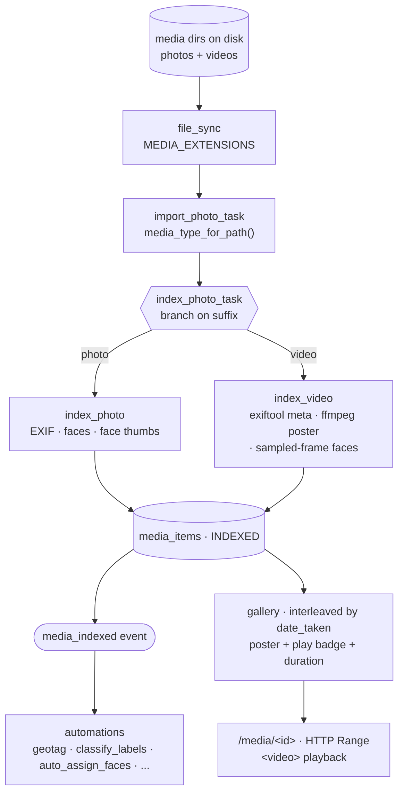

# Video Support — Implementation Reference

> **Status: implemented.** Video is a first-class member of the library. Clips
> import through the same scan/import/index pipeline as photos, get a poster frame
> and metadata, appear in the gallery interleaved by capture time, play inline in
> the browser, and participate in favorites, tags, labels, locations, faces,
> albums, sharing, and duplicate detection. This document describes what exists and
> why it is shaped that way.

## Overview

Yaffo organizes media by capture time, location, people (faces), and labels. Phones
and cameras produce video in the same folders as photos, on the same outings, so
video is cataloged alongside them rather than siloed.

The whole app is built around one media entity. Instead of a parallel `Video`
model, the `photos` table was renamed to **`media_items`** (model `Photo` →
`MediaItem`) and a `media_type` column discriminates `"photo"` from `"video"`. A
video is a `media_items` row with `media_type = "video"` plus a few video-only
columns; every shared column (`date_taken`, `year`/`month`, `latitude`/`longitude`,
`location_name`, `device`, `orientation`, `favorite`, `status`) and every
relationship (`faces`, `tags`, `labels`) carries over unchanged. Features that do
not care about the difference operate on a generic `MediaItem` and needed no video
handling at all.



## Data model

### `media_items` columns

The video-specific columns on `MediaItem` (`yaffo/db/models.py`). All are nullable
and left NULL on photo rows, except the discriminator.

| Column | Type | Notes |
|---|---|---|
| `media_type` | `String`, not null, default `"photo"` | `MEDIA_TYPE_PHOTO` / `MEDIA_TYPE_VIDEO`. Indexed. |
| `poster_path` | `String` | Absolute path to the extracted poster still, in `thumbnail_dir` alongside face crops. |
| `duration_seconds` | `Float` | Clip length, from exiftool `Duration`. |
| `width` / `height` | `Integer` | Display dimensions. Populated for **both** media types — photos record theirs upright, so the shape filter sees what the browser draws. |
| `video_codec` | `String` | Normalized codec name (`h264`, `hevc`, `mpeg4`) or the raw container value. |

`full_file_path` remains the unique key and points at the original `.mp4`/`.mov`,
so the re-import idempotency guard works for video for free. `status` reuses
`IMPORTED → INDEXED`; no new states.

The columns arrived in migration
`yaffo/scripts/db/migrations/003_MIGRATION_20260622_add_video_columns.py` —
additive `ALTER TABLE`s, `media_type` backfilled to `"photo"`, plus an index on
`media_type`. The `photos → media_items` rename itself is migration `001`, and the
event-name rename (`photo_* → media_*`) is `002`.

### Extension sets and helpers (`yaffo/common.py`)

```python
PLAYABLE_VIDEO_EXTENSIONS = {".mp4", ".mov", ".m4v"}
VIDEO_EXTENSIONS = PLAYABLE_VIDEO_EXTENSIONS | {".avi", ".mkv", ".wmv", ".flv"}
PHOTO_EXTENSIONS = {".jpg", ".jpeg", ".png", ".heic"}
MEDIA_EXTENSIONS = PHOTO_EXTENSIONS | VIDEO_EXTENSIONS

MEDIA_TYPE_PHOTO = "photo"
MEDIA_TYPE_VIDEO = "video"

media_type_for_path(path) -> str          # suffix -> MEDIA_TYPE_*
is_browser_playable_video(path) -> bool   # container-level inline-play check
```

The split between "playable" and "cataloged" matters: the non-playable containers
are still fully indexed (exiftool and ffmpeg read them), they just cannot go into
an HTML5 `<video>`, so the UI offers "open in default player" instead.
`MEDIA_TYPE_*` live in `common.py` (a dependency-free leaf) and are re-exported
from `db/models.py`, so both import paths work.

`is_browser_playable_video` is registered as a Jinja global and `format_duration`
(M:SS / H:MM:SS) as a Jinja filter in `yaffo/template_filters.py`.

## Indexing pipeline

The scan → import → index chord is shared wholesale; only the per-file index step
branches.

- **Discovery** — `yaffo/utils/file_sync.py` filters on `MEDIA_EXTENSIONS`, so the
  scanner and the watcher pick up video with no video-specific code.
- **Import** — `import_photo_task` stamps `media_type=media_type_for_path(path)`
  on the new row. Otherwise unchanged.
- **Index** — `index_photo_task` dispatches on the suffix: `index_photo()` for
  photos, `index_video()` for video. `index_video` returns the **same result dict
  shape** as `index_photo`, so the DB-write half of the task (metadata assignment,
  face inserts, job counters, the delete-then-insert face idempotency guard) is
  shared verbatim; only `duration_seconds`, `video_codec`, and `poster_path` are
  set behind a `media_type` check.
- **Events** — indexing a video emits the usual `media_indexed`, so every
  subscribed automation (geotagging, label classification, face assignment) fires
  for video with no change.

### `index_video` (`yaffo/utils/index_video.py`)

1. **Metadata via exiftool** (already a dependency). Date is taken from the first
   present tag of `DateTimeOriginal`, `CreationDate`, `CreateDate`,
   `MediaCreateDate`, `TrackCreateDate`, `DateUTC`, `CreationTime`, parsed to a
   **naive wall-clock** value to match photo `date_taken` (QuickTime `CreateDate`
   is UTC by spec, but mixing clocks would break time comparisons such as
   `geotag_from_neighbors`). Falls back to the filename date parser. GPS goes
   through the same signed-coordinate helper as photos, and `device` through
   `device_from_exif`.
2. **Codec** is container-specific, so the tags are tried in order —
   `CompressorID` (MP4/MOV), `VideoCodecID` (Matroska), `VideoCodec`/`Compression`
   (AVI), `VideoCodecName` (ASF/WMV), `VideoEncoding` (FLV) — and known ids are
   normalized (`avc1 → h264`, `hvc1`/`hev1 → hevc`, `mp4v → mpeg4`); anything else
   is stored raw.
3. **Display dimensions** swap width/height when the container carries a 90°/270°
   `Rotation` flag, so a phone clip stored landscape reports the portrait shape it
   actually plays at (and matches the ffmpeg poster, which honors rotation).
4. **Poster frame** — `extract_poster` seeks to the middle of the clip (or 1.0s
   when the duration is unknown) and writes a JPEG into `thumbnail_dir`.
5. **Faces** — `detect_video_faces` samples frames and runs the normal InsightFace
   path (below).

A hard failure returns `None` and the item is counted as an error; a missing
ffmpeg degrades gracefully — poster becomes `None` and faces become `[]`, and the
clip is still indexed for metadata.

### Poster and frame extraction

Both go through the app-managed ffmpeg binary via
`yaffo/utils/ffmpeg_path.py::get_ffmpeg_path()`, invoked as a subprocess with a
fast `-ss` seek, a single `-frames:v 1`, and a 60s timeout. ffmpeg applies the
container's rotation, so the extracted frame is already oriented correctly.

The poster filename is **deterministic** — `poster_<sha1(source path)[:16]>.jpg` —
so a re-index overwrites in place rather than leaking a new file per run. That is
why there is no separate "clear the poster on re-index" step.

Sampled frames for faces and labeling share one helper so both sample identically:

- `_sample_offsets` — evenly spaced timestamps excluding the very start and end,
  one per **3s**, capped at **20 frames**; a single early frame when the duration
  is unknown.
- `extract_sample_frames` — writes those frames as **lossless PNG** (they feed
  detection and embedding, so re-compressing an already-compressed frame would
  only add artifacts for ArcFace to see; the display-only poster stays JPEG).
- `iter_video_frame_arrays` — yields each sampled frame as an RGB numpy array from
  a temp dir cleaned up when iteration ends. Consume it eagerly.

### Faces on sampled frames

`detect_video_faces` runs the existing `detect_faces` on each sampled frame and
returns `faces_data` in exactly the photo shape, so downstream face storage,
clustering, and person assignment are unchanged.

Two video-specific filters keep the results usable:

- **Minimum size** — faces whose shorter box side is under **50px** are dropped.
  Below ArcFace's 112px input the crop is mostly interpolation, and anyone not in
  close-up is tiny in a video frame; dropping them keeps junk out of people
  clustering rather than relying on dedup to bury it.
- **Within-clip dedup** — the same person across frames collapses to one `Face`.
  Greedy single-link clustering on the L2-normalized ArcFace embeddings (dot
  product == cosine) with a **0.5** threshold, which sits below the same-person
  median (~0.66) but above cross-person scores. The surviving crop is the
  highest-**quality** one, where quality is `det_score × min box side ×
  Laplacian variance` — multiplicative, so any near-zero factor tanks the crop.
  Confidence alone is not enough: a blurry close-up can out-score a sharp one.

Face thumbnails are cropped from the frame files into the persistent
`thumbnail_dir` before the temp dir is cleaned up.

## Serving and playback

`yaffo/routes/media.py`:

- `GET /media/<id>` streams the original file with `send_file(..., conditional=True)`,
  which emits `Accept-Ranges` and honors `Range`, so `<video>` seeking works
  directly against the source file. No transcoding.
- `GET /media/<id>/poster` serves `poster_path`; the gallery `` points here,
  never at the multi-MB original.
- `GET /media/view/<id>` passes `playable=is_browser_playable_video(file_path)` to
  the detail template.
- In demo mode both routes resolve paths through `_demo_contained_media_path`, so
  posters and originals stay inside the configured media/thumbnail roots.

## UI

**Gallery card** (`templates/components/photo_card.html`, `static/media/gallery_video.js`)
— a video renders as its poster (falling back to `static/video_placeholder.svg`),
with a duration overlay and, on playable formats only, a ▶ badge. Clicking the
badge swaps the still for an inline muted+`playsinline` `<video>` and plays it in
place; clicking anywhere else on the card opens the detail view. Player clicks stop
propagating so scrubbing doesn't navigate away, `.is-playing` drops the hover
overlay so it stops intercepting the native control bar, and a load error restores
the poster and badge with a notification (this is the HEVC-in-Chrome path). Wiring
is idempotent, since the timeline re-runs init as batches stream in.

**Detail view** (`templates/media/view.html`) — four states: file missing on disk;
playable video (`<video controls preload="metadata">`); non-playable video (poster
plus an "open in default player" button through `/api/open-file`); photo. Duration
and codec join the metadata panel. The face-box canvas overlay is photo-only —
video faces come from arbitrary sampled frames, so their boxes do not correspond to
anything on screen.

**Elsewhere** — a Media Type filter (`All / Photos only / Videos only`) backed by
`media_filter_repository`, matched by the client-side filter; poster thumbnails in
the locations map list, the faces grid, album covers and album pickers, and the
sharing file list; and videos flow through favorites, tags, and albums with no
special casing.

## Automations and utilities

- **`classify_labels`** — for a video, CLIP scores each sampled frame and takes the
  element-wise **max** per label across frames, so a concept appearing in any frame
  counts. A clip with no extractable frames (ffmpeg unavailable) is skipped rather
  than mislabeled.
- **`find_duplicates` / `remove_duplicates`** — perceptual hash over the poster.
  Indexed clips reuse the stored `poster_path`; anything else gets a poster
  extracted into a temp dir on the fly. Hashes are namespaced `"<media_type>:<phash>"`
  so a video never groups with a visually similar photo. The review UI marks video
  rows and whether they are browser-playable.
- **Geotagging / location naming** — no video-specific code. GPS is read at index
  time and `assign_location_name` / `geotag_from_neighbors` treat a clip like any
  other item.
- **Metadata write-back** (`yaffo/utils/write_metadata.py`) — `_write_video_metadata`
  writes `XMP:Subject` keywords (labels, custom tags, the favorite marker) merged
  with existing ones, plus `XMP:Location` and `XMP:DateTimeOriginal`, via exiftool
  `-overwrite_original`. XMP rather than the QuickTime-native fields, which players
  read inconsistently. **People are deliberately not written** — video faces come
  from sampled frames, so a `PersonInImage` tag would assert a presence the file
  itself cannot localize. An export requesting only people returns success with
  nothing written instead of erroring per clip.
- **Thumbnail housekeeping** — posters live in `thumbnail_dir`, so orphan detection
  counts `MediaItem.poster_path` as referenced alongside `Face.full_file_path` (a
  poster belongs to no Face and would otherwise read as orphaned), and changing the
  thumbnail directory relocates poster paths along with face crops.
- **P2P sharing** — grants filter on `media_type`, the shared file list carries it,
  and preview pulls serve a video's poster (erroring cleanly when it has none).

## ffmpeg: bundling, licensing, patents

The original plan leaned toward OS-native decode (AVFoundation / Media Foundation)
to avoid shipping a decoder. **What shipped is a bundled ffmpeg** — one
cross-platform code path instead of a per-OS implementation, and the same binary
serves posters, sampled frames, and the dedup fallback.

`yaffo/download_assets.py::download_ffmpeg()` fetches a static build from
`eugeneware/ffmpeg-static` (pinned at release `b6.1.1`) for the current
platform/arch into `FFMPEG_DIR`, alongside its `ffmpeg.LICENSE`. Platforms are
mapped explicitly (darwin arm64/x64, win32 x64, linux x64/arm64); an unmapped
platform logs a warning and skips, and the app degrades to metadata-only indexing.
It is one of the assets `yaffo/setup.py` and `__main__.py` provision, and the
Settings page reports its path and flags a failed asset download.

Two separate concerns, kept apart:

- **FFmpeg's copyright license.** The bundled static build includes GPL
  components. It is invoked **only as a separate CLI subprocess**, never linked, so
  this is mere aggregation and the copyleft does not reach the application's own
  code. The obligations honored for the binary are shipping its license text and
  identifying the exact source build — both recorded in `THIRD_PARTY_LICENSES.txt`.
- **Codec patents.** The GPL grants no patent rights, and H.264/HEVC are
  patent-encumbered. This is noted explicitly in `THIRD_PARTY_LICENSES.txt` and is
  a known, accepted exposure for a personal side project — not something the
  license choice resolves.

## Tests

- `tests/yaffo/utils/test_index_video.py` — metadata mapping and the result shape,
  date-tag precedence and filename fallback, codec field selection and passthrough,
  exiftool failure, poster offsets and stable naming, ffmpeg-unavailable paths,
  sample-offset spacing and caps, dedup (collapse same person keeping the best
  crop, don't merge distinct people), min-size rejection.
- `tests/yaffo/routes/test_video_rendering.py` — play badge and duration on the
  card, the badge being a wired button, detail-view player and metadata, missing
  file, 404 from `/media/<id>`, the open-externally path for unplayable formats,
  and locations payloads carrying `media_type`.
- `tests/yaffo/background_tasks/test_find_duplicates.py` and
  `test_classify_labels_automation.py` cover the video branches of dedup and
  labeling; `tests/yaffo/utils/test_write_metadata.py` covers video write-back.
- `yaffo_ui_tests/specs/photo_gallery.yaml` exercises gallery video playback
  end-to-end; the albums and remove-duplicates specs seed video into their
  libraries.

## Not implemented

- **Transcoding.** Non-playable containers and codecs are cataloged and opened
  externally; nothing is re-encoded. Bundling ffmpeg makes this feasible, but the
  patent question would need reopening for *encode*.
- **Face boxes on video.** Faces are detected and attributed, but there is no
  overlay or timestamp — a video face has no on-screen location in the player.
- **`PersonInImage` write-back to video containers**, for the same reason.
- **Scene/shot detection.** Poster selection is the middle frame, not a chosen
  representative shot.
