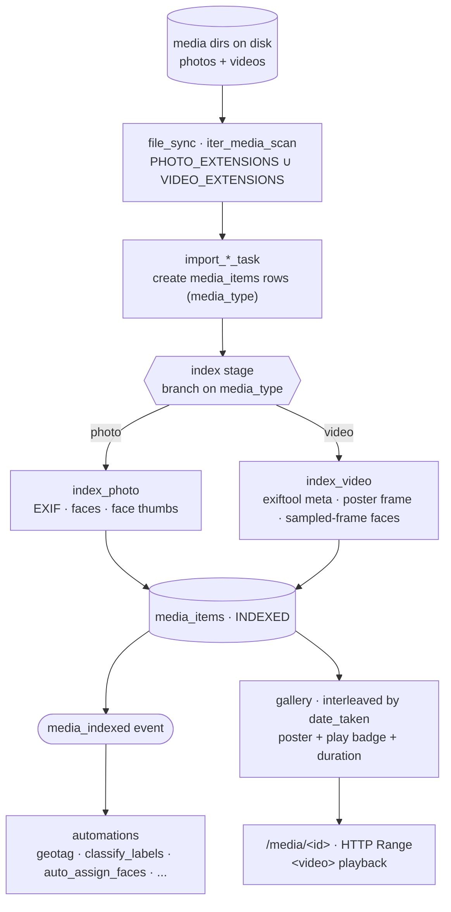

# Video Support — Design Reference

> **Status (2026-06-21): proposed, not built.** This doc plans first-class video
> support: importing, indexing, and playing back video files alongside photos.
> Nothing here is implemented yet. The one existing seam is `VIDEO_EXTENSIONS` in
> `yaffo/common.py` (defined, currently unused) — every other component below is
> photo-only today. This is the reference for the data model, the indexing
> pipeline, the impacted components, and the design decisions to settle before we
> build.
>
> **Approach:** the `Photo` model / `photos` table is renamed to **`MediaItem` /
> `media_items`**, a single table holding both photos and videos discriminated by
> `media_type`. This is a deliberate **breaking change** — acceptable here (side
> project, no prod/CI, no external API consumers). See *Design decisions*.

## Overview

Yaffo organizes a library of media by capture time, location, people (faces), and
labels. Today "media" means **photos**. Phones and cameras produce video in the
same folders, interleaved with photos on the same outings — so a library that
ignores video is missing half the trip. This feature makes a video a first-class
member of the library: it imports, gets a poster frame and metadata, shows in the
gallery interleaved by capture time, plays back in the browser, and participates
in the same favorite / tag / label / location machinery as a photo.

### Core principle: one `media_items` table, discriminated by `media_type`

The entire app is built around what is today the `Photo` entity. `Face`, `Tag`,
and `PhotoLabel` all foreign-key to it; automations operate on lists of ids;
`file_sync`, the gallery, favoriting, and metadata export are all centered on it.
Rather than build a parallel `Video` model and re-wire all of that, the existing
table is **renamed `photos` → `media_items`** (model `Photo` → `MediaItem`) and a
`media_type` column discriminates `"photo"` vs `"video"`. A video is just a
`media_items` row with `media_type = "video"` and a few video-only columns. The
shared columns (`date_taken`, `year`/`month`, `latitude`/`longitude`,
`location_name`, `device`, `favorite`, `status`, and the `faces`/`tags`/`labels`
relationships) carry over unchanged.

> The model controls *which kind of media* a row is (`media_type`); every feature
> that doesn't care about the difference treats it as a generic `MediaItem`.

This is a breaking rename rather than an additive one — chosen because it's a side
project with no prod data, CI, or external consumers to migrate, so the codebase
gets the honest name instead of a `Photo` misnomer. See **Design decisions**.



## Features (user-facing)

What the feature delivers, roughly in priority order. Phasing is in **Rollout**
below — not all of this lands at once.

1. **Import & index video.** Video files under the configured media dirs are
   discovered by `file_sync` / the watcher and imported like photos. Indexing
   extracts duration, resolution, codec, capture date, and GPS, and generates a
   **poster frame** (a representative still) for the gallery.
2. **Gallery integration.** Videos appear in the main gallery **interleaved with
   photos by `date_taken`**, rendered as their poster frame with a **play badge**
   and a **duration overlay** (e.g. `0:42`). No separate "videos" silo by default
   (a filter to show only videos is a nice-to-have).
3. **In-browser playback.** Clicking a video opens an HTML5 `<video>` player.
   Seeking/scrubbing works (requires HTTP Range support on the media route).
4. **Metadata & detail view.** The photo detail view shows video metadata
   (duration, resolution, codec, device, capture date, location/map).
5. **Location.** GPS embedded in the video is read at index time; the
   `assign_location_name` and `geotag_from_neighbors` automations apply to videos
   exactly as to photos (a GPS-less clip can borrow coordinates from a neighbor).
6. **Favorite / tags / metadata export.** Favoriting, manual tags, and writing
   tags back into the file all work on videos (subject to format support in the
   metadata writer — see **Impacted components**).
7. **Labels (classification).** The `classify_labels` automation runs CLIP on the
   **poster frame** (or a few sampled frames) so videos get content labels too.
8. **Faces (phase 2).** Detect faces on **sampled frames** so a person can be
   found in videos they appear in. Heavier and lower-precision than photo faces;
   deferred to its own phase.
9. **Duplicate detection (phase 2+).** Perceptual-hash the poster frame to catch
   duplicate clips; or defer (video dedup is lower value and noisier).

## Data model

### `media_items` table (renamed from `photos`)

The existing `Photo` model becomes `MediaItem` and the `photos` table becomes
`media_items`. Every existing column is kept; a `media_type` discriminator plus
video-only nullable columns are added.

| Column | Type | Notes |
|---|---|---|
| `media_type` | `String`, not null, default `"photo"` | `MEDIA_TYPE_PHOTO` / `MEDIA_TYPE_VIDEO`. Backfills to `"photo"` for every existing row. |
| `poster_path` | `String`, nullable | Path to the extracted poster-frame still (lives in `thumbnail_dir`, alongside face thumbnails). Photo rows leave this NULL and serve the original. |
| `duration_seconds` | `Float`, nullable | Video length. |
| `width` | `Integer`, nullable | Frame width (px). Could also be populated for photos later, but scoped to video here. |
| `height` | `Integer`, nullable | Frame height (px). |
| `video_codec` | `String`, nullable | e.g. `"h264"`, `"hevc"` — from exiftool. |

Notes:
- **Why columns on `media_items`, not a side table:** these are 1:1 with the row
  and always read together with it; a join would buy nothing. SQLite stores NULLs
  cheaply, so the unused columns on photo rows cost effectively nothing.
- **`full_file_path` stays the unique key** — points at the original video file
  (the `.mp4`/`.mov`), exactly as it points at the original image for photos. The
  unique constraint that protects re-imports (see the idempotency notes in
  `index_photo`) carries over for free.
- **`status`** reuses `IMPORTED → INDEXED`. No new states.

### Constants

```python
# yaffo/db/models.py
MEDIA_TYPE_PHOTO = "photo"
MEDIA_TYPE_VIDEO = "video"
```

`VIDEO_EXTENSIONS` already exists in `yaffo/common.py`:
```python
VIDEO_EXTENSIONS = {".mp4", ".mov", ".avi", ".mkv", ".wmv", ".flv", ".hevc"}
```
(Worth pruning to formats the browser can actually play and we can probe — see
**Open questions**.)

### Relationships & the rename's blast radius

The relationships are structurally unchanged — a face detected in a video frame is
just a `Face` row on a video `MediaItem` — but the rename ripples through names:

- **FK columns** `Face.photo_id`, `Tag.photo_id`, `PhotoLabel.photo_id` →
  `media_item_id`, all still pointing at the (renamed) table.
- **`PhotoLabel`** model → `MediaLabel` (`photo_labels` → `media_labels`). `Tag`,
  `Face`, `Person` keep their names.
- **Event payloads & automation host API** carry `photo_ids` today → renamed to
  `media_ids` for consistency. This is the widest blast: it touches `events.py`,
  every automation handler, the Starlark host API, and **any existing AI-generated
  custom automation that references `photo_ids`** — those scripts break. Accepted
  for consistency (breaking is cheap here); the rename must be reflected in
  `docs/development/automations.md` and the host-API reference so script authors see the new
  name.
- This is a **codebase-wide find/replace**, not a localized change: `Photo`,
  `photo_id`, `photos`, `photo_ids` appear across models, repositories,
  serializers/DTOs, routes, templates, the automations system, and tests. Doing it
  as one mechanical sweep (then fixing what the type checker/tests flag) is the
  sane path.

## Indexing pipeline

The import → index chord is reused wholesale; only the per-file **index step**
branches on media type.

- **Discovery** (`utils/file_sync.py::iter_media_scan`): the walk currently keeps
  files whose suffix is in `PHOTO_EXTENSIONS`. Extend to
  `PHOTO_EXTENSIONS ∪ VIDEO_EXTENSIONS`, and stamp `media_type` from the suffix
  when the `Photo` row is created.
- **Import** (`import_photo_task`): unchanged except it sets `media_type`. (Or a
  thin `import_media_task`; the body is identical — it just inserts rows.)
- **Index branch** (`index_photo_task`): dispatch on `media_type`:
  - `photo` → existing `index_photo()`.
  - `video` → **new `index_video()`** (`utils/index_video.py`):
    1. **Probe metadata** with `exiftool` (already a dependency): duration,
       width/height, codec, capture date, GPS. Map onto the same result dict shape
       `index_photo` returns (`date_taken`, `year`, `month`, `latitude`,
       `longitude`, `location_name`, `device`) plus the new video fields.
    2. **Extract a poster frame** via the chosen decoder (v1 leaning: OS-native —
       macOS AVFoundation/VideoToolbox; or ffmpeg if bundled) at a fixed offset or
       the middle, write it to `thumbnail_dir`, store `poster_path`. See *Design
       decisions: Frame extraction & codecs*.
    3. **Faces (phase 2):** sample N frames (keyframes or every K seconds), run the
       existing InsightFace `detect_faces` on each, dedupe, and emit `faces_data`
       with face-crop thumbnails — same downstream as photos.
  - The DB-write half of `index_photo_task` is largely shared: it already sets
    metadata fields and inserts faces. The **idempotency guard we added**
    (`clear_faces_for_photos` → delete-then-insert + post-commit thumbnail unlink)
    should also clear the **poster** on re-index so a requeued video index doesn't
    leak stale posters.
- **Events:** `index_video` finishing emits the same `photo_indexed` event, so
  every subscribed automation fires for videos with no change.

## Playback & serving

- **New route `/media/<int:media_id>`** (or extend `/photos/<id>`) that streams the
  original file with **HTTP Range support** so `<video>` seeking works. Flask's
  `send_file` supports conditional/range responses, but this needs verifying for
  large files and partial requests — byte-range is the one genuinely new serving
  requirement.
- **Poster serving:** the gallery `` for a video points at `poster_path`
  (served like a face thumbnail), not the multi-MB original.
- **Content types:** serve with the right `Content-Type` (`video/mp4`, etc.). Only
  browser-playable codecs (H.264/AAC in MP4/MOV) play inline; others would need
  transcoding (explicitly **out of scope** for v1 — see Open questions).

## Impacted components

| Component | Change |
|---|---|
| **Codebase-wide rename** | `Photo`→`MediaItem`, `photos`→`media_items`, `*.photo_id`→`media_item_id`, `PhotoLabel`→`MediaLabel`. Sweeps models, repositories, serializers/DTOs, routes, templates, automations, tests. (See *Relationships & blast radius*.) |
| `yaffo/common.py` | `VIDEO_EXTENSIONS` already there; prune to supported set. |
| `yaffo/db/models.py` | Rename model to `MediaItem`/`media_items`; add `media_type` + video columns + `MEDIA_TYPE_*` constants. |
| `scripts/db/` (init + dev migration) | Rename table, add columns, backfill `media_type="photo"`, rename child FKs. |
| `yaffo/utils/file_sync.py` | `iter_media_scan` includes video extensions; set `media_type`. |
| `yaffo/utils/index_video.py` *(new)* | Metadata (`exiftool`) + poster frame (OS-native decode: macOS AVFoundation/VideoToolbox) + (phase 2) frame faces. ffmpeg only if bundled. |
| `yaffo/background_tasks/tasks/index_photo.py` | Branch on `media_type`; clear poster on re-index. |
| `yaffo/routes/photos.py` | New range-enabled `/media/<id>`; poster serving; detail view shows video meta. |
| Gallery templates / JS | Render poster + play badge + duration; open `<video>` player. |
| Photo detail template | Video metadata block; map still works (GPS shared). |
| `yaffo/utils/write_metadata.py` | Tag write-back for video containers (exiftool supports MP4/MOV; verify favorites/keywords). Skip cleanly for unsupported formats. |
| `classify_labels` automation | Run CLIP on poster/sampled frames instead of the original file. |
| `find_duplicates` / `remove_duplicates` | Phase 2: phash the poster, or exclude videos from dedup. |
| Packaging (PyInstaller `.app`) | v1 leaning needs **no new binary** (OS-native decode + bundled `exiftool`). Only if ffmpeg is chosen (transcoding): bundle an LGPL build + its license/credits. See *Design decisions: Frame extraction & codecs*. |
| Settings / thumbnail-stats | Posters live in `thumbnail_dir`; stats/orphan-cleanup should account for them. |

## Design decisions

### One `media_items` table vs. a separate `Video` model

**Chosen: rename `photos` → `media_items` and discriminate with `media_type`.**

- **For:** every downstream feature (faces, tags, labels, automations, gallery,
  favorite, `file_sync`, export, the `media_indexed`/`media_modified` events) is
  keyed to the one media entity. Reusing it means those features work on video
  with little to no change. A separate `Video` table would force parallel FKs on
  `Face`/`Tag`/`MediaLabel` (or a polymorphic association), duplicate the gallery
  and automation wiring, and double the `file_sync` and routing logic — directly
  against the codebase's DRY ethos.
- **Against:** it's a breaking, codebase-wide rename, and every photo row carries
  a few always-NULL video columns. The NULL columns are free in SQLite; the rename
  is mechanical churn but a one-time cost — and it's acceptable precisely because
  this is a side project with **no prod data, CI, or external API consumers** to
  migrate. The payoff is an honest name (`MediaItem`) instead of a `Photo`
  misnomer everywhere.
- **Alternative (rejected):** keep the additive route — leave the table named
  `photos`/`Photo` and just add `media_type`. Zero rename churn, but it bakes the
  misnomer in permanently. Rejected *because* breaking changes are cheap here, so
  there's no reason to carry the wrong name.
- **Alternative (rejected):** a `media_items` base with `photos`/`videos` subtype
  tables (joined-table inheritance). Cleaner taxonomically, far more surface area,
  and SQLAlchemy polymorphic loading adds complexity the code doesn't use anywhere
  else.

### Poster frame as the universal still

A video's `poster_path` is the single image that stands in for it everywhere a
photo would show its pixels: gallery thumbnail, CLIP labeling input, (phase 2)
duplicate hashing. This keeps "show me this media as an image" a uniform
operation and avoids special-casing video in the gallery and the label pipeline.

### Frame extraction & codecs: app-managed ffmpeg vs. OS-native decode

Getting a poster frame (and probing metadata) needs a video decoder. Python has no
native one, so there's a real dependency decision here — and it gates Phase 1. Two
*separate* concerns get conflated as "ffmpeg licensing"; keep them apart.

**(a) FFmpeg's own copyright license — the easy part.** FFmpeg is **LGPL 2.1+** by
default; it becomes **GPL** if built with GPL-only components (x264/x265 encoders,
some filters). The big mitigator: we'd invoke `ffmpeg`/`ffprobe` as a **separate
CLI subprocess**, not link the libraries into our process. Calling a separate
executable is "mere aggregation," not a derivative work — so even a GPL build's
copyleft does **not** reach our application code. We'd still owe the redistribution
duties for the downloaded binary itself: store FFmpeg's `COPYING`/`LICENSE`, credit
it in an acknowledgements screen, and link the exact source/build. Use an **LGPL
build** to keep even that minimal.

**(b) Codec patents — the actual landmine, and independent of (a).** The LGPL/GPL
grants **no patent rights**. The codecs are patent-encumbered: **H.264/AVC**
(MPEG-LA pool; royalty-free tiers exist, esp. for decode in a free product) and
**H.265/HEVC** (three pools + unpooled holders — aggressive and murky). Bundling
our *own* decoder for these is, in principle, taking on those codec licenses; we
do **not** inherit Apple's/Microsoft's OS-level codec license just by running on
their OS. HEVC is the real exposure since it's exactly what newer iPhones produce.

**Chosen direction (v1): decode through the OS, skip bundling ffmpeg.** For the v1
need — decode the user's *own* files + grab a poster frame — the macOS path is
**AVFoundation / VideoToolbox** (the system already holds licensed H.264/HEVC
decode; the in-app `<video>` tag plays via the OS for the same reason), and
metadata comes from **`exiftool`** (already a dependency — covers duration,
dimensions, codec, date, GPS). That combination potentially ships v1 with **no
bundled ffmpeg at all**, dodging both the license churn *and* the patent exposure.

- **Cost:** a platform-specific frame-extraction path. The other target is Windows
  (Media Foundation is the equivalent), so "OS-native" means two implementations.
- **When ffmpeg becomes worth bundling:** **transcoding** non-playable codecs
  (Phase 3) or wanting one cross-platform code path. At that point bundle an LGPL
  build via subprocess and re-open the patent question for *encode*.

So Open Question #1 is really this fork: **OS-native decode + exiftool** (no
bundle, platform-specific, macOS-first) vs. **bundle ffmpeg** (one codepath, LGPL
license easy via subprocess, but codec-patent exposure + ~70–100 MB binary).

### Faces on sampled frames, deferred

Photo face detection runs once per image. Video needs to sample frames, which is
heavier, noisier, and raises dedup-across-frames questions. It reuses the same
InsightFace path and `Face` schema, so it's additive — but it's deferred to its
own phase so the core import/playback feature can ship first.
