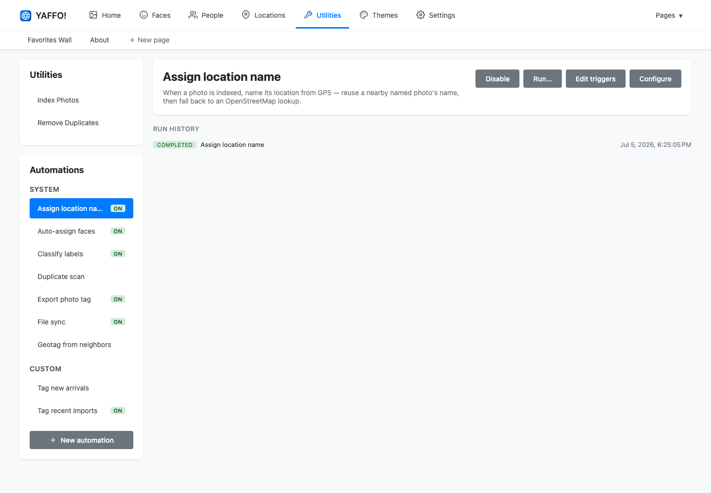

# Automations

Automations are background behaviors that run on their own — either on a schedule
or in response to something happening, such as a photo being indexed. They are how
Yaffo keeps a library tidy without you clicking through the same steps by hand.

Open **Utilities** → **Automations**.

The sidebar lists automations in two groups, **System** and **Custom**. Select
one to see its description, actions, and run history on the right. A green **ON**
badge marks the ones that are currently enabled.

## System Automations

System automations ship with Yaffo and cover its routine upkeep. They can be
enabled, disabled, and tuned, but not deleted. They include:

- **Assign location name** — names a photo's location from GPS when it is indexed.
- **Auto-assign faces** — assigns new faces to people that already match.
- **Classify labels** — runs label classification on new photos.
- **Duplicate scan** — looks for duplicate photos.
- **Export photo tag** — writes selected tags back to photo metadata.
- **File sync** — keeps the index in step with your media folders.
- **Geotag from neighbors** — fills in missing GPS from nearby photos taken close
  in time.

Select a system automation to **Enable** or **Disable** it, **Run…** it on
demand, **Edit triggers**, or **Configure** its tunable settings (for example, a
similarity threshold).

## Create an Automation

Click **New automation** to build your own. Give it a name, then describe what it
should do in plain language — *"tag every photo imported in the last day as New
arrival"* — and the assistant writes the automation for you.

While you build it, your work is a draft:

- **Publish draft** makes the draft the live version that actually runs.
- **Discard** throws the draft away.

Use **Edit details** to change the name or description, and **Delete** to remove a
custom automation.

## Test Before Publishing

Before you turn a custom automation loose on your whole library, try it on a small
part of it. Click **Test…** in the editor and pick a file or folder.

The test is a safe dry-run:

- It runs the automation against only the indexed photos at or under the path you
  chose.
- It shows what the automation *would* do — such as which photos it matched —
  without actually changing anything.
- Nothing is written and no run is recorded in the automation's history.

You can test either the working **draft** or the currently **published** code, so
you can check a change before publishing it. Once the results look right, use
**Publish draft** to make it live.

## Triggers: When an Automation Runs

An automation does nothing until it has a trigger. Open **Edit triggers** to add
one — or several:

- **Schedule** — run on a repeating clock, set with a cron expression (for
  example, every night at 2 AM). Yaffo validates the expression as you type.
- **Event** — run when something happens in Yaffo, such as a photo being indexed.

An automation with no triggers stays idle until you add one.

## Run and Review

You can run an automation yourself with **Run now** (or **Run…** for options),
which is handy for testing or one-off cleanups.

Every run — scheduled, event-driven, or manual — is recorded under **Run
history**, with a status such as **COMPLETED** and a timestamp. If an automation
misbehaves, check its run history first to see what happened and when.

## Related

Several system automations power features documented elsewhere:

- [Labels and Auto-Classification](../organize-review/labels.md) — Classify labels.
- [Locations & Map](../organize-review/locations.md) — Assign location name and
  Geotag from neighbors.
- [Finding Duplicates](../organize-review/duplicates.md) — Duplicate scan.

Tunable defaults for system automations also appear in the
[Settings Reference](../reference-maintenance/settings.md).
