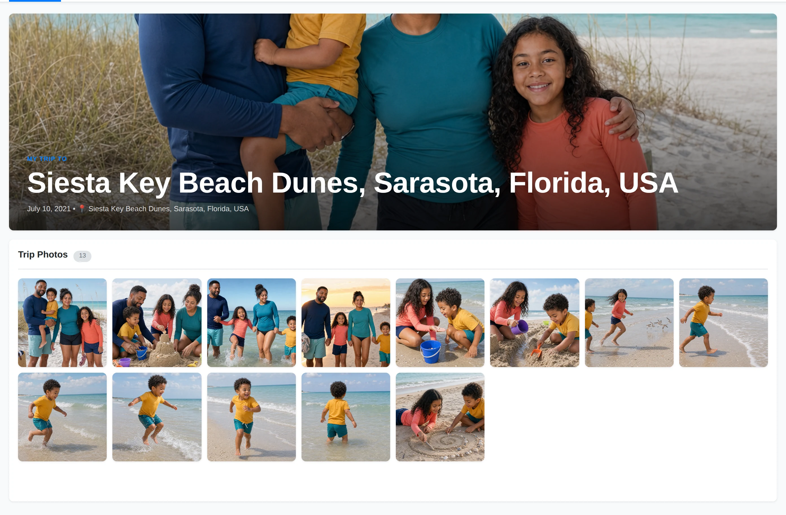
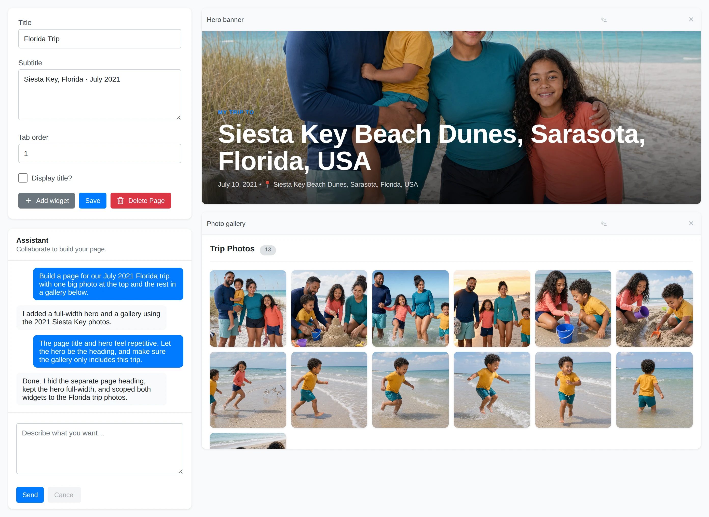

# Custom Pages

Custom pages turn library data into your own dashboards, trip stories, maps,
galleries, and other presentations. Each page appears on the **Pages** strip
below the main navigation.

## Create a Page

Click **+ New page** on the Pages strip. Yaffo creates an **Untitled Page**
immediately and opens its design view.

The left editor contains:

- **Title** and optional **Subtitle** fields;
- **Tab order**, which sets the page's position among other custom-page tabs;
- **Display title?**, which controls whether presentation mode adds a separate
  page heading above the widgets;
- **Add widget**, **Save**, and **Delete Page** actions;
- the **Assistant** conversation.

The canvas on the right is a responsive 12-column grid. Click **Save** to commit
page settings and manual layout changes. A page with no saved widgets keeps
opening in design mode; a page with widgets opens in presentation mode.

## Work with Widgets

A widget is an independently rendered block with its own title, data request,
layout, and presentation code. Widgets run in isolated frames. Yaffo validates
and resolves their library queries on the server, so generated widget code does
not receive direct database or network access.

Click **Add widget** to add a blank widget manually. Use its pencil to rename it,
drag its header to move it, drag its resize handle to change its size, or click
**×** to remove it after confirming. The blank widget has no generated content;
use the Assistant when you want Yaffo to design a functional widget.

The Assistant can use or adapt these built-in widget patterns:

- **Hero banner** — a full-width focal image and heading;
- **Photo grid** — a simple responsive thumbnail grid;
- **Photo gallery** — a polished gallery with captions and a lightbox;
- **Library stats** — photo, people, and year summary tiles;
- **Featured photo** — one full-bleed image with a caption;
- **Filterable gallery** — a gallery with its own year filter;
- **People** — person selectors and their associated photos;
- **Photo map** — an interactive map of geotagged photos;
- **Filter controls** and **Linked gallery** — a connected pair where filters
  update one or more galleries;
- **Photo picker** and **Photo spotlight** — a connected selector and featured
  photo pair;
- **Folder picker** and **Folder gallery** — a connected folder browser and
  gallery pair.

This catalog gives the Assistant reliable starting points; it can combine,
filter, restyle, or create other widget designs for your request.

## Generate and Refine a Page

AI generation requires a configured provider and API key under **Settings** →
**AI Generation**.

1. Describe the page or widget in the Assistant box and click **Send**.
2. Yaffo creates a durable working version and starts generation in the
   background.
3. While generation is running, the grid, Add widget, and Send controls are
   locked. The elapsed timer and conversation show progress. **Cancel** discards
   the working version after confirmation.
4. When generation succeeds, the grid unlocks so you can review, move, resize,
   rename, or request follow-up changes.
5. Click **Save** to publish the ready version.

Closing or reloading the browser does not discard an active generation because
the working version is stored by Yaffo. If generation fails, the draft becomes
editable for a retry or follow-up; it is not published automatically.

## Present and Edit a Page

Presentation mode shows the published version in a static grid without editing
controls. If **Display title?** is enabled, the page title and subtitle appear
above the grid. A widget can also provide its own heading, as the seeded Florida
Trip page does.

Open a page from the Pages strip. When its tab is active in presentation mode,
click the pencil beside the tab to return to design mode.

Manual changes to the published page remain in the browser until **Save**. AI
changes remain in a separate working version until **Save** publishes them. This
keeps a partially generated draft from replacing the current presentation.

## Delete a Page

Open design mode and click **Delete Page**. Yaffo asks for confirmation and names
the page that will be removed. Deleting a page removes its versions, widgets, and
conversation, then removes its tab from the Pages strip.

For how custom pages fit alongside filters, favorites, albums, and tags, see
[Organizing Photos](../library-basics/organizing-photos.md). To restyle the whole
app, including custom pages and widgets, see [Themes](themes.md).
