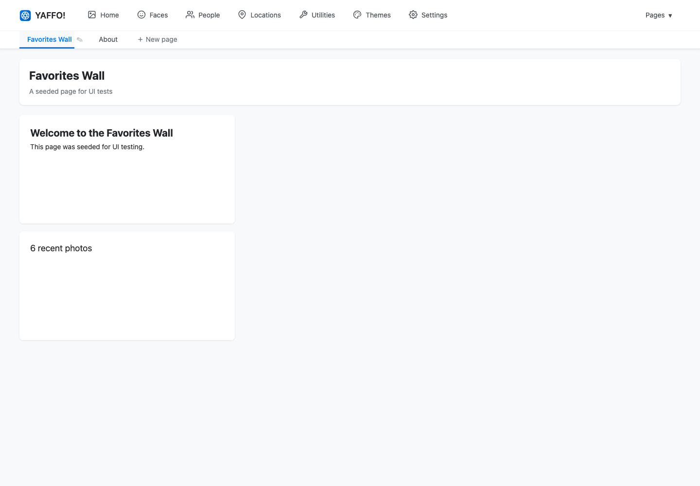
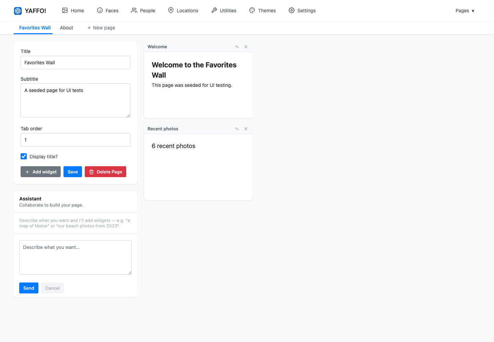

# Custom Pages

Custom pages let you build your own views of the library and pin them to the top
navigation, next to **Home**, **Faces**, and the rest. Instead of laying out a
page by hand, you describe what you want and an assistant drafts the building
blocks — **widgets** — for you.

## Create a Page

Click **+ New page** in the top navigation. Yaffo creates an empty page and opens
it in the design view, where you can name it and start adding content.

The design view has three parts:

- **Page settings** (left) — the **Title**, an optional **Subtitle**, a
  **Tab order** number that sets where the page sits in the navigation, and a
  **Display title?** toggle. Click **Save** to keep changes, or **Delete Page**
  to remove the page entirely.
- **The Assistant** (left, below settings) — where you describe the widgets you
  want.
- **The grid** (right) — where your widgets live and can be arranged.

## Work with Widgets

A widget is a single block on the page — a heading, a wall of photos, a map, a
list of people, and so on.

To add one, type a description into the **Assistant** and click **Send**. For
example:

- *a polaroid wall of our Maine trip in summer 2023*
- *a map of everywhere we took photos this year*
- *my six most recent favorites*

The assistant drafts a widget and drops it onto the grid. You decide how it
looks; Yaffo always fills in the actual photo data from your library, so a widget
only ever shows media you already have.

Once widgets are on the grid you can:

- **drag** a widget to move it;
- **resize** a widget by its edges;
- **remove** a widget with the **×** on its header;
- keep the conversation going to add more widgets or refine existing ones.

Click **Save** when the layout looks right.

## Publish and Present

The page you see while designing is a working draft. Yaffo keeps your published
page separate from in-progress edits, so anyone viewing the page always sees the
last version you published — not a half-finished change.

When you are happy with the draft, publish it. The page then appears as a tab in
the top navigation (and in the **Pages** menu) for everyone using your library.
You can reopen the design view at any time to keep iterating; your live page
stays untouched until you publish again.

Custom pages are one of several ways to organize a library. For how they fit
alongside filters, favorites, and tags, see
[Organizing Photos](../library-basics/organizing-photos.md). To restyle the whole
app, including your custom pages, see [Themes](themes.md).
