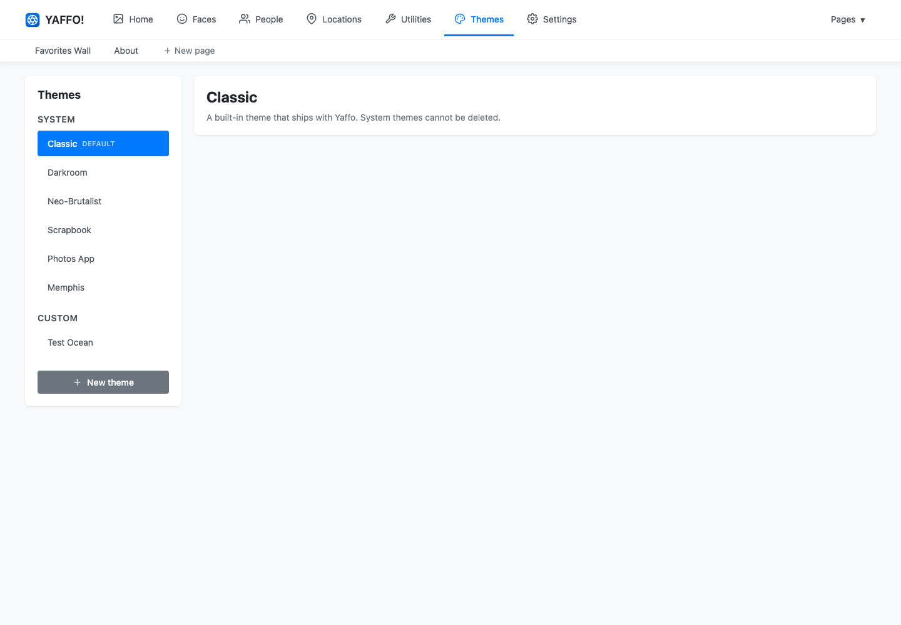
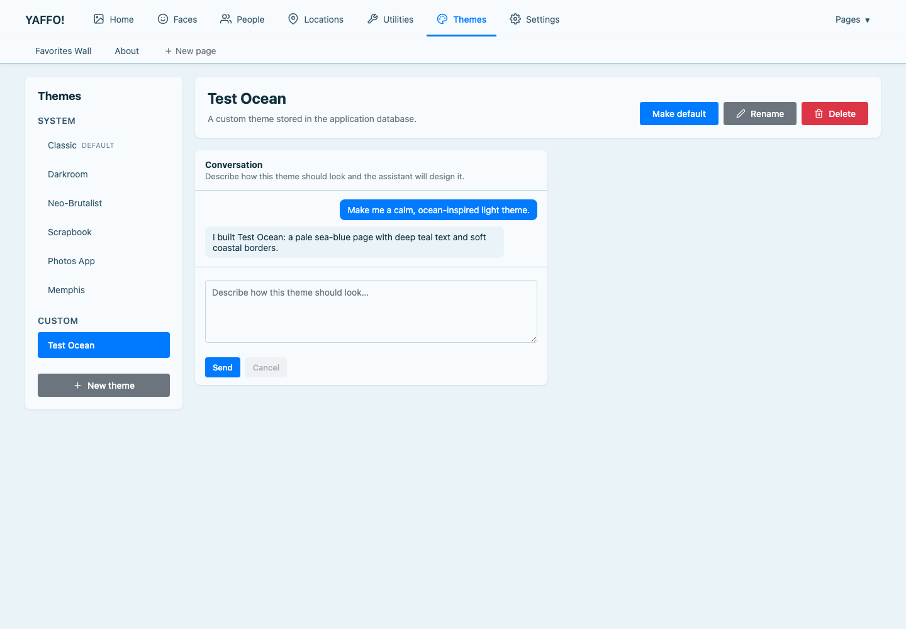

# Themes

A theme controls how Yaffo looks — colors, typography, spacing, and borders.
Yaffo ships with several themes, and you can design your own by describing the
look you want.

Open **Themes** from the top navigation.

## Choose a Theme

Themes are grouped into two sections:

- **System** themes ship with Yaffo — **Classic**, **Darkroom**,
  **Neo-Brutalist**, **Scrapbook**, **Photos App**, and **Memphis**. They can be
  used and copied from, but not deleted.
- **Custom** themes are the ones you create.

Select a theme to preview it, then click **Make default** to apply it across the
whole app. The current default is marked in the list.

## Create a Theme

Click **New theme** and give it a name, such as `Midnight`, `Pastel`, or
`Forest`. A new theme starts from the Classic look, and you shape it through a
conversation.

In the **Conversation** panel, describe how the theme should look and click
**Send**. For example:

- *a calm, ocean-inspired light theme*
- *high-contrast dark mode with warm accents*
- *soft pastel palette with rounded corners*

The assistant redesigns the theme and the page updates so you can see the result.
Keep the conversation going to refine it — adjust colors, contrast, or spacing
until it feels right.

## Publish, Rename, and Delete

While you are editing, your changes are a working draft layered over the last
published version:

- **Publish** applies the draft so it becomes the theme everyone sees.
- **Discard** throws the draft away and returns to the last published version.

From a theme's editor you can also:

- **Make default** — apply the theme across the app.
- **Rename** — change the theme's name. Renaming also updates the theme's web
  address, so any saved links to it will change.
- **Delete** — remove a custom theme. System themes cannot be deleted.

Themes apply everywhere, including your [Custom Pages](custom-pages.md).
