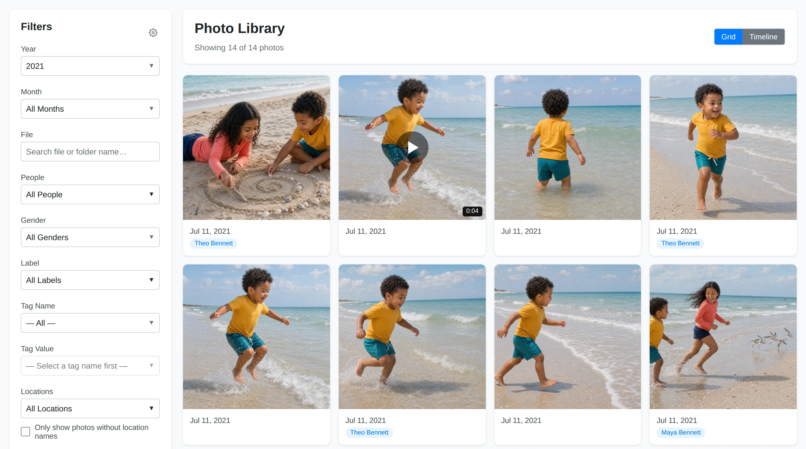
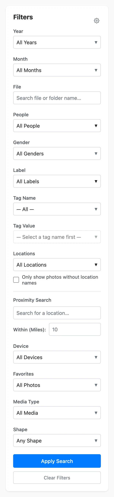

# Browsing, Filtering, and Search

The **Home** page is the main photo library view. It shows indexed photos and
videos as a grid, with filters on the left.

## Browse the Gallery

Each card represents a photo or video in your indexed library. The gallery is
ordered by date, with the newest media first.

Use the gallery to:

- scan recent photos quickly;
- open a photo or video detail page;
- spot videos by their video card controls;
- review dates and visible people at a glance;
- move through large libraries with pagination.

Click a card to open the media detail page.

## Use the Filter Sidebar

The filter sidebar narrows the gallery to matching media.

Common filters include:

- **Year** and **Month:** find media from a time period.
- **File:** search by file or folder name.
- **People:** show photos containing one or more people.
- **Gender:** filter by detected or assigned face gender metadata when present.
- **Label:** filter by automatic classification labels.
- **Tag Name** and **Tag Value:** filter by custom tags.
- **Locations:** filter by assigned location names.
- **Only show photos without location names:** find GPS-backed photos that still
  need a location name.
- **Proximity Search:** find photos near a place.
- **Device:** filter by camera or device metadata.
- **Favorites:** show only favorited media.
- **Media Type:** show photos only or videos only.

Click **Apply Search** to update the gallery.

## Match Any or All

Some filter groups let you choose how multiple selected values are matched.

Use **any** when a photo can match at least one selected value. For example,
photos containing Alice or Bob.

Use **all** when a photo must match every selected value. For example, photos
containing both Alice and Bob.

Not every filter benefits from **all** matching. A photo has only one assigned
location name, so selecting all locations is treated like any matching.

## Clear Filters

Click **Clear Filters** to return to the unfiltered gallery.

If a filter result looks empty, clear filters first. Then reapply one filter at a
time to see which condition narrowed the results.

## Configure the Sidebar

Click the filter configuration button in the sidebar header to choose which
filter groups are visible. This is useful if you mostly use a smaller set of
filters.

Filter layouts are page-specific. Changing the gallery sidebar does not
necessarily change the Locations map sidebar.

## Useful Searches

Try these common patterns:

- **Find videos:** set **Media Type** to **Videos Only**.
- **Find photos from a year:** choose a **Year**, then apply filters.
- **Find unnamed locations:** enable **Only show photos without location names**.
- **Find photos from one camera:** choose a **Device**.
- **Find classified photos:** choose one or more **Label** values.
- **Find custom organization:** choose a **Tag Name**, then a **Tag Value**.

## When Results Look Wrong

If expected photos are missing:

- confirm the files have been indexed;
- clear filters and try again;
- check whether the filter is set to **all** instead of **any**;
- make sure the relevant people, labels, tags, or locations have been assigned;
- run **Utilities** → **Index Photos** if files were recently added or moved.
