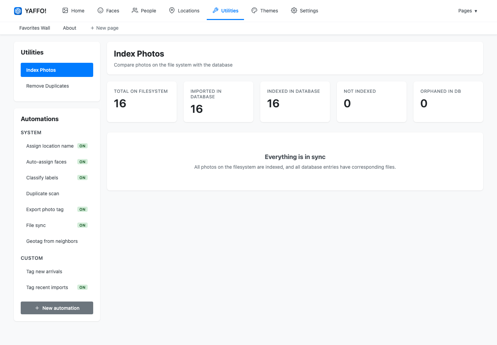

# Indexing & Library Management

Indexing is how Yaffo learns what photos and videos are in your library. Yaffo
does not move your originals into a special folder. Instead, you choose media
folders, and Yaffo builds a local index from those files.

## Add Media Folders

Open **Settings** and add one or more media directories. These are the folders
Yaffo scans for photos and videos.

Use folders that contain your actual library, such as:

- a Pictures folder;
- a camera import folder;
- an external drive folder;
- a folder synced from another device.

Yaffo stores its own database, thumbnails, logs, and temporary files separately
from these media folders. Removing a folder from Yaffo's settings removes it
from future scans; it does not delete the folder from disk.

## Scan the Library

Go to **Utilities** → **Index Photos**. Yaffo compares the configured media
folders with the local database.

The page shows several counts:

- **Total on Filesystem:** media files found in your configured folders.
- **Imported in Database:** files already known to Yaffo.
- **Indexed in Database:** files already processed for browsing and metadata.
- **Not Indexed:** files found on disk but not yet indexed.
- **Orphaned in DB:** database records whose files are no longer present.

Scanning is a read-only comparison step. It tells you what needs to be synced.

## Sync New or Changed Files

When the scan finds work to do, click **Sync Database**. Yaffo starts background
jobs to import new files, remove orphaned database records, and process media.

During indexing, Yaffo may:

- create thumbnails;
- read dates, camera metadata, and GPS metadata;
- detect faces;
- run automatic labels;
- prepare video posters or metadata;
- update searchable fields used by filters.

Large libraries can take time. You can keep using the app while background jobs
run.

## Watch Background Jobs

Yaffo shows active indexing work as job cards. A job card may show progress and a
cancel control when cancellation is available.

If you close the browser tab, the app and its background worker can continue
running as long as Yaffo itself is still running. Use the Yaffo tray/menu icon to
reopen the app or quit it.

## Re-Index After Changes

Yaffo has two automatic ways to notice library changes while the app is running:

- A watcher process monitors configured media directories and reacts when files
  are added, changed, or removed.
- A background sync job runs about once an hour and performs the same kind of
  folder-to-database reconciliation as the manual sync.

These automatic checks are useful for normal day-to-day changes, such as copying
new photos into a watched folder.

You can still run the indexing utility manually whenever you want an immediate
check. Manual sync is useful when you:

- add new photos or videos to a configured folder;
- remove files from a configured folder;
- add another media directory;
- move a library folder;
- want Yaffo to clean up orphaned database records.

Some operations, such as changing the automatic label vocabulary, have their own
reprocessing controls. Use the indexing utility for file-system changes or when
you do not want to wait for the watcher or hourly sync.

## Supported Media

Yaffo is designed for photo and video libraries. Exact format support depends on
the image, video, and metadata tools bundled with the app. Common photo formats
and browser-playable videos are the safest choices.

If a file does not appear after indexing, check that:

- the folder is configured in Settings;
- the file is inside that folder;
- the file extension is a supported media type;
- Yaffo has permission to read the folder;
- indexing has finished.
