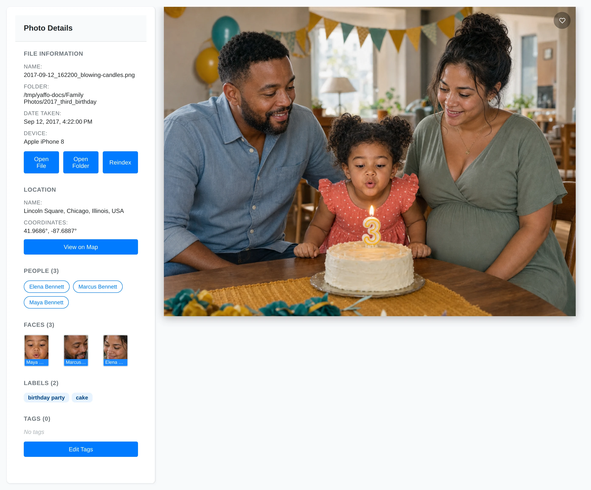

# Photo Details

The photo detail page is where you review one photo or video closely. Open it by
clicking a card in the gallery.

## Review the Preview

The main area shows the selected photo or video.

For photos, Yaffo shows the image and can draw face highlights when you hover
over detected face thumbnails in the sidebar.

For videos, Yaffo shows an in-browser player when the format is playable. If the
video format cannot play in the browser, Yaffo shows the poster image and offers
an **Open in default player** action.

## Read File Information

The **File Information** section shows the file name and folder. When available,
it also shows:

- date taken;
- camera or device;
- video duration;
- video resolution;
- video codec.

Use this section when you need to confirm which original file you are looking
at.

## Open the Original File or Folder

Use **Open File** to open the original media file with your operating system's
default app.

Use **Open Folder** to open the folder that contains the original file.

These actions use your local operating system. If the file or folder no longer
exists, Yaffo shows an error instead of opening it.

## Reindex One Item

Use **Reindex** when the selected file's metadata, thumbnail, labels, or detected
faces need to be rebuilt. Reindexing rereads the original file and detects its
faces again. Existing face-to-person assignments for this item are removed, so
Yaffo asks you to confirm before starting the background job.

## Mark a Favorite

Use the heart button on the preview to toggle favorite status. Favorites can be
used later in gallery filters.

Favorite status is stored in Yaffo's database. If the **Export photo tag**
automation's favorite option is enabled, Yaffo also writes a `Favorite` keyword
to the file.

## Review Location Information

The **Location** section shows a location name when one has been assigned. If the
photo has GPS coordinates, it also shows the coordinates and a **View on Map**
link.

If the page says **No location information**, Yaffo does not have GPS coordinates
or a location name for that media item.

Use the [Locations & Map](../organize-review/locations.md) guide for assigning
or clearing location names in bulk.

## Review People and Faces

The **People** section lists people assigned to faces in the photo. Click a
person to open that person's face page.

The **Faces** section shows detected face thumbnails. Hover over a face thumbnail
to highlight that face in the main photo when face coordinates are available.
Click a face thumbnail to open the reassignment control, then choose a person and
apply the change.

Use the [Faces & People](../organize-review/faces-and-people.md) guide for
assigning, correcting, and reviewing people.

## Review Labels

The **Labels** section shows automatic classification labels that Yaffo assigned
to the media item. Label chips include confidence information in their tooltip.

Labels are read-only on this page. Manage the label vocabulary and reclassify
photos from Settings. See [Labels and Auto-Classification](../organize-review/labels.md).

## Edit Tags

The **Tags** section shows user-editable tags.

Click **Edit Tags** to open the tag editor. In the editor, you can:

- add a tag name and optional value;
- edit existing tag names or values;
- remove tags;
- save all tag changes at once.

Every tag must have a name. Values are optional.

## Keyboard Shortcut

Press **Escape** to go back when the detail page was opened from another Yaffo
page.
