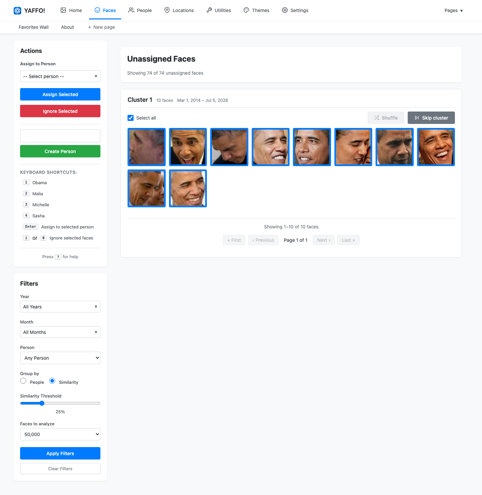
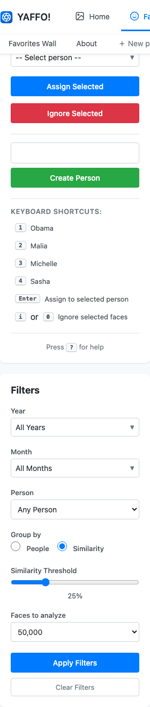
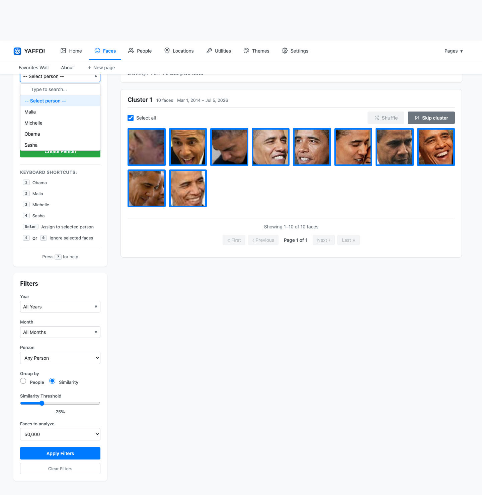
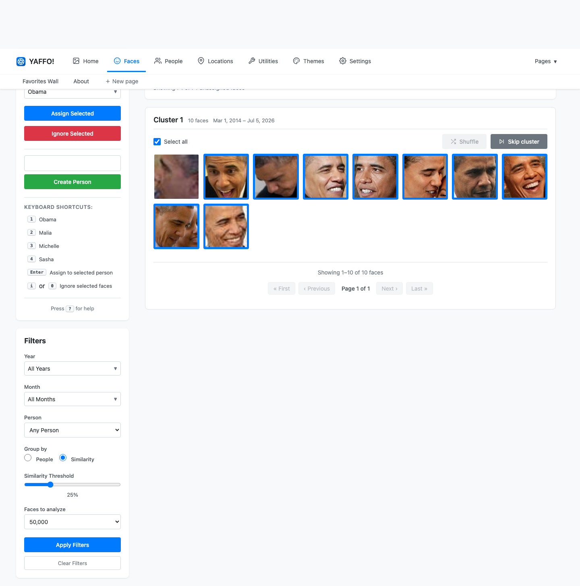
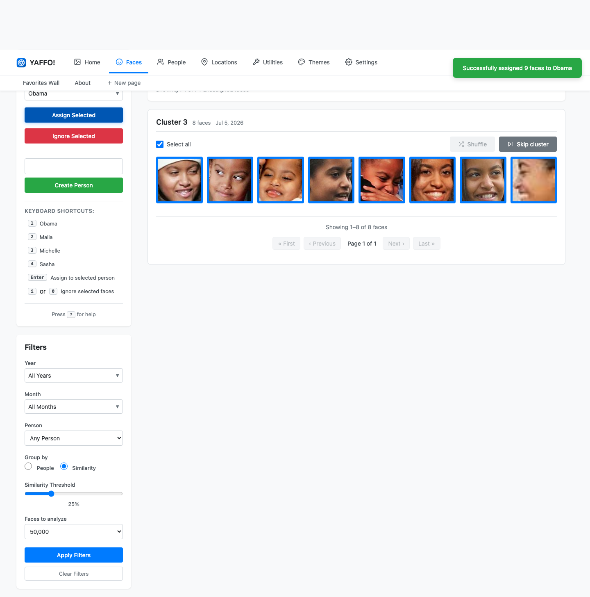
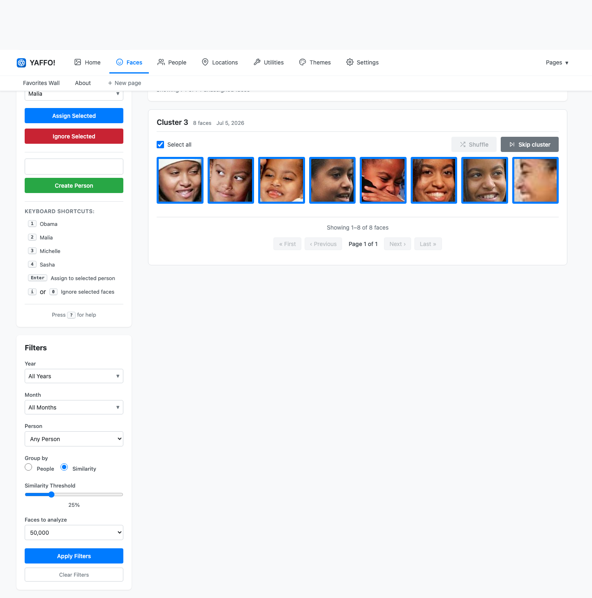
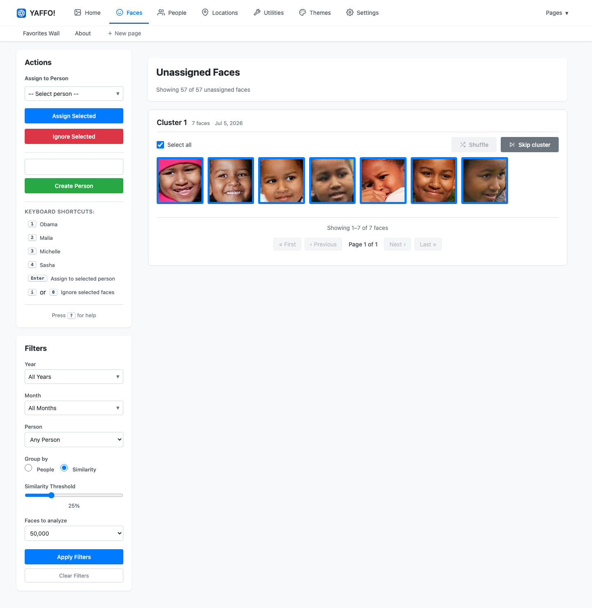

# Assigning Faces

This page walks through the day-to-day workflow of clearing the pile of
unassigned faces by assigning clusters of faces to people. For background on how
Yaffo detects faces and what people are, see
[Faces & People](faces-and-people.md).

## Open the Faces Page

Open **Faces** from the top navigation. The page has two parts:

- The **main area** shows one cluster of unassigned faces at a time.
- The **sidebar** holds the **Actions** panel (assign or ignore faces, create a
  person) and the **Filters** panel (how faces are grouped).

The header reports how much work is left, for example
*Showing 74 of 74 unassigned faces*.

## Choose How Faces Are Grouped

Use the **Filters** panel to control grouping before you assign anything.

- **Group by** — **Similarity** clusters visually similar unassigned faces
  together, which is the best way to make a first pass. **People** instead
  matches faces to people you already have.
- **Similarity Threshold** — how strict grouping is. Higher values make tighter,
  cleaner groups; lower values make larger, looser ones. The screenshots here
  use a low threshold of **25%**, which pulls each person's faces into one big
  cluster so you can assign a lot at once.
- **Faces to analyze** — how many unassigned faces to pull in and cluster at a
  time.

## Assign a Cluster

With a cluster in front of you, assign it in three steps.

**1. Pick the person.** Choose someone from **Assign to Person**. The selector is
searchable, so you can type to filter a long list.

**2. Refine the selection.** Every face in the cluster starts selected (a blue
border). Click any face that does not belong to remove it from the assignment —
blurry, partial, or clearly-different faces. Here the first face, a low-quality
partial, has been deselected.

**3. Assign.** Click **Assign Selected**. Yaffo confirms the assignment and moves
straight to the next cluster so you can keep going.

## Work Through Multiple Clusters

Because Yaffo advances automatically, review is a rhythm: assign the current
cluster, then assign the next one — usually a *different* person.

Each assignment removes those faces from the pile. After clearing two clusters
here, the unassigned count has dropped from 74 to 57, and the next person's
cluster is ready.

Two buttons on each cluster help you keep moving:

- **Skip cluster** leaves the cluster unassigned and jumps to the next one.
- **Shuffle** swaps in a different sample of faces from the same cluster, useful
  for large clusters where only some faces are shown at once.

## Quick Assignment

Once a cluster is obviously one person, you can assign it without touching the
sidebar:

- **Assign to _Name_** buttons appear on a cluster when Yaffo already has a
  strong guess. Click one to assign the whole selected group in a single step.
- **Keyboard shortcuts** speed up repeated assignment. The sidebar lists a number
  key for each of your top people; select faces and press that number to assign
  them. Other shortcuts:
    - **Shift + Click** — select a range of faces.
    - **Enter** — assign selected faces to the chosen person.
    - **i** or **0** — ignore selected faces.
    - **?** — open the on-page help.

## Ignore Faces

Not every face is worth keeping. Select the faces you don't want and click
**Ignore Selected** for:

- blurry or partial faces;
- background or incidental faces;
- false detections;
- people you don't want to track.

Ignoring a face removes it from the review pile without assigning it to anyone.
It does not affect the original photo.

## Refresh Between Passes

When the biggest clusters are gone and only loose, mixed groups remain, reload
the page. Yaffo re-clusters the remaining unassigned faces into tighter, cleaner
groups for the next pass. Lowering the **Similarity Threshold** further can also
pull the stragglers together. As your catalog of people grows, a background task
also assigns obvious matches on its own, so the pile keeps shrinking even between
review sessions.
