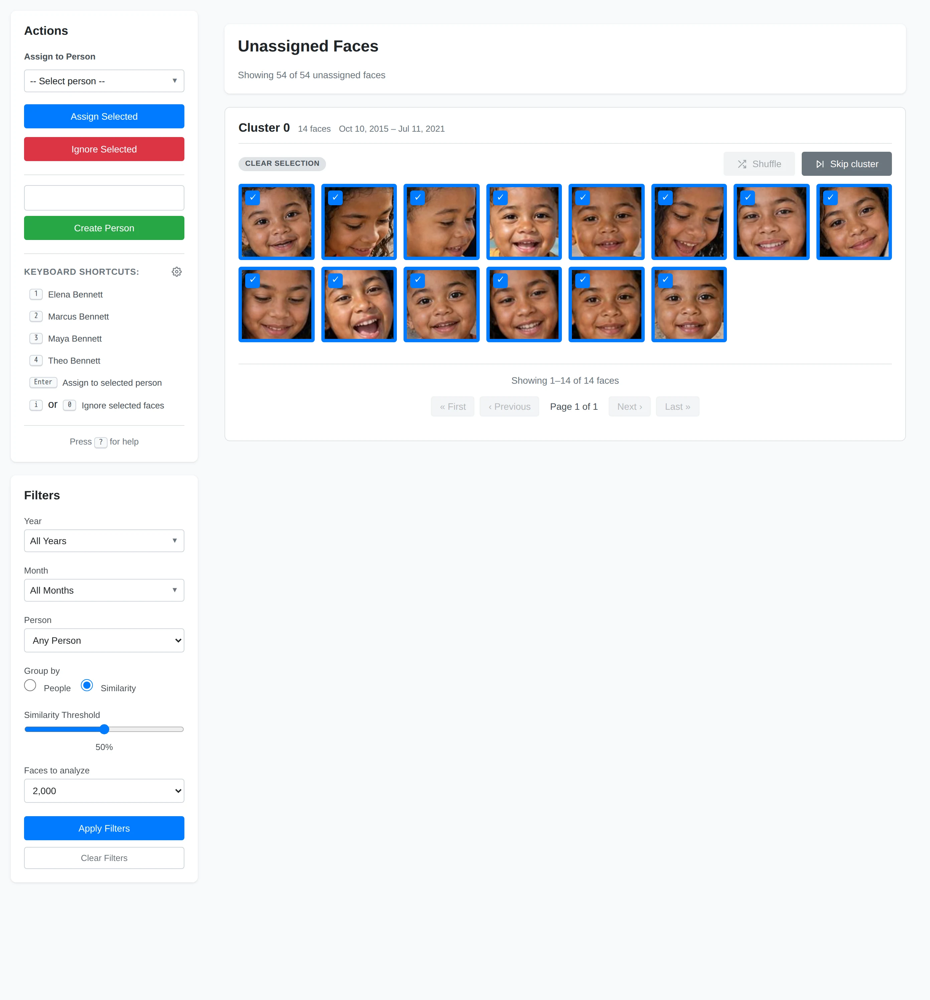
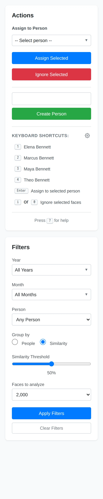
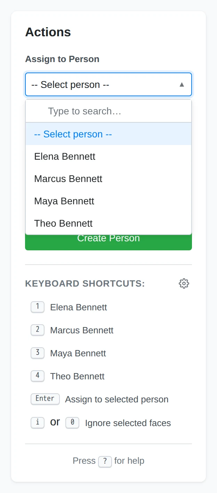
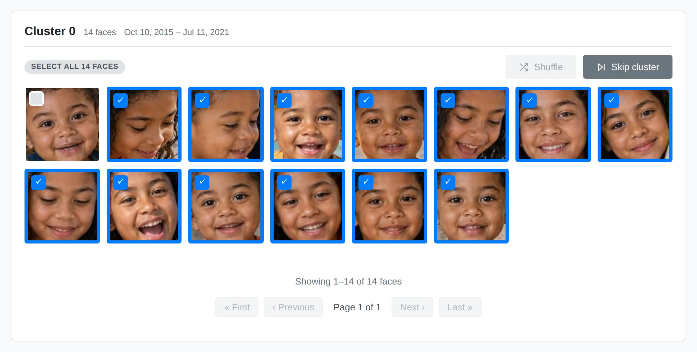
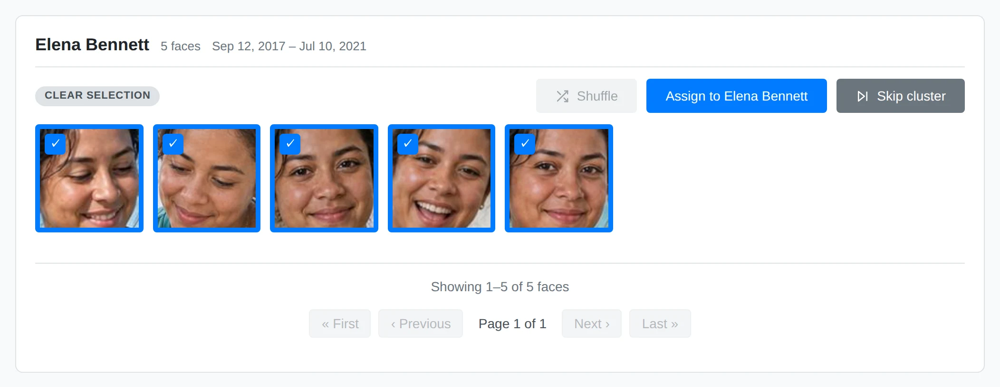

# Assigning Faces

This page walks through the day-to-day workflow of clearing the pile of
unassigned faces by assigning clusters of faces to people. For background on how
Yaffo detects faces and what people are, see
[Faces & People](faces-and-people.md).

## Open the Faces Page

Open **Faces** from the top navigation. The page has two parts:

- The **main area** shows one cluster of unassigned faces at a time.
- The **sidebar** holds the **Actions** panel (assign or ignore faces, create a
  person) and the **Filters** panel (how faces are grouped).

The header reports how much work is left.

## Choose How Faces Are Grouped

Use the **Filters** panel to control grouping before you assign anything.

- **Group by** — **Similarity** clusters visually similar unassigned faces
  together, which is the best way to make a first pass. **People** instead
  matches faces to people you already have.
- **Similarity Threshold** — how strict grouping is. Higher values make tighter,
  cleaner groups; lower values make larger, looser ones. Start with the default
  **50%**, then adjust it as you learn what works for the current batch.
- **Faces to analyze** — how many unassigned faces to pull in and cluster at a
  time. This is the batch size, not the number of thumbnails shown at once.

After changing a filter, click **Apply Filters**.

## Assign a Cluster

With a cluster in front of you, assign it in three steps.

**1. Pick the person.** Choose someone from **Assign to Person**. The selector is
searchable, so you can type to filter a long list.

**2. Refine the selection.** Every face in the cluster starts selected, marked by
a blue border and checkmark. Click any face that does not belong to remove it
from the assignment. Use **Clear selection** when you would rather start with
nothing selected and add individual faces back.

**3. Assign.** Click **Assign Selected**. Yaffo confirms the assignment and moves
straight to the next cluster so you can keep going.

## Work Through Multiple Clusters

Because Yaffo advances automatically, review becomes a rhythm: assign the
current cluster, then review the next one—often for a different person. The
header count updates when Yaffo loads the next batch.

Two buttons on each cluster help you keep moving:

- **Skip cluster** leaves the cluster unassigned and jumps to the next one.
- **Shuffle** swaps in a different sample from the same cluster. It is available
  only when a cluster contains more faces than the current thumbnail page.

## Quick Assignment

Once a cluster is obviously one person, you can assign it without touching the
sidebar:

- In **Group by People** mode, **Assign to _Name_** buttons appear when Yaffo has
  a strong guess. Click one to assign the selected faces in a single step.
- **Keyboard shortcuts** speed up repeated assignment. The sidebar lists a number
  key for each displayed person; select faces and press that number to assign
  them. Use the gear beside **Keyboard Shortcuts** to choose and order those
  people. Other shortcuts:
    - **Shift + Click** — select a range of faces.
    - **Enter** — assign selected faces to the chosen person.
    - **i** or **0** — ignore selected faces.
    - **?** — open the on-page help.

## Ignore Faces

Not every face is worth keeping. Select the faces you don't want and click
**Ignore Selected** for:

- blurry or partial faces;
- background or incidental faces;
- false detections;
- people you don't want to track.

Ignoring a face removes it from the review pile without assigning it to anyone.
It does not affect the original photo.

## Refresh Between Passes

When the biggest clusters are gone and only loose, mixed groups remain, reload
the page. Yaffo clusters the current unassigned pile again for the next pass.
Lowering the **Similarity Threshold** can pull stragglers together, but review
looser groups more carefully. As your catalog of people grows, the built-in
**Auto-assign faces** automation can also assign confident matches when new
photos are indexed.
