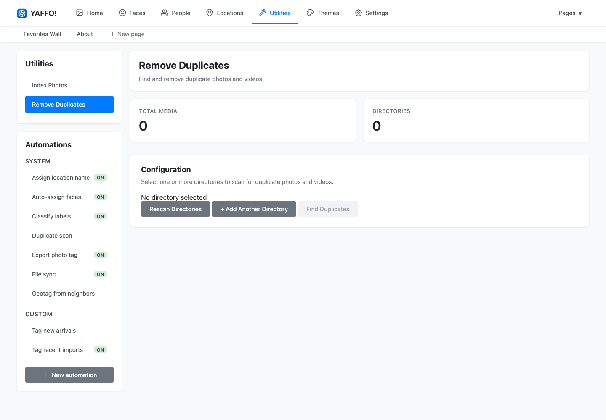

# Finding Duplicates

The duplicate utility helps find photos and videos that appear to be the same or
nearly the same. Use it as a review workflow, not as an automatic delete button.

## How Duplicate Detection Works

Yaffo scans selected directories and compares media visually. This can find files
that look alike even when filenames, folders, or metadata differ.

Because visual comparison is not the same as human judgment, always review the
results before removing anything.

## Start a Duplicate Scan

Go to **Utilities** → **Remove Duplicates**.

1. Add one or more directories to scan.
2. Click **Rescan Directories** if you change the directory list.
3. Click **Find Duplicates**.

Yaffo starts a background job. When the job finishes, open the results.

## Review Duplicate Groups

Duplicate results are shown in groups. Each group contains files Yaffo believes
belong together.

For each group, compare:

- the image or video preview;
- the filename;
- the folder path;
- dates or other visible context;
- whether one copy is clearly better or more complete.

Select only the files you want Yaffo to act on. Leave the keeper unselected.

## Choose an Action

The results page supports several actions:

- **Move to Trash:** sends selected files to the operating system trash when
  possible. This is the safest cleanup option.
- **Move to Folder:** moves selected files to a folder you choose. This is useful
  for quarantine or manual review.
- **Permanently Delete:** deletes selected files directly.

Prefer **Move to Trash** or **Move to Folder** until you trust the results for
your library.

## Remove Selected Duplicates

After selecting duplicates and choosing an action, click **Remove Selected
Duplicates**.

Yaffo starts a background job for the removal action. The original duplicate scan
result is replaced by the removal job once processing starts.

## Safety Checklist

Before removing files:

- make sure every selected file is truly a duplicate;
- make sure at least one good copy remains unselected in each group;
- prefer **Move to Trash** or **Move to Folder** for the first few runs;
- avoid **Permanently Delete** unless you have backups;
- run a small scan first if you are testing the workflow.

## When No Duplicates Are Found

If Yaffo reports no duplicates, it means the scanned directories did not contain
media that matched closely enough. Try a broader directory or verify that the
media has been indexed and is readable.
