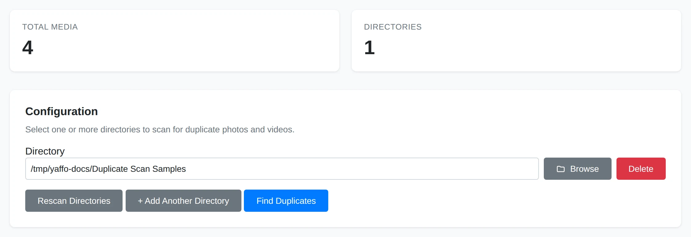
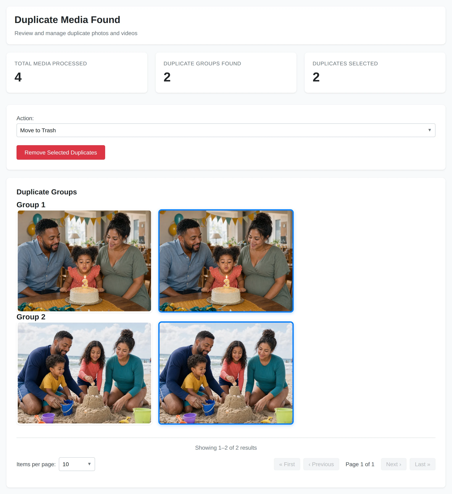

# Finding Duplicates

The duplicate utility finds photos and videos with the same visual fingerprint.
Use it as a review workflow, not as an automatic delete button.

## How Duplicate Detection Works

Yaffo scans the selected directories recursively and calculates a perceptual hash
from each photo. For a video, it hashes an indexed poster or a frame extracted
from the video. Files with the same media type and hash are grouped together,
even when their filenames or metadata differ.

Because visual comparison is not the same as human judgment, always review the
results before removing anything.

## Start a Duplicate Scan

Go to **Utilities** → **Remove Duplicates**.

1. Click **+ Add Another Directory**.
2. Type a directory path or click **Browse** to select one.
3. Add more directories if needed, then click **Rescan Directories** to refresh
   the media count.
4. Click **Find Duplicates**.

Yaffo starts a background job. You can leave the page while it runs. When the job
finishes, click **Show Results** on its job card.

## Review Duplicate Groups

Duplicate results are shown in groups. Each group contains files with the same
visual fingerprint.

Yaffo leaves the first card in each group unselected as the initial keeper and
selects the remaining cards for removal. This is only a starting point; it is not
a quality judgment. Click any card to toggle its selected outline.

The results currently show previews but not filenames, paths, or capture dates.
Compare the visible content carefully. If you cannot confidently identify the
keeper, leave that group alone and repeat the scan with a narrower directory.

For each group, compare:

- the image or video preview;
- cropping and orientation;
- visible resolution or compression differences;
- whether one copy is clearly more complete.

Select only the files you want Yaffo to act on. Leave the keeper unselected.

## Choose an Action

The results page supports several actions:

- **Move to Trash:** sends selected files to the operating system trash when
  possible. This is the safest cleanup option.
- **Move to Folder:** moves selected files to a folder you choose. If a filename
  already exists there, Yaffo adds a numeric suffix. This is useful for quarantine
  or manual review.
- **Permanently Delete:** deletes selected files directly.

Prefer **Move to Trash** or **Move to Folder** until you trust the results for
your library.

## Remove Selected Duplicates

After selecting duplicates and choosing an action, click **Remove Selected
Duplicates**. The action starts immediately; there is currently no additional
confirmation dialog.

Yaffo starts a background job for the removal action. The original duplicate scan
result is replaced by the removal job once processing starts.

## Safety Checklist

Before removing files:

- make sure every selected file is truly a duplicate;
- make sure at least one good copy remains unselected in each group;
- prefer **Move to Trash** or **Move to Folder** for the first few runs;
- avoid **Permanently Delete** unless you have backups;
- remember that **Remove Selected Duplicates** starts immediately;
- run a small scan first if you are testing the workflow.

## When No Duplicates Are Found

If Yaffo reports **No Duplicates Found**, the scan completed without finding two
readable files of the same media type with the same visual fingerprint. Try a
broader directory or verify that the files are readable. Files do not need to be
indexed before this utility can scan them.
