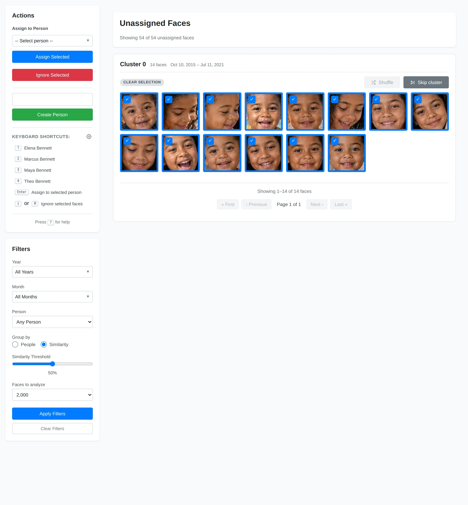
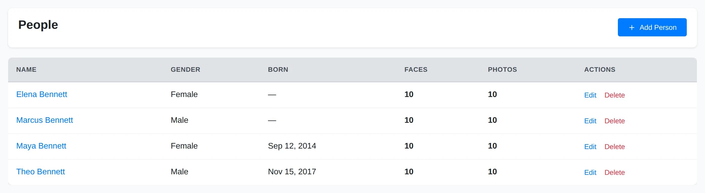

# Faces & People

Yaffo detects faces during indexing and lets you assign those faces to people.
After that, you can browse a person's faces or filter the library by people.

This page explains the concepts. For the hands-on, step-by-step workflow of
clearing the unassigned pile, see [Assigning Faces](assigning-faces.md).

## Understand the Face Review Page

The **Faces** page shows unassigned faces. The goal is to empty that pile over
time.

Yaffo groups faces in two ways:

- **Group by People:** shows faces that look like people already in your library.
- **Group by Similarity:** clusters visually similar unassigned faces together.

The **Similarity Threshold** controls how strict grouping should be. Higher
values create tighter, cleaner groups. Lower values create larger, looser groups.

A practical first pass is:

1. Start with **Group by Similarity** at a high threshold.
2. Assign the biggest obvious clusters first.
3. Lower the threshold as the remaining groups get smaller.
4. Switch to **Group by People** after you have several known people.
5. Ignore low-quality faces that are blurry, partial, or not useful.

Refreshing between passes can help because Yaffo reclusters the remaining
unassigned faces. See [Assigning Faces](assigning-faces.md) for how to do all of
this in practice.

## Create People

Open **People** to create and manage people.

Each person can have:

- a name;
- an optional gender;
- an optional birthdate.

A birthdate helps Yaffo compare a person's faces from similar life stages. Gender
is used by the gallery's gender filter. Neither field is required.

You can also create a person on the fly while assigning faces, using the
**Create Person** box in the Faces sidebar.

## Review a Person's Faces

Click a person in the **People** table to open that person's face page. From
there, you can:

- see all faces assigned to the person;
- filter by similarity;
- select incorrect faces;
- click **Remove Selected** to remove wrong assignments.

Removing a face from a person does not delete the original photo. It only removes
that face assignment.

## Automatic Assignment

The built-in **Auto-assign faces** automation runs when a photo is indexed. It
compares each detected face with your known people and assigns a face when one
person clears the configured match threshold.

By default, a face that strongly matches more than one person stays unassigned
for you to review. You can instead enable **Assign when multiple people match**
to choose the highest-scoring match. A higher threshold makes fewer, more
confident assignments.

Open **Utilities** → **Automations** → **Auto-assign faces** to enable or disable
the automation and change those settings. Review automatic results periodically,
especially while each person has only a few examples.
