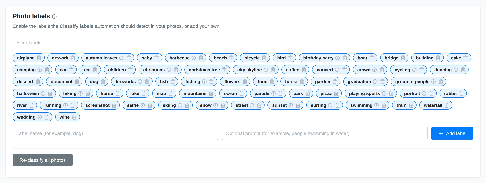
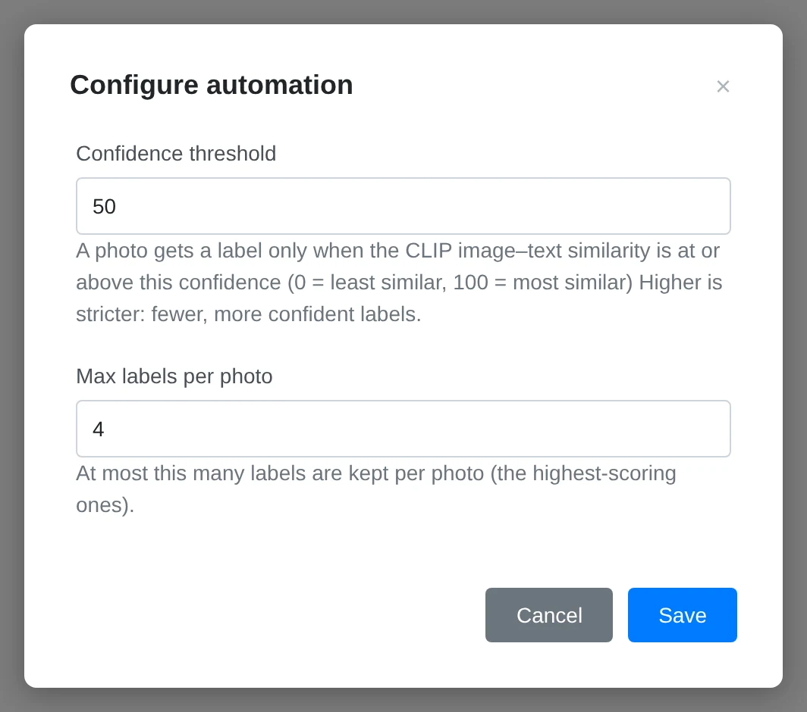
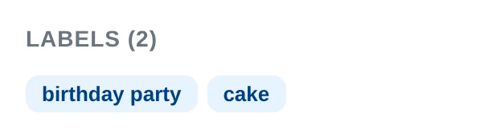

# Labels and Auto-Classification

Labels are automatic categories Yaffo can assign to photos, such as `dog`,
`beach`, `wedding`, or `city skyline`. They help you find photos by content even
when you did not tag them manually.

## How Labels Work

The built-in **Classify labels** automation compares newly indexed photos and
sampled video frames against the enabled label vocabulary using an offline CLIP
image-recognition model. Labels that clear the configured confidence threshold
appear on the media detail page and become available in gallery filters.

Labels are machine-generated. Treat them as helpful search hints, not perfect
truth. Some labels may be missed, and some may be wrong.

## Manage the Vocabulary

Open **Settings** and find **Photo labels**.

From there you can:

- enable or disable built-in labels;
- filter the label list;
- add your own labels;
- remove labels you do not need.

Disabled labels are not used on future classification runs. Existing assignments
remain until you reclassify the library. Removing a label also removes its saved
assignments.

## Starter Vocabulary

New libraries start with these 64 labels:

- **Animals:** `dog`, `cat`, `bird`, `horse`, `fish`, `rabbit`.
- **Activities:** `swimming`, `hiking`, `skiing`, `running`, `cycling`,
  `dancing`, `fishing`, `camping`, `surfing`, `playing sports`.
- **Nature and scenes:** `beach`, `mountains`, `forest`, `lake`, `river`,
  `ocean`, `waterfall`, `garden`, `park`, `sunset`, `snow`, `autumn leaves`.
- **Urban:** `city skyline`, `street`, `building`, `bridge`.
- **Events:** `wedding`, `birthday party`, `graduation`, `concert`, `parade`,
  `fireworks`, `christmas`, `halloween`.
- **Food and drink:** `food`, `coffee`, `dessert`, `cake`, `pizza`, `barbecue`,
  `wine`.
- **People:** `baby`, `children`, `group of people`, `selfie`, `portrait`,
  `crowd`.
- **Objects and transport:** `car`, `boat`, `airplane`, `bicycle`, `train`,
  `flowers`, `christmas tree`.
- **Utility:** `document`, `screenshot`, `artwork`, `map`.

## Add Custom Labels

When adding a label, provide:

- **Label name:** the short name shown in the UI, such as `kayak`.
- **Optional prompt:** a more descriptive phrase, such as `people kayaking on a
  lake`.

Simple object labels often work with just the label name. Activities and scenes
usually benefit from a fuller prompt.

Label names and prompts should be written in English because the offline image
recognition model understands English text.

## Configure Classification

Open **Utilities** → **Automations** → **Classify labels**, then click
**Configure**. Two settings control the results:

- **Confidence threshold:** the minimum image-to-text similarity required for a
  label. Higher values produce fewer, more confident labels. The default is
  **50%**.
- **Max labels per photo:** the maximum number of highest-scoring matches retained
  for each item. The default is **4**.

## Re-Classify Photos

Click **Re-classify all photos** after changing the label vocabulary if you want
existing photos to be checked against the new vocabulary.

Reclassification runs in the background and may take time for large libraries.
Newly indexed media is classified automatically while the built-in automation
and its **Media indexed** event trigger are enabled.

## Use Labels in Filters

Labels appear in the gallery filter sidebar. Use them to find broad categories
of photos, such as:

- beach scenes;
- dogs;
- weddings;
- food;
- city skylines;
- screenshots.

When selecting multiple labels, use the match type controls to decide whether
photos should match **any** selected label or **all** selected labels.

## Review Labels on a Photo

Open a photo detail page to see labels assigned to that specific media item.
Hover over a label chip to see confidence information when available.

Labels cannot be edited directly on the detail page. Change the vocabulary in
Settings, then reclassify when needed.
