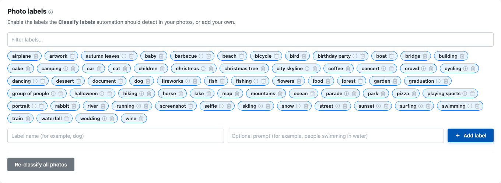

# Labels and Auto-Classification

Labels are automatic categories Yaffo can assign to photos, such as `dog`,
`beach`, `wedding`, or `city skyline`. They help you find photos by content even
when you did not tag them manually.

## How Labels Work

Yaffo compares indexed photos against the enabled label vocabulary. When a photo
matches a label strongly enough, that label appears on the photo detail page and
can be used in filters.

Labels are machine-generated. Treat them as helpful search hints, not perfect
truth. Some labels may be missed, and some may be wrong.

## Manage the Vocabulary

Open **Settings** and find **Photo labels**.

From there you can:

- enable or disable built-in labels;
- filter the label list;
- add your own labels;
- remove labels you do not need.

Disabled labels are not used by the classification automation.

## Add Custom Labels

When adding a label, provide:

- **Label name:** the short name shown in the UI, such as `kayak`.
- **Optional prompt:** a more descriptive phrase, such as `people kayaking on a
  lake`.

Simple object labels often work with just the label name. Activities and scenes
usually benefit from a fuller prompt.

Label names and prompts should be written in English because the offline image
recognition model understands English text.

## Re-Classify Photos

Click **Re-classify all photos** after changing the label vocabulary if you want
existing photos to be checked against the new vocabulary.

Reclassification runs in the background and may take time for large libraries.
Newly indexed photos are classified as part of normal background processing.

## Use Labels in Filters

Labels appear in the gallery filter sidebar. Use them to find broad categories
of photos, such as:

- beach scenes;
- dogs;
- weddings;
- food;
- city skylines;
- screenshots.

When selecting multiple labels, use the match type controls to decide whether
photos should match **any** selected label or **all** selected labels.

## Review Labels on a Photo

Open a photo detail page to see labels assigned to that specific media item.
Hover over a label chip to see confidence information when available.

Labels cannot be edited directly on the detail page. Change the vocabulary in
Settings, then reclassify when needed.
