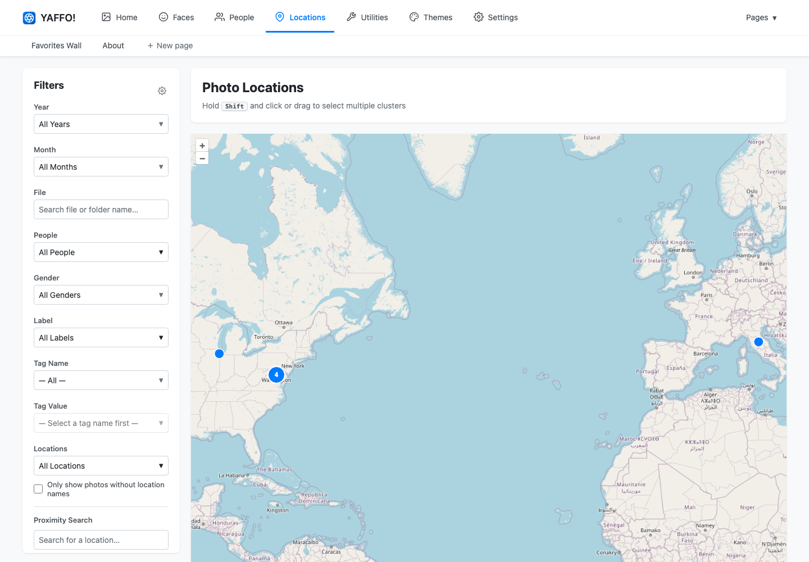
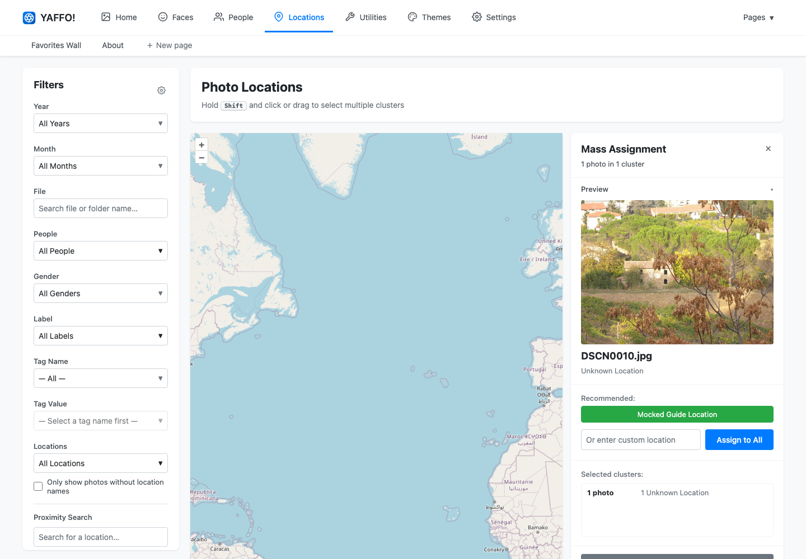

# Locations & Map

The **Locations** page shows photos and videos that have GPS coordinates. It is
useful for reviewing where photos were taken and assigning human-readable
location names.

## Map Markers and Clusters

Each marker represents one or more located media items. When several items are
close together, Yaffo groups them into a cluster.

Use normal map controls to pan and zoom. Zooming in can split clusters into
smaller groups or individual points.

Photos without GPS coordinates do not appear on the map.

## Select Photos on the Map

Click a marker or cluster to open the selection panel.

The panel shows:

- the selected photo count;
- a preview image;
- thumbnails or a selector when multiple photos are selected;
- current location-name breakdown;
- recommended location actions;
- custom assignment controls;
- clear-selection and clear-name actions.

Use **Shift** with click or drag to build a larger selection from multiple
clusters.

## Preview the Selection

The **Preview** section shows the currently previewed photo. If the selection has
multiple photos, use the thumbnails or selector to switch the preview.

Collapse the preview section when you want more room for assignment controls.

## Assign Location Names

To assign a custom location name:

1. Select one or more map markers or clusters.
2. Type a name in **Or enter custom location**.
3. Click **Assign to All**.

The selected photos receive that location name, and the map payload updates
without requiring a full page reload.

## Use Recommendations

Yaffo can suggest a location name in two ways:

- If nearby photos already share one location name, Yaffo recommends that name.
- If no unique nearby name is available, Yaffo can use reverse geocoding to
  suggest a name from the selected coordinates.

Recommendations are meant to speed up assignment. Review the suggestion before
applying it.

## Clear Location Names

Select one or more photos and click **Clear location names** to remove their
assigned names.

This does not remove GPS coordinates from the original file. It only clears the
human-readable name stored in Yaffo.

## Filter the Map

The Locations page uses the same style of filter sidebar as the gallery, but it
filters map markers in the browser.

Useful filters include:

- **Only show photos without location names:** find located photos that still
  need names.
- **Locations:** show photos with specific assigned names.
- **Proximity Search:** find photos near a place.
- **Year**, **Month**, **People**, **Labels**, **Tags**, **Device**, **Favorites**,
  and **Media Type:** narrow map markers by the same library metadata used in the
  gallery.

Click **Clear Filters** to restore the full located set.

## When the Map Looks Empty

If the map has no markers:

- confirm the photos have GPS metadata;
- run indexing after adding new photos;
- clear active filters;
- check that the selected media folders are configured;
- remember that photos with location names but no GPS coordinates cannot appear
  on the map.
