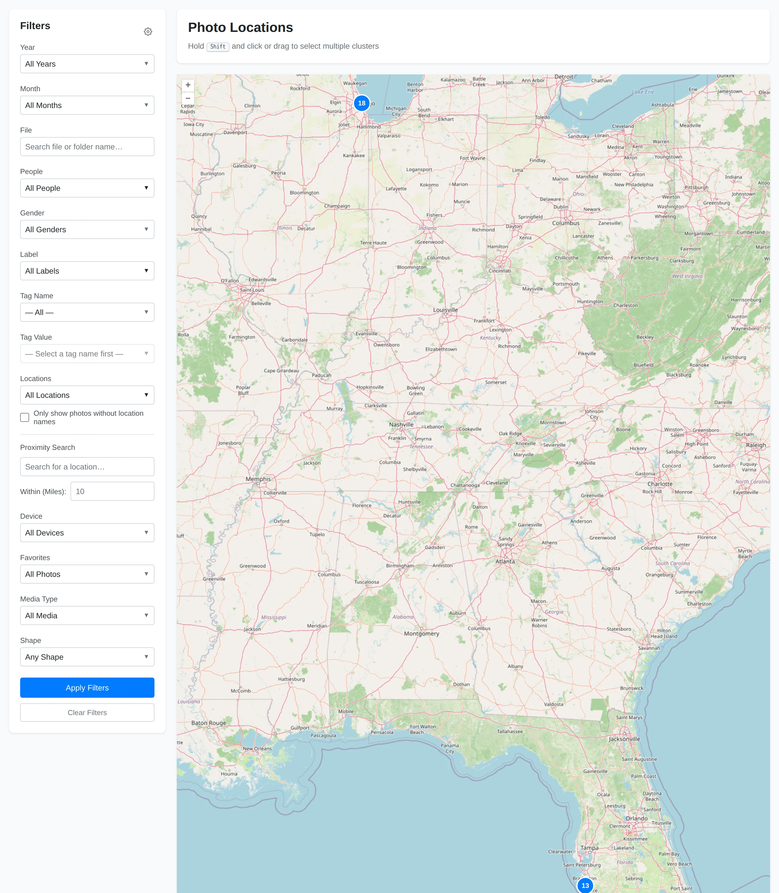
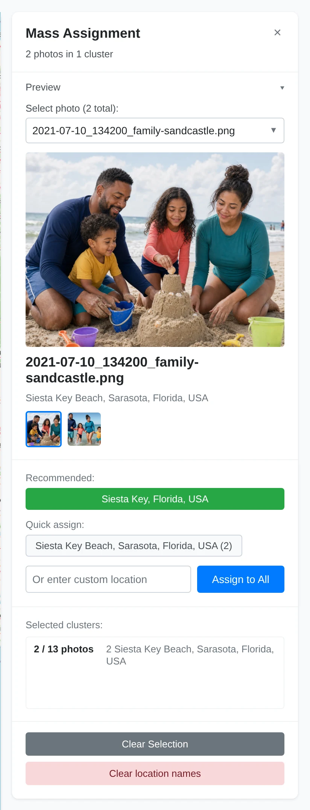

# Locations & Map

The **Locations** page shows photos and videos that have GPS coordinates. It is
useful for reviewing where photos were taken and assigning human-readable
location names.

## Map Markers and Clusters

Each marker represents one or more located media items. When several markers are
close together at the current zoom level, Yaffo groups them into a numbered
cluster. Zooming in can split a cluster into smaller groups or individual
markers.

Use the **+** and **-** controls, the mouse wheel, or normal touch gestures to
zoom. Drag the map to pan.

Photos without GPS coordinates do not appear on the map.

## Select Photos on the Map

Click a marker or cluster to select every photo it represents and open the
selection panel. A plain click starts a new selection. Hold **Shift** while
clicking to add or remove another cluster, or hold **Shift** and drag a box around
several markers.

The panel shows:

- the selected photo count;
- a preview image;
- a thumbnail strip and selector when multiple photos are selected;
- current location-name breakdown;
- recommended location actions;
- custom assignment controls;
- clear-selection and clear-name actions.

Click an empty part of the map, the close button, or **Clear Selection** to start
over.

## Preview the Selection

The **Preview** section shows the currently previewed photo. If the selection has
multiple photos, use the thumbnails or selector to switch the preview.

Collapse the preview section when you want more room for assignment controls.

## Assign Location Names

To assign a custom location name:

1. Select one or more map markers or clusters.
2. Type a name in **Or enter custom location**.
3. Click **Assign to All**.

The selected photos receive that location name, and the map payload updates
without requiring a full page reload.

## Use Recommendations

Yaffo can suggest a location name in two ways:

- If the photos within the configured nearby radius have exactly one saved
  location name, Yaffo recommends that name.
- Otherwise, Yaffo sends the center of the selection to its reverse-geocoding
  service and may suggest the returned place name.

Recommendations are meant to speed up assignment. Review the suggestion before
applying it.

## Clear Location Names

Select one or more photos and click **Clear location names** to remove their
assigned names.

This does not remove GPS coordinates from the original file. It only clears the
human-readable name stored in Yaffo.

## Filter the Map

The Locations page uses the same style of filter sidebar as the gallery. Click
**Apply Filters** to filter the already-loaded map markers in the browser; the
page does not reload or recenter the map.

Useful filters include:

- **Only show photos without location names:** find located photos that still
  need names.
- **Locations:** show photos with specific assigned names.
- **Proximity Search:** find photos near a place.
- **Year**, **Month**, **File**, **People**, **Gender**, **Labels**, **Tags**,
  **Device**, **Favorites**, **Media Type**, and **Shape:** narrow map markers by
  the same library metadata used in the gallery.

Click **Clear Filters** to restore the full located set.

## When the Map Looks Empty

If the map has no markers:

- confirm the photos have GPS metadata;
- run indexing after adding new photos;
- clear active filters;
- check that the selected media folders are configured;
- remember that a saved location name by itself is not enough: the item must also
  have GPS coordinates to appear on the map.
