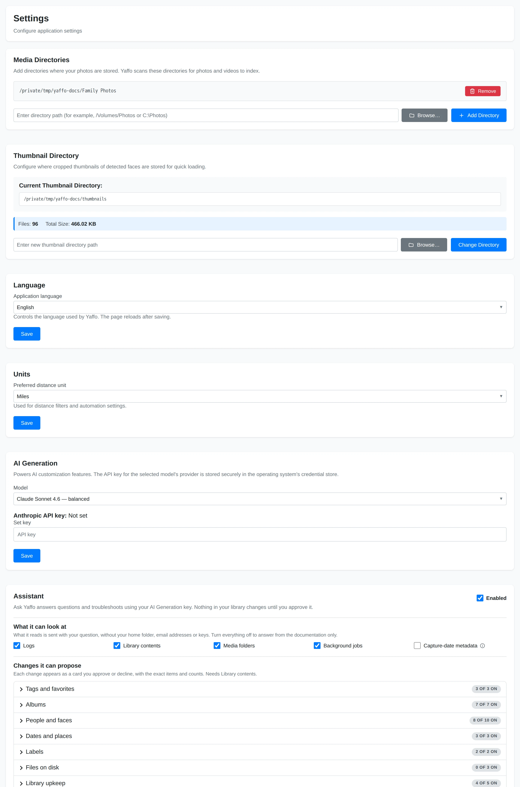

# Settings Reference

This page lists the options on the **Settings** screen. Open **Settings** from
the top navigation.

Most sections have their own **Save** button — changes take effect when you save
that section.

## Language

- **Application language** — the language Yaffo's interface uses. The page
  reloads after you save.

## Units

- **Preferred distance unit** — miles or kilometers, used for distance filters
  and for automation settings that measure distance.

## Media Directories

The folders Yaffo scans for photos and videos to index. Yaffo reads these files
in place; it does not move or modify your originals.

- **Add Directory** — type a path or **Browse…** to a folder, then add it.
- **Remove** — stop scanning a folder. This does not delete anything on disk.

Media and thumbnail directories cannot be changed while an import or index is in
progress. See [Indexing & Library Management](../library-basics/indexing-library.md).

## Thumbnail Directory

Where Yaffo stores the cropped face thumbnails it generates for quick loading.
The section also reports the current directory, file count, and total size, and
lets you change the location. A thumbnail directory must be set for face
thumbnails to be generated.

## AI Generation

Powers Yaffo's AI features, such as the
[page builder](../create-customize/custom-pages.md),
[theme designer](../create-customize/themes.md), custom
[automations](../create-customize/automations.md), and
[Ask Yaffo](../start-here/ask-yaffo.md).

- **Model** — the model used for AI generation.

The API key for the selected model's provider is stored securely in your
operating system's credential store (the OS keychain), **not** in Yaffo's
database.

## Assistant

Controls [Ask Yaffo](../start-here/ask-yaffo.md), the built-in assistant. It uses
the model and key from **AI Generation**.

- **Enabled** — show or hide Ask Yaffo. On by default.
- **What it can look at** — what the assistant may check on this computer when
  troubleshooting. What it reads is sent to the AI provider with your question.
  Turn everything off and it answers from Yaffo's documentation only.
  - **Logs** — recent errors and lines from Yaffo's logs.
  - **Library contents** — counts, individual photos, faces, and scripts that
    read your library. Proposing changes needs this.
  - **Media folders** — whether folders exist and respond, free space, and file
    names.
  - **Background jobs** — jobs, the background task host, and automation runs.
  - **Capture-date metadata** — read a photo's capture date from its file when
    checking a date problem. Off by default.
- **Changes it can propose** — one switch per kind of change, in groups: Tags and
  favorites, Albums, People and faces, Dates and places, Labels, Files on disk,
  Library upkeep, and Preferences. Each group shows how many are on, and changes
  that can't be undone are marked **Can't be undone**. Changes to files on disk,
  merging or deleting people, and running automations are off by default.
- **Confirm large changes** — above this many items, **Approve** also asks you to
  confirm the count. The default is 500.

## Photo Labels

The vocabulary of labels Yaffo can auto-assign to photos.

- **Add label** — a label name (for example, `dog`) with an optional prompt that
  describes what it should match (for example, `people swimming in water`).
- **Re-classify all photos** — re-run classification across the library after
  changing the vocabulary.

See [Labels and Auto-Classification](../organize-review/labels.md) for how labels
are used.

## System Information

Read-only build details and configured paths, including the build version. Useful
when reporting a problem.

## Automations

Scheduled and event-driven behaviors are configured on their own screen, under
**Library** → **Automations**, not on the Settings page. Their tunable defaults
are edited there through each automation's **Configure** panel. See
[Automations](../create-customize/automations.md).
