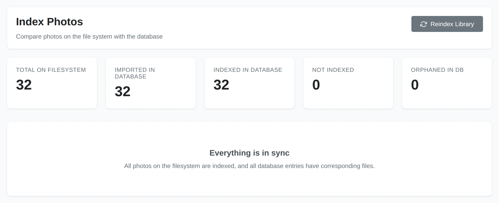
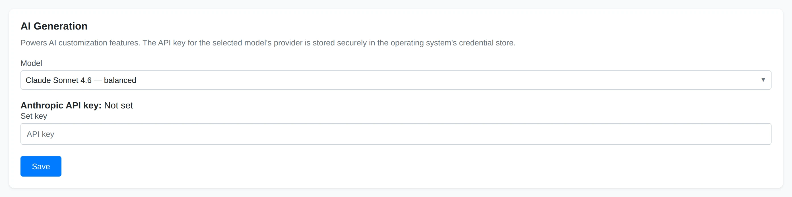

# Troubleshooting

This page covers the most common problems and how to narrow them down. Many
issues come down to indexing or background jobs, so it is worth checking those
first.

## Photos Do Not Appear

If photos are missing from the library:

- **Check your media directories.** Open **Settings** and confirm the folder
  containing the photos is listed under **Media Directories**.
- **Index the library.** New files only show up after indexing. Run
  **Utilities** → **Index Photos** → **Sync Database**, or wait for Yaffo's
  automatic sync to pick them up.
- **Look for orphaned or not-indexed counts.** The Index Photos page reports how
  many files are found on disk versus processed. A large **Not Indexed** count
  means a sync is needed.
- **Confirm the file type is supported.** Unusual or non-media files are skipped.
- **Check folder permissions.** Yaffo can only index files it is allowed to read.

See [Indexing & Library Management](../library-basics/indexing-library.md).

## Jobs Are Stuck or Slow

Indexing, classification, and face detection run as background jobs.

- **Give large libraries time.** A first index of a big library processes every
  file and can take a while. Progress is shown as it works.
- **Make sure the background worker is running.** Yaffo processes jobs with a
  background task host. If jobs never start or never finish, the host may not be
  running — restart the application.
- **Cancel and retry.** A job that appears wedged can be cancelled and started
  again.

## Faces, Labels, or Duplicates Look Wrong

These features are powered by machine learning, so they are helpful but not
perfect. Some mistakes are expected, and each has a correction path:

- **Wrong or missing faces.** Review unassigned faces, correct bad assignments
  from a person's page, and ignore low-quality faces. See
  [Assigning Faces](../organize-review/assigning-faces.md).
- **Wrong or missing labels.** Treat labels as search hints. Adjust the label
  vocabulary and re-classify if needed. See
  [Labels and Auto-Classification](../organize-review/labels.md).
- **Duplicate matches you disagree with.** Always review a duplicate group before
  removing anything. See [Finding Duplicates](../organize-review/duplicates.md).

Re-running the relevant step, or lowering a similarity threshold, often improves
results as your library grows.

## Map or Location Suggestions Do Not Work

- **Check for GPS metadata.** Only photos with GPS coordinates appear on the map.
  Many scans and screenshots have none.
- **Fill in missing coordinates.** The **Geotag from neighbors** automation can
  copy GPS from nearby photos taken around the same time.
- **Location names need a lookup.** Names come from nearby already-named photos or
  an online map lookup, which requires a network connection. See
  [Locations & Map](../organize-review/locations.md).

## AI Features Do Not Work

The page builder, theme designer, and custom automations need AI generation to be
configured.

- **Set a model and API key.** In **Settings** → **AI Generation**, choose a
  model. The provider's API key is stored in your operating system's credential
  store. Without a valid key, generation cannot run.
- **Check your network.** Generation calls the model provider over the internet;
  an offline machine or blocked connection will fail.
- **Read the error.** Provider errors (an invalid key, a rate limit, or an
  unavailable model) are surfaced in the app — the message usually names the
  cause.

See the [Settings Reference](settings.md) for where these options live.
