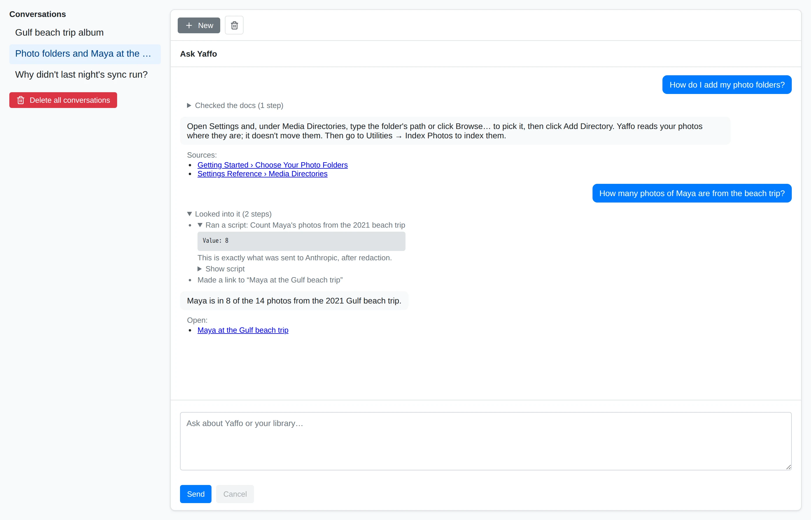
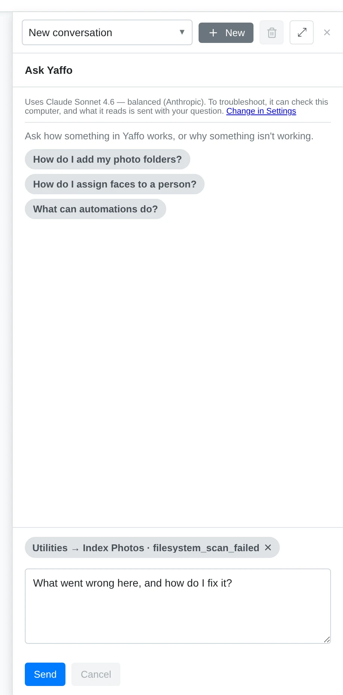
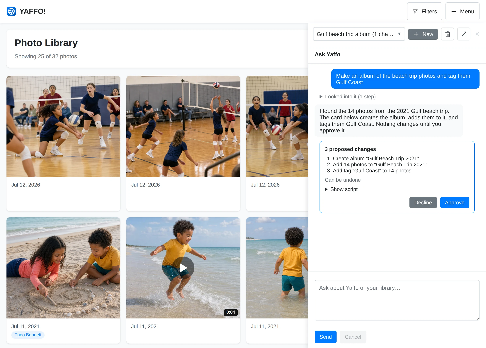
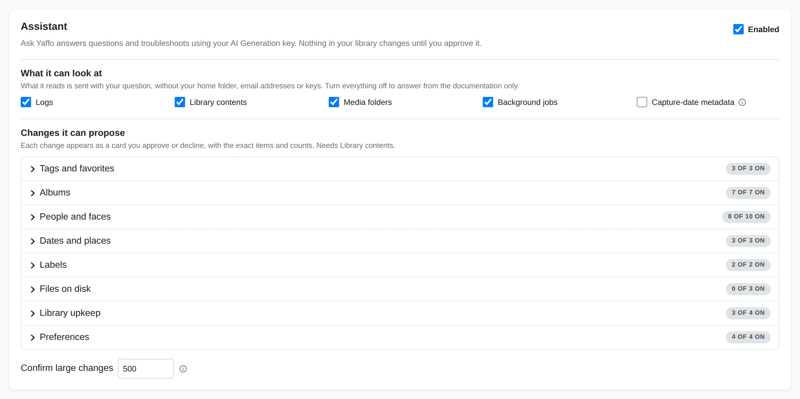

# Ask Yaffo

**Ask Yaffo** is Yaffo's built-in assistant. Ask it how something works, why
something isn't working, or to make a change to your library, such as "tag every
photo from the Yellowstone trip". It answers from Yaffo's own documentation and,
when you allow it, from the state of this computer. It never changes anything
until you approve the change.

Ask Yaffo uses the model and API key you set up under **Settings** →
**AI Generation**, the same as the page builder and theme designer. This feature is hidden if no key is configured.

## Open Ask Yaffo

Click the round **Ask Yaffo** button in the bottom-right corner of any page. On a
smaller screen, open **Menu** and choose **Ask Yaffo** instead. The assistant opens
in a panel over the page you're on, so you can keep working while it answers.

- **New conversation** starts over with no earlier context.
- **Open full page** shows the assistant on its own page, with your
  **Conversations** listed beside it. Conversations are kept until you delete them.
- Drag the panel's edge to resize it; double-click the edge to reset it.

### Ask About a Problem Where It Happens

Many error messages, failed job cards, and run history rows with errors have
their own **Ask Yaffo** button. It opens a new conversation with what went wrong
attached, shown as a chip above your message, and suggests a first question:
"What went wrong here, and how do I fix it?" Edit the question if you like, or
remove the chip with its ✕, then send it.

When the attached context names a job or an automation, and the assistant may
look at background jobs, Yaffo looks up that job or the automation's recent runs
before the assistant starts. You'll see this as the first line of its activity.

## Ask Questions

Ask the way you'd ask a person: "How do I add my photo folders?", "What do
automations do?", "How many photos of Billy do I have from 2019?"

- **How-to questions** are answered from Yaffo's user guide. The pages it used
  are listed under the answer as **Sources**.
- **Questions about your library** are answered by looking it up. The assistant
  writes a short script that reads your library and shows it as an activity line,
  such as "Ran a script: Count photos of Billy by year". Click **Show script** to
  see exactly what ran. Scripts can only read; they can't change anything.
- **Links.** When an answer points somewhere in the app, the assistant adds links
  under it (**Open:**), such as a gallery already filtered to the photos it found.
  For a file or folder on your computer it adds a button: **Open on this computer**
  or **Show in its folder**. Nothing opens until you click.

While it's answering, you can stop it. What it already wrote stays in the
conversation.

## Troubleshoot Problems

Describe what's wrong: "My external drive isn't showing", "Faces are stuck after
assigning", "Why did last night's sync fail?" The assistant checks before it
answers. It can:

- run Yaffo's health checks;
- read recent errors from Yaffo's logs;
- check your media folders and whether a drive responds;
- look at background jobs, the task host, and automation runs and settings;
- check device sharing and recent transfers;
- look up everything about one photo.

Each check appears as an activity line under the answer. Expand a line to see
exactly what was sent to the AI provider.

The [Troubleshooting](../reference-maintenance/troubleshooting.md) pages describe
common problems and what the assistant looks for.

## Make Changes With Approval

Ask for a change in plain words. The assistant finds the items, then proposes
the change as a card under its reply. The card is written by Yaffo, not by the
AI, and shows:

- each step, with the number of photos, faces, or other items it affects;
- whether it can be undone.

Click **Approve** to apply it or **Decline** to drop it. Nothing changes before
you approve.

- **Large changes.** Above a set number of items (500 by default), check
  "Yes, change all N items" before **Approve** is available.
- **Changes to files on disk** (renaming, moving, or moving photos to the system
  trash) are off until you turn them on in Settings. When they're on, type the
  number of items to confirm.
- **Expiry.** A card that isn't approved within 30 minutes, or whose items
  changed in the meantime, expires. Ask again to get a fresh one.

Approving applies exactly the items on the card, even if your library changed
after the card appeared.

### Undo a Change

After a change runs, most cards keep an **Undo** button. Undo restores what the
change replaced. Items that changed again since, by you or an automation, are
left as they are. A card marked **Can't be undone** has no Undo: for example
moving photos to the system trash (restore them from the trash instead),
deleting an album or a person, or cancelling a job.

### What It Can Change

What the assistant may propose is set in **Settings** → **Assistant**. By
default it can:

- **Tags and favorites** — add or remove tags, mark favorites.
- **Albums** — create, rename, and delete albums, add or remove photos, choose
  the cover, and put photos in order.
- **People and faces** — create and rename people, assign or unassign faces,
  ignore faces you don't want to name, set a birthdate, and repair faces stuck
  in the wrong state. It can also find unassigned faces that look like someone,
  or group unassigned faces that look alike, so you can name them.
- **Dates and places** — change capture dates, location names, and GPS
  coordinates. It can suggest location names from photos already named nearby;
  it never looks places up online.
- **Labels** — add labels to the vocabulary, or remove them. Photos get a new
  label when they're classified again: click **Re-classify all photos** in
  Settings, or let the assistant start it when **Run automation** is on.
- **Library upkeep** — re-index items, cancel a background job, and turn
  automations on or off.
- **Preferences** — change the theme, the language, the distance unit, and which
  filters the sidebar shows.

Off by default, until you turn them on: renaming or moving files, moving photos to
the system trash, merging or deleting people, and running an automation.

**Duplicates.** The assistant can read the results of a duplicate scan, suggest
which copy in each group to keep, and propose moving the others to the system
trash or into a folder for review. Start the scan from **Library** →
**Remove Duplicates** yourself, or let the assistant start it when **Run automation** is on; moving
files needs those file switches on too. See
[Finding Duplicates](../organize-review/duplicates.md).

**Recurring changes.** For rules that should keep applying, such as "tag every
new photo from this camera", the assistant points you to
[Automations](../create-customize/automations.md) instead.

## What Is Sent to the AI Provider

- **Your messages**, and the results of the checks and scripts the assistant runs:
  log lines, file and folder names, people's names, counts, and settings.
- **Before sending**, Yaffo replaces your home folder with `~`, shows media
  folders as labels instead of full paths, rounds GPS coordinates, and hides
  email addresses and anything that looks like a key.
- **Never sent:** your photos and videos themselves, the database, or your API
  keys. Reading capture dates from files is a separate setting, off by default.

The assistant connects to nothing except your AI provider. Conversations and the
record of what was sent stay on this computer until you delete them, one
conversation at a time, or all at once with **Delete all conversations** on the
full Ask Yaffo page.

To limit what it can check, turn groups off in
[Settings → Assistant](../reference-maintenance/settings.md#assistant). With
every group off, it answers from the documentation only, and nothing from this
computer is sent.

## What It Won't Do

- Look at the content of your photos.
- Change your media folders, thumbnail folder, API keys, or device sharing. It can
  explain sharing and check its status, but pairing and sharing stay with you.
- Edit automation, custom page, or theme code. Use the builders for those.
- Delete files permanently. Photos only ever go to the system trash.
