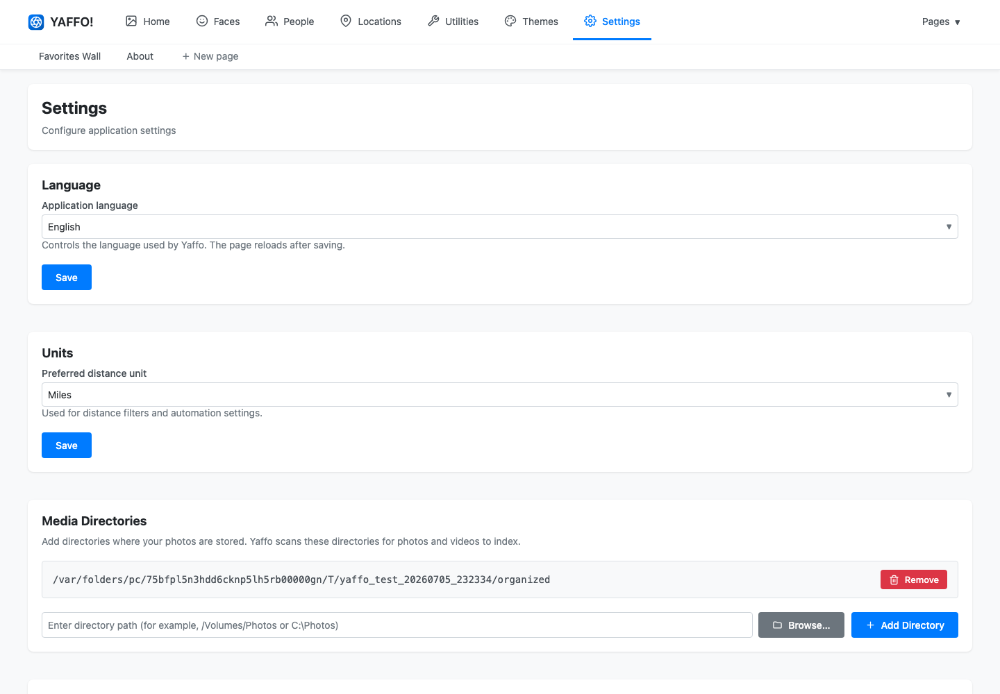
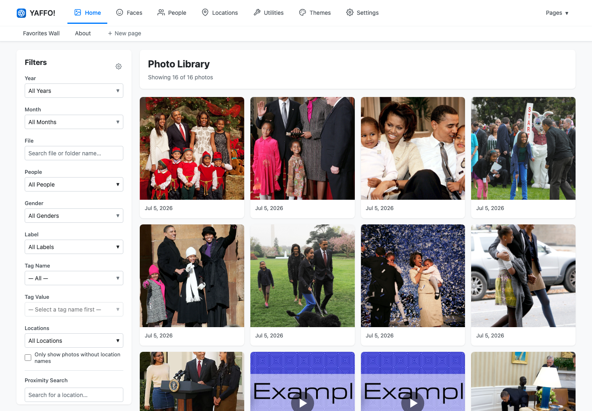
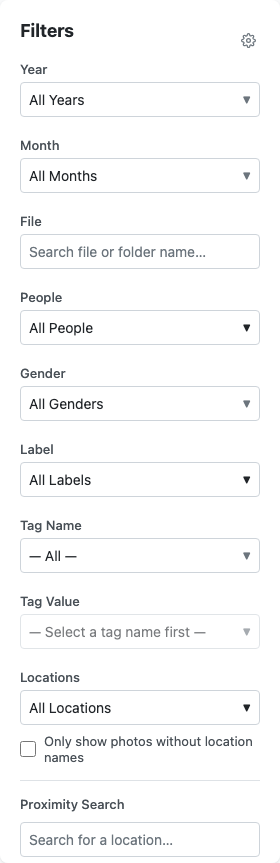
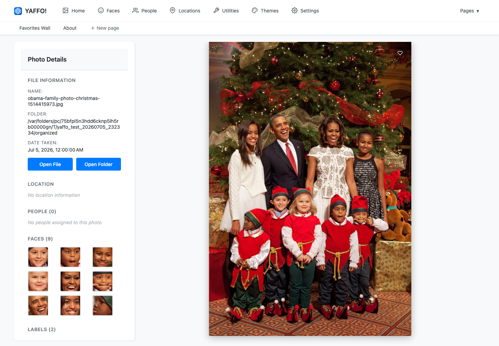

# Getting Started

Yaffo is a local photo organizer. You point it at folders on your computer, it
indexes your photos and videos, and then you can browse, filter, tag, map,
deduplicate, and build pages from your own library.

This guide takes you from installation to your first indexed photos.

## Install

Yaffo currently installs as a Python package. macOS and Windows distributables
are a work in progress and may be added if there is sufficient demand for the
product.

You need:

- Python 3.13
- pipx
- A terminal or command prompt

Yaffo downloads ExifTool and other runtime assets during setup, so you do not
need to install ExifTool separately.

Install Yaffo with pipx:

```shell
pipx install yaffo
```

Yaffo pulls in a sizeable set of image, video, machine-learning, and web-app
dependencies. pipx keeps those dependencies in a dedicated virtual environment
for Yaffo instead of mixing them into your system Python or another project's
environment.

Then run the setup helper:

```shell
yaffo setup
```

Setup prepares the local database, downloads runtime assets, and can install a
desktop shortcut. After setup, launch Yaffo with:

```shell
yaffo
```

Yaffo starts a local web app and opens it in your browser. By default, it runs on
`http://127.0.0.1:5001`.

While Yaffo is running, it also shows a tray/menu icon using the standard
cross-platform tray icon library used by the app. Use that icon to reopen Yaffo
or quit the background app:

- **Windows:** look in the notification area at the right side of the taskbar.
  It may be inside the hidden-icons chevron.
- **macOS:** look in the menu bar near the clock and system status icons.
- **Linux:** look in your desktop environment's system tray or status area. Some
  Linux desktops hide or disable tray icons by default; in that case, keep the
  browser tab open or relaunch Yaffo from the terminal when needed.

## Choose Your Photo Folders

Open **Settings** and add one or more media directories. These are the folders
Yaffo scans for photos and videos.



Yaffo stores its own database, thumbnails, logs, and temporary files separately
from your photo folders. Your original photo folders remain where they are.

## Index Your First Photos

Go to **Utilities** → **Index Photos**.


Yaffo scans the configured folders and shows which files are new, already
indexed, or no longer present. Start the sync to import new files into the
library index.

Indexing may take a while for large libraries. During indexing, Yaffo creates
thumbnails, reads metadata, detects faces, prepares labels, and records location
data when GPS metadata is available.

## Browse Your Library

After indexing, go to **Home**. Your library appears as a grid of photos and
videos.



Use the filter sidebar to narrow the library by date, people, labels, tags,
location, favorites, media type, device, and file path.



## Open a Photo

Click a photo to open its detail page.



The detail page shows the media preview, metadata, people, labels, tags, and
location information. This is where you review and correct what Yaffo found.

## What Yaffo Adds

Once your first photos are indexed, Yaffo can help you:

- Browse and filter your whole library.
- Review faces and assign them to people.
- Find duplicate or near-duplicate photos.
- View GPS-tagged photos on a map.
- Add tags and favorite important photos.
- Use automatic labels such as `dog`, `beach`, `wedding`, or your own custom
  labels.
- Create custom pages from your photo library.

## Next Steps

- [Organizing Photos](../library-basics/organizing-photos.md)
- [Faces & People](../organize-review/faces-and-people.md)
- [Finding Duplicates](../organize-review/duplicates.md)
- [Custom Pages](../create-customize/custom-pages.md)
- [Settings Reference](../reference-maintenance/settings.md)
- [Uninstalling Yaffo](../reference-maintenance/uninstalling.md)
