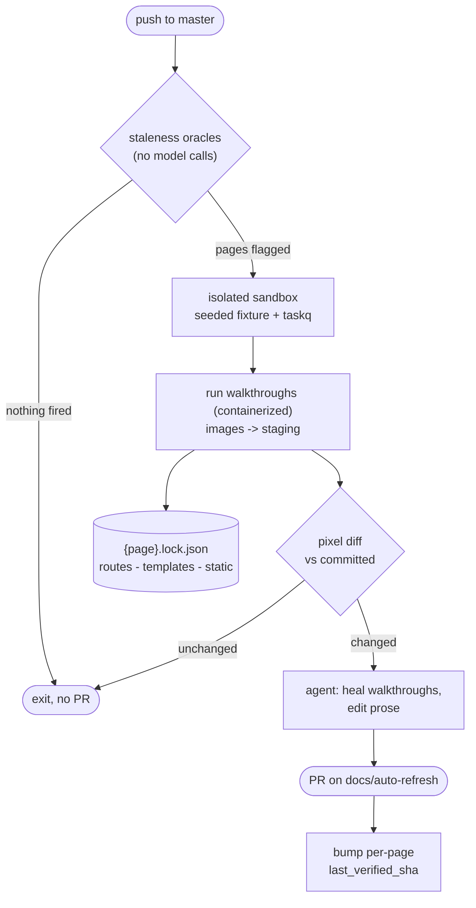

# Documentation Automation — Plan

> **Status: partly built.** Screenshot capture and prose updates are both in scope
> and ship together, not as separate phases.
>
> Working today. Infrastructure in `yaffo_ui_tests/lib/user_doc_automation/`
> (settle, framing, WebP encode, pixel comparison, dependency observation, runner,
> evidence, triage, and the two entry points); authored and generated content in
> `yaffo_ui_tests/user_doc_automation/` (`spec.yaml` covering 17 pages, and one
> reference walkthrough, `library-basics/browsing-filtering/`); the server-side
> observer at `yaffo/doc_observer.py`. A run captures to staging, pixel-diffs against
> what is committed, records that page's routes, templates, and static assets, and
> `docs:heal` classifies whatever changed.
>
> Not built: the staleness oracles beyond A, the watermark, the agent, and the
> workflow. Those parts below are still design.
>
> Last updated: 2026-08-22

## Goal

Keep the published user guide (`docs/guide/**`, MkDocs Material, deployed by
`.github/workflows/docs.yml`) in step with the app, without a human remembering to
re-shoot screenshots after every UI change.

A push to `master` evaluates the current state of the docs against the current
state of the app and, when something has gone stale, opens a PR containing both
regenerated screenshots and updated prose. It never pushes to `master` and never
auto-merges.

The same entry point runs locally, so a stale shot can be fixed and reviewed
without waiting for CI.

## Scope

**In:** `docs/guide/**` — the 17 user-guide pages, both their **screenshots and
their prose**. Stale images and stale text are regenerated in the same PR rather than
staged as separate rollouts: a renamed control usually invalidates both the shot
showing it and the sentence naming it, so splitting them would produce two changes
that each look wrong in isolation.

**Out:** `docs/development/**`. Architecture prose is where a model most reliably
invents plausible-sounding falsehoods, and those docs change on a different rhythm.
They stay hand-written.

## Two artifacts, two different guarantees

This distinction drives the whole design and is worth stating before the pipeline.

**Screenshots are deterministic.** The committed artifact is the *shot spec*, not
the PNG. An image is a pure function of `(spec, container image, seeded fixture,
app commit)`. Same inputs, same bytes. When a shot breaks — a renamed selector, a
moved page — the agent repairs **the spec**, and the PR carries both the spec change
and the regenerated image. This mirrors the existing test framework: specs are the
source of truth, execution is deterministic, and healing edits code rather than
output. An agent that emitted images directly would produce artifacts nobody could
reproduce or audit.

**Prose is not deterministic.** No script generates markdown. The agent edits `.md`
files directly, so the same input can yield different wording. What replaces
reproducibility is *boundedness*: the input is limited to one page's dependency
diff, the edit is scoped to one page, and a human reviews the PR before it merges. Do
not blur these two under "the bot updates the script" — they carry different
guarantees, and *What the agent owns* sets out the boundary.

## Pipeline



## Local / CI parity

The capture must be **containerized** — the official Playwright image
(`mcr.microsoft.com/playwright:v1.x-jammy`), used identically on a laptop and on the
runner.

Without this, "runnable in both places" is not achievable. macOS and Ubuntu have
different font stacks; different font metrics change text wrapping; changed wrapping
moves layout. Every CI run would detect a change from the last local commit and vice
versa, and the pixel diff would be pure noise. Containerising makes the two
byte-identical.

Docker is already used for the demo deployment, so this is not a new tool in the
stack. The app can keep running on the host with the browser in the container
pointing at `host.docker.internal`, which leaves the existing sandbox untouched.

**Accepted trade-off:** committed screenshots are Linux-rendered, not macOS-rendered.
For a pipx-installed product documented on a web page this is judged acceptable; it
is the reason capture cannot simply run natively on a Mac.

## Determining what is stale

Handing a model the commit diff and asking what to update fails on cost and
precision: most pushes touch nothing user-visible, the diff is unbounded, and the
same push can produce different answers on different runs. Staleness is instead
detected mechanically by independent oracles, and the model is invoked only on what
they flag. When none fire, the job exits without a model call — which is what makes a
push-triggered job affordable.

Oracles A–C are **diff-triggered**: they fire when something that was true becomes
false. Oracle D is a **standing property** and answers a different question, so it
runs on a different cadence.

### Oracle A — visual (ground truth for screenshots)

Re-capture, then compare against the committed image **pixel by pixel**. This is
observation rather than inference: if pixels moved, the UI moved. It catches changes
no code heuristic would predict, such as a theme token tweak or a changed icon.

> **Correction.** An earlier draft specified a *perceptual* hash, reusing the
> `imagehash` dependency from duplicate detection. That is wrong, and measurably so.
> Blanking a single 300×46 caption in the gallery shot — the smallest doc-relevant
> change there is — leaves `phash`, `average_hash`, and `dhash` all at **distance 0**
> while moving 668 pixels. A perceptual hash reduces 4.5 MP to a 64-bit signature of
> gross structure, so a text label sits far below its resolution. It is the right
> tool for "is this the same photograph", which is why duplicate detection uses it,
> and the wrong tool for "did this UI change".

Implemented in `lib/user_doc_automation/imagediff.py` (Pillow + NumPy, both already project
dependencies, so no npm package needing its own WebP decoder). It mirrors what
Playwright's `toHaveScreenshot` does via pixelmatch:

- a per-channel colour tolerance (`COLOR_THRESHOLD = 24`) to absorb encoder ringing
  around text;
- a flat budget of differing pixels (`MAX_DIFF_PIXELS = 100`), comfortably under the
  ~670 a one-word label change produces;
- ignore regions zeroed on the pixel copy only, never on the published image;
- a size mismatch short-circuiting to changed with `reason: "size"`, since a reframed
  shot is a change and the pixel maths would not line up anyway;
- a magenta-on-dimmed **diff overlay** written beside the staged shot, so a reviewer
  sees where it moved rather than only that it did.

Measured: identical shots report 0 differing pixels, a changed caption reports 686 in
a 143×17 box, and the same change inside an ignore region reports 0.

This also sharpens why containerization is not optional. Cross-machine font
antialiasing perturbs *every glyph on the page*, far more than the ~0.015% a real
label change produces, so no threshold can separate "different runner" from "renamed
button". The noise has to be removed rather than tuned around.

**One hazard.** Comparison assumes both sides are first-generation WebP — captured as
PNG, encoded once. Re-encoding an existing WebP is second-generation lossy and smears
differences across the whole frame, which both hides real changes in the noise and
defeats ignore regions. Nothing in the pipeline should ever re-encode a committed
image.

Capture writes to a **staging directory**, never straight into `docs/guide/**`, so a
plain run can answer "is anything stale?" without having already changed something.
The flow is capture to staging → compare against committed → promote only what
changed, matching Playwright's own baseline/actual/diff triad. `--promote` is what
copies staged shots into the guide.

### Oracle B — user-visible string diff (precise, prose-focused)

`messages.pot` is committed and holds **861 msgids** — effectively every
user-facing string in the app, because the UI is fully internationalized.

```
git diff <watermark>..HEAD -- messages.pot
```

Added, removed, and changed strings fall out directly. Grep the guide for the
removed ones: a page instructing the reader to click **Apply Filters** when that
msgid no longer exists is *provably* stale. This is a set intersection — no model
call — and it catches prose rot that screenshots miss entirely, such as a renamed
button or changed hint text.

### Oracle C — observed dependencies (scoping)

Which source files back which page, so a push can be intersected against them. See
the next section; this one is detailed enough to warrant its own.

### Oracle D — coverage gaps (not diff-triggered)

Oracles A–C all detect staleness. None detects **incompleteness**: something new that
was never documented at all. Nothing goes stale when the app grows a sixth Settings
section — the reference page just becomes wrong by omission, and no diff of any
existing artifact reveals it.

The input is a per-page **charter** (see *Spec, walkthroughs, and state*): what the page is
obliged to cover, as distinct from what it currently says. The agent compares the
charter against the app's actual surface — route inventory, settings keys, filter
definitions, the message catalog — and reports what is missing.

Because this is a standing property rather than a diff, it runs on the weekly
scheduled run rather than on every push; a coverage gap does not appear or disappear
with a single commit.

### The watermark

A bot-owned `last_verified_sha` per page, stored in that page's lockfile (see *Bot
state*) rather than in the markdown, which stays clean. It does two jobs:

- **Bounds the model's input** to `git diff <last_verified>..HEAD -- <that page's deps>`
  rather than "the repository".
- **Breaks the retrigger loop.** Push produces a PR; merging the PR is another push.
  After the merge each touched page's watermark is the merge commit, so the next run
  finds nothing new.

## The observed-dependency lockfile

Committed at `user_doc_automation/{area}/{page}/{page}.lock.json`, in that page's own
folder (see *Bot state* for what else it holds).

The set of source files whose change could alter a given page, **produced as the
second output of that page's walkthrough** rather than hand-maintained. Because it is
generated by deterministically driving the app it cannot drift the way a hand-written
mapping does, and re-running the same walkthrough against the same commit yields the same
set.

### What to record

Recorded while the page's walkthrough runs, bucketed by run. Layers 1–3 are built —
the server side in `yaffo/doc_observer.py`, the client side in
`lib/user_doc_automation/observe.ts`:

| Layer | Mechanism | Yields |
|---|---|---|
| Routes | `after_request` records `request.endpoint`, resolved via `app.view_functions[ep].__module__` | `yaffo/routes/home.py` |
| Templates | wrap `app.jinja_env.loader`, record every `get_source` call | `templates/index.html`, `_sidebar.html`, `components/photo_card.html` |
| Static | Playwright `page.on('request')`, filtered to same-origin `/static/` | `static/media/gallery_video.js`, theme CSS |
| Logic | `coverage.py` scoped to `yaffo/` for the duration of the shot | `db/repositories/media_filter_repository.py`, `template_filters.py` |

Layers 1–3 cover what makes a *screenshot* change and are what shipped. Layer 4
catches a different class — logic that alters displayed *values* without touching any
template — and is noisy enough (filter to `yaffo/`, begin measurement after boot,
reset between runs) that it waits until the first real miss justifies it.

For `browsing-filtering` a run records 3 route modules, 21 templates, and 70 static
files. The observer is dev-only: `init_doc_observer` returns immediately unless
`YAFFO_DOC_OBSERVER=1`, so nothing is registered in a shipped configuration.

### Two implementation notes

**Do not use Flask's `template_rendered` signal.** It fires only for top-level
`render_template`; includes, imports, and inheritance parents render inside Jinja and
never emit it. Confirmed in practice: of the 21 templates a `browsing-filtering` run
records, the signal would have reported exactly one — `index.html`. Everything else,
`photo_card.html`, `_sidebar.html`, and all 14 filter partials, arrives only through
the loader.

Two traps in the loader approach, both hit during implementation:

- **Disable the template cache by assigning `jinja_env.cache = None`**, not
  `cache_size`. `cache_size` is read once at construction to build the cache;
  assigning it afterwards does nothing, and the second page to render `base.html`
  never re-hits the loader.
- **Anchor repo-relative paths on the package directory**, not by counting `.parent`
  hops. A virtualenv usually lives at the repo root, so a hop-counted root silently
  admits `venv/lib/.../flask/app.py` as a dependency of every page. Worse, when the
  checkout directory is itself named `yaffo`, a `startswith("yaffo/")` guard passes
  for the wrong reason and hides the bug.

**Attribution is by run, not by page.** Playwright sends two headers:
`X-Yaffo-Doc-Run` (a fresh id per walkthrough run) buckets the records, and
`X-Yaffo-Doc-Page` rides along as metadata. Reading a run **consumes** it
(`GET /__doc_observer__/<run_id>`), which is what removes the need for a reset call —
and a global reset is precisely what would make two concurrent runs clobber each
other. Static assets bucket naturally in the browser-side request log.

### Honest limits

- **It is reactive.** The lockfile records what was touched at the *last* capture, so
  a brand-new code path is absent until it has been captured once. This is acceptable
  because Oracle A re-captures and pixel-diffs regardless: the lockfile is an
  optimization for scoping prose review, **not** the safety net. It should not be
  treated as one.
- **Shared files flag everything.** `base.html` is in every page's dependency set, so
  touching it flags all pages. That is correct behaviour, not noise — but it means a
  nav change triggers a full re-capture, which therefore has to stay cheap.
- **Some prose has no observable dependency.** `getting-started.md` documents
  `pipx install yaffo` and `yaffo setup`; no Playwright shot will ever touch
  `yaffo/setup.py`. `spec.yaml` therefore carries a hand-declared `also_depends_on:`
  list per page, merged with the observed set — the same idea as the `context:` blocks
  in the test specs, but confined to what driving the app cannot reach, so it stays
  small.
- **The observer holds state per process.** Under a single-process dev server that is
  fine. Served by multiple worker *processes*, each would hold its own buckets and a
  collect would return only whichever worker answered — a silently partial dependency
  set. Capture runs should keep the app single-process.

## Concurrency

Walkthroughs **cannot** run concurrently against one app instance, and the observer is
the least of the reasons.

The observer itself is safe: buckets are keyed by run id and consumed on read, so two
runs never share or clear each other's records. That was deliberate — an earlier
global `reset` endpoint would have had walkthrough B wipe A's in-flight records.

The blocker is that **the app has global mutable state and walkthroughs write it**.
`yaffo/routes/home.py::_resolve_library_view` persists `library_view` whenever the
URL's `view` disagrees with the saved value, so `/?view=grid` is not a read — it is a
write to a shared setting. Two concurrent walkthroughs, one pinning grid and one
timeline, would flip it under each other, possibly mid-render. The same applies to
anything else in `application_settings`: filter-group visibility, locale, theme,
thumbnail directory.

Fixing the observer alone would not make concurrency safe; it would make the failures
subtler, trading an obviously empty dependency set for intermittently wrong
screenshots.

**Shard by sandbox, not by thread.** N isolated instances, one walkthrough each: the
observer is per-process so buckets cannot collide, and app state is per-instance. The
seed cache already exists for this, and CI already fans out per-spec via
`list_specs.ts`. Within an instance, stay sequential.

This is also why pinning state *in the shot* is mandatory rather than stylistic. Even
run sequentially, one walkthrough leaves `library_view` set for whoever runs next —
the mechanism behind the Timeline surprise recorded under *What is built*.

## Spec, walkthroughs, and state

Three artifacts, split by **who writes them**. The split is the point: mixing
hand-authored intent with generated state makes every automated run look like a
content change in a file a human is trying to review.

### Intent lives in the markdown

A guide page already declares everything a shot spec would:

```markdown

```

That one line carries the shot's **identity** (the path), **what it should depict**
(the alt text), and **which page consumes it** (the file it sits in). The alt text is
a natural-language statement of intent — structurally the same thing as `goal:` in a
test spec. Nothing about a shot should be authored a second time anywhere else.

> This corrects an earlier draft of this plan, which placed alt text in a manifest
> "so a caption and its image cannot drift apart". That is backwards — duplicating alt
> text into a manifest is what *creates* the drift. Alt text should also be
> contextual: the same gallery shot is captioned differently on `getting-started.md`
> than on `browsing-filtering.md`.

**There are no shared images.** Every image belongs to exactly one page and lives at
`docs/guide/{area}/assets/{page}/`, even when two pages show the same view — each
page's walkthrough captures its own copy. `getting-started.md` and `browsing-filtering.md`
both show the Home grid, and each owns its own file.

That costs a handful of duplicated files, and buys three things: ownership is never
ambiguous, placement is a pure function of the page path rather than of how many
pages happen to reference an image, and the two copies are free to diverge when a tour
page wants a tighter crop than a reference page. A sharing rule would have made an
image's location depend on the *other* pages that reference it, so adding a reference
elsewhere could relocate a file and rewrite an unrelated page.

This also enables a cheap CI check worth running independently of everything else:
every reference resolves, every image on disk is referenced by exactly one page, and
every image sits in its own page's directory.
That check would have caught `faces-review.png`, which sat unreferenced for months.

### One walkthrough per page

`yaffo_ui_tests/user_doc_automation/{area}/{page}/{page}.ts`

The walkthrough is the deterministic driver for a page. **Every page has one**, including
pages that own no screenshots, because a walkthrough has two outputs and only the first is
optional:

1. **The screenshots that page owns** — captured to staging, then promoted if changed.
2. **That page's runtime dependency set** — the routes, templates, and static assets
   touched while driving the flows the page describes.

That second output is why a page like `organizing-photos` or `troubleshooting` still
gets a walkthrough: it owns no images, but its prose describes flows, and walking those
flows is the only way to learn which source files back them. A walkthrough that captures
nothing is still doing the job.

Determinism comes from the walkthrough being the committed artifact. The same walkthrough, the
same container, and the same seeded fixture produce the same images *and* the same
dependency set. Nothing about either output is inferred from a heuristic.

Only `reference-maintenance/uninstalling` has `walkthrough: null` — it is entirely a
terminal workflow with no app surface to drive.

### Walkthroughs are generated, committed, and editable

`url`, the `clip` selector, the viewport, the row-completion rule, and the setup steps
are implementation details of the current templates — `.main-container-layout`,
`.photo-grid`, `.photo-card`. That is precisely the layer that breaks and needs
healing, so the bot owns it, the same way `generated_tests/*.spec.ts` is owned rather
than hand-written.

Given a page whose walkthrough is missing or whose owned shot has no capture step, the bot
explores the app with Playwright and filesystem tools — as the test generator already
does — and writes one. When a walkthrough breaks, it heals it. Walkthroughs stay committed and
human-editable: to show three gallery rows instead of two, edit the walkthrough. No spec
field is needed for it.

Three consequences:

- **Adding a screenshot is never a markdown-only edit.** The reference has to exist
  before the image does, and `mkdocs build --strict` fails on a missing image, so the
  reference, the walkthrough change, and the capture all land in the same PR.
- **Shot identity is the image path**, so renaming an image appears as delete + add.
- **A page's dependency set is only as good as its walkthrough's coverage.** A walkthrough that
  drives three of a page's five described flows records dependencies for three. This
  is the practical limit on Oracle C, and it argues for walkthroughs that walk the page's
  whole surface even where they capture nothing.

### Non-reproducible regions

Some content differs run to run for reasons that have nothing to do with the app
changing. `locations-map` is the live case: `ol.source.OSM()` in
`yaffo/static/locations/list.js` fetches basemap tiles over the network, so the
imagery under the markers is never twice the same.

Three ways to handle it, best first:

1. **Make it reproducible.** Serve a fixed tile set locally so the shot becomes
   ordinarily stable and needs no special handling anywhere. This is the right answer
   for OSM and removes the case entirely.
2. **Ignore a region.** The walkthrough declares `ignoreRegions: ['.ol-viewport']` — a
   selector, which is exactly the kind of implementation detail walkthroughs already own.
   The walkthrough resolves it to a box and emits it beside the image; the differ
   zeroes that rectangle before counting differing pixels. Implemented and verified:
   a change inside an ignore region reports 0 differing pixels.
3. **Exclude the shot.** Last resort, because it blinds the oracle to *every* change on
   that page — a new panel or a restyled marker would go undetected forever.

Two constraints on option 2. **The published image must never be masked**: Playwright's
`mask` option paints over the element in the captured file, which would ship a
coloured box into the docs. The mask applies at diff time only, to a pixel copy.
And an element mask is coarse — masking `.ol-viewport` also hides the markers
OpenLayers draws from our own data, which are meaningful and stable. That coarseness
is the practical argument for fixing this with option 1.

**Most instability should not be declared at all.** The double-capture flake check
already measures it: capture twice, and a shot whose two captures disagree is unstable
by observation, whichever shot it turns out to be. A declaration is only worth adding
for a known, permanent cause — and then it earns its keep as a cross-check, since a
shot declared unstable but measured stable is a signal the declaration can go.

### The hand-authored spec

`yaffo_ui_tests/user_doc_automation/spec.yaml` — one entry per guide page, holding
only what is neither derivable from the docs nor generatable by the bot:

```yaml
pages:
  reference-maintenance/settings:
    covers: >-
      Every section of the Settings screen, in the order they appear on screen.
      A new section is a gap.
    walkthrough: settings

  start-here/getting-started:
    covers: >-
      Install through first indexed photos ... A tour: it shows the same views
      the deeper pages cover, in its own shots.
    walkthrough: getting-started
    also_depends_on:
      - yaffo/setup.py
      - yaffo/launcher.py
```

- **`covers`** is the charter Oracle D needs. The page's own intro says what it *does*
  cover; the charter says what it is *obliged* to cover, and the gap between them is
  the entire signal. Charters are written to name an *enumerable* surface wherever one
  exists ("every section", "the built-in theme list") so the check has something
  concrete to compare against.
- **`walkthrough`** is a boolean: the module's path is derivable from the page id, so
  naming it would be redundant. `false` only where a page has no app surface at all and
  never will — currently just `reference-maintenance/uninstalling`, which is entirely a
  terminal workflow.
- **`also_depends_on`** is the escape hatch for prose with no observable dependency.
  `getting-started.md` documents `pipx install yaffo` and `yaffo setup`; no walkthrough will
  ever touch `yaffo/setup.py`. A page property, not a shot property, and small because
  it only covers what driving the app cannot reach.

There is deliberately no `owns` field. A page owns exactly the images it references,
and they all sit in its own assets directory, so ownership is read off the markdown.

Nothing shot-shaped survives in the spec, including non-reproducible content — see
*Non-reproducible regions* below.

**Validation.** The spec is checkable against the tree without running anything: every
page in the spec exists and vice versa, every referenced image exists and sits under
its own page's assets directory, no image is unreferenced, and every
`also_depends_on` path resolves. That belongs in CI alongside the reference check above.

### Bot state is never hand-edited

One committed snapshot per guide page, in that page's own folder:

```text
user_doc_automation/{area}/{page}/{page}.lock.json
```

So `docs/guide/library-basics/browsing-filtering.md` is described by
`user_doc_automation/library-basics/browsing-filtering/browsing-filtering.lock.json`.
It holds everything the automation knows about that page after its last successful
run, and is written by `docs:capture --promote` — only on promote, because the shot
hashes are a record of what the guide actually holds:

- **`lastVerifiedSha`** — the watermark that bounds the model's input and breaks the
  retrigger loop.
- **`routes` / `templates` / `static` / `urls`** — the observed dependency set, the
  input to Oracle C.
- **`shots`** — each image's hash *as the automation last wrote it*. Not for the diff,
  which always has both images and compares pixels, but to detect a committed
  screenshot changing **outside** the pipeline. "Someone replaced this by hand" is a
  different question from "is it stale", and a stored hash is the only thing that
  answers it.
- **`serverObserver`** — whether the observer answered, so an empty dependency set
  cannot be misread as "this page touched nothing".

`lastVerifiedSha` is written as an explicit `null` until the watermark lands, rather
than omitted: a present-but-empty field says the slot exists and is unfilled, where an
absent one just looks like an older format.

Three reasons for one file per page rather than a single shared state file:

- **Diffs stay legible.** A run that touches one page changes one small file, so the
  PR shows what actually moved instead of a churned blob.
- **Sharding is natural.** Walkthroughs shard by sandbox (see *Concurrency*), and
  per-page files mean parallel jobs write disjoint paths — no merge step, no lost
  updates.
- **It lives with the automation, not the site.** `docs/` is published; a bot-owned
  JSON blob there is both noise and a thing MkDocs has to be told to ignore.
- **It sits beside what it describes.** The lockfile, the walkthrough that produced
  it, that page's catalog, and its memories are one folder, so everything about a page
  moves, reviews, and is deleted together.

Written only by the automation. A human editing one by hand is corrupting a record of
what was observed, not configuring anything — the hand-authored knobs are in
`spec.yaml`.

## What the agent owns

The agent has autonomy over two artifacts per page: **the markdown** and **the
walkthrough** — the walkthrough being both the deterministic capture script and the
page's image catalogue. It may rewrite prose, add a section, rename or add or remove a
screenshot, and change how a shot is framed.

That breadth is deliberate. The output is a PR that a person reads before it merges,
and a reviewer is better placed than any automated rule to judge whether a change was
warranted or well written. Constraining the agent to, say, a two-word diff would only
stop it from doing the right thing when a renamed feature genuinely needs a new
heading.

Because the walkthrough owns the image catalogue, a new screenshot is one coherent
change rather than a three-way coordination problem: the markdown reference, the
walkthrough entry, and the captured file all land in the same commit. They have to —
`mkdocs build --strict` fails on a reference with no file behind it.

### Gates are for correctness, not taste

Automated checks exist to stop a broken PR, not an opinionated one. A change passes
when:

- `mkdocs build --strict` succeeds — every image reference resolves;
- the walkthrough typechecks;
- re-capturing against the edited walkthrough succeeds;
- every referenced image exists and every image on disk is referenced.

Nothing checks how many lines moved, whether headings changed, or whether the wording
is the wording a human would have picked. This mirrors the test healer, where
`typescript_validator` gates whether generated code is *valid* and nothing gates
whether it is *tasteful*.

Two things the agent still does not do. It does not adopt a screenshot classified as
`application_regression` — a broken UI is reported, never documented. And where it
finds staleness it cannot confidently resolve, such as a described workflow that no
longer matches any observable flow, it says so in the PR body instead of guessing.

Every change lands as a PR on a long-lived branch and is reviewed. Nothing is
auto-merged.

## The agentic loop

Three layers, deliberately the same shape as the UI-test framework — define, generate,
execute, heal — so there is one mental model rather than two.

### A docs diff is usually correct

The asymmetry that shapes everything else: in test automation a failure is
unambiguous, something is broken and wants fixing. Here the common case is the
opposite. The UI legitimately changed, and the right response is to **accept** the new
screenshot and check whether the prose around it still holds. What the test framework
treats as a failure is this pipeline's primary output.

So triage does not ask "why did this break", it asks "what kind of change is this".
Four classes, against the three in `lib/test_generator/heal_analysis.ts`:

| Class | Action |
|---|---|
| `intended_change` | Promote the shot, review the prose. **The happy path.** |
| `walkthrough_defect` | Selector gone, timeout, wrong state pinned, page moved. Fix the walkthrough and re-capture. The direct analogue of `test_code_defect`. |
| `application_regression` | The UI changed in a way that looks broken. **Report it; do not document it.** |
| `environment_instability` | Flake, non-reproducible region, fixture drift. Quarantine; leave the docs alone. |

The third class is the one a naive design omits, and it is the one that keeps the
automation honest. A bot that accepts every pixel change will eventually enshrine a
bug in the manual: if the gallery renders with broken thumbnails, the correct output
is a regression report, not a screenshot of broken thumbnails.

### Commands

| Test framework | Docs | State |
|---|---|---|
| `test`, `test:sandboxed` | **`docs:capture`** — deterministic run; `--promote` writes into the guide | Built, as `npm run docs:capture` |
| `generate` | **`docs:generate`** — writes a walkthrough for a page that has none | 16 of 17 pages still need one |
| `test:heal` | **`docs:heal`** — triage a capture's changes; `--apply` promotes | Built, as `npm run docs:heal` |
| `test:heal:repo` | **`docs:heal:repo`** — the same across every flagged page, for CI | Not built |

Generate and heal stay separate for the same reason they are separate in the test
framework: different inputs. Generate works from *intent* — the markdown's image
references and their alt text, plus the page charter. Heal works from *evidence* — a
diff, or a walkthrough that threw.

### What triage receives

Keeping this packet small and bounded is what makes the step affordable and its output
reviewable. It is also what the plumbing built so far exists to produce.

- The before and after images **and the diff overlay**. The model has to look, not
  infer.
- Diff box, pixel count, and ratio, from `report.json`.
- The walkthrough source.
- The page markdown, plus its `covers` charter from `spec.yaml`.
- A **bounded** code diff: `git diff <lastVerifiedSha>..HEAD` scoped to that page's
  lockfile dependencies — never the whole repository.
- The message-catalog diff, from Oracle B.

Output: a classification and a line for the PR body — plus, on `intended_change`, the
edits themselves.

### How the fix turn works

Triage and fix are **one model session**, as in `auto_heal_orchestrator.ts`: the client
stays alive after classifying, so the fix turn still has the screenshots and evidence
in context rather than re-sending three images.

The agent edits through the filesystem tool rather than returning patch data.
`mcp_filesystem_client.ts` already takes `allowedDirectories`, so writes are scoped to
the page being healed and its assets.

Handing back structured `{find, replace}` pairs was considered and rejected. The guide
is hard-wrapped at 80 columns, so a quoted sentence spans line breaks and substituting
a word of different length leaves the paragraph needing a reflow that a
single-sentence replacement cannot perform. A tool lets the agent read the file, make
the edit, and rewrap — which is what a person would do.

### Reuse, and the one real gap

Reused as-is: `lib/model_clients/` (provider abstraction and `MODEL_ALIAS`),
`lib/tool_providers/mcp_filesystem_client.ts` for edits,
`lib/tool_providers/mcp_playwright_client.ts` for `docs:generate` to explore the app,
`lib/test_generator/code_safety.ts` as guards on model-written code, and
`lib/services/typescript_validator.ts` so a healed walkthrough must typecheck before it
is trusted. The two-phase triage-then-fix-in-one-session pattern from
`auto_heal_orchestrator.ts` ports unchanged.

**The gap: the conversation type is text-only.** The clients are built on the Vercel AI
SDK, whose `UserModelMessage` supports image parts natively, but
`ConversationTurn.content` in `lib/model_clients/model_client.types.ts` is typed
`string | Array<{type: string; text?: string}>`. Triage cannot classify a visual change
without seeing the overlay, so widening that type to carry image parts is a
prerequisite rather than a refinement. It is small and localised.

### Flake detection comes free

The test framework feeds `{feature}.history.json` — the last five results — to the
model for trend analysis. The per-page lockfile should carry recent shot statuses the
same way. A shot that reports changed on every run is a flake signal, and that is how
an unstable shot gets quarantined automatically instead of somebody having to declare
it (see *Non-reproducible regions*).

## Workflow shape

Model it on `.github/workflows/playwright-auto-heal.yml`, which already has the
required bones: seed cache at `/tmp/yaffo-seed`, asset cache at `/tmp/yaffo-assets`,
a `MODEL_ALIAS` variable, `contents: write` plus `pull-requests: write`, and a
discover → matrix → PR structure.

- `on: push: [master]` with `paths-ignore: [docs/**, tests/**, yaffo_ui_tests/**]`,
  plus `workflow_dispatch`, plus a weekly `schedule` as a backstop for drift the
  oracles miss.
- Concurrency group with `cancel-in-progress: true` — a newer `master` supersedes an
  in-flight run.
- **One long-lived branch** (`docs/auto-refresh`), force-pushed, reusing a single PR.
  Otherwise open PRs accumulate.
- Reuse the existing seed cache so the sandbox boot stays cheap. Note the current
  constraint that a seeded data dir is portable only to the absolute path it was
  built at, because the DB stores absolute media paths; a repath step (a small
  `UPDATE` over `media_items.full_file_path` plus the `media_dirs` setting) removes
  that limitation and is needed anyway — see *Fixture work* below.
- **Collect the diff overlays before anything else runs.** Every run begins by
  wiping the staging directory, so an overlay survives only until the next
  invocation. Upload them as artifacts, or attach them to the PR, in the same job
  that produced them; otherwise the evidence for a change is destroyed by the run
  that follows. The report's `shots[].diff.diffImage` gives the paths, so the step
  does not have to re-derive them.

### Staging layout

A run writes only into `user_doc_automation/.staging/` (gitignored):

```text
.staging/
├── report.json                                    every shot's status, diff, and deps
└── {area}/assets/{page}/
    ├── {shot}.webp                                the candidate capture
    └── {shot}.diff.png                            only when that shot changed
```

Paths under `.staging/` mirror their destination under `docs/guide/`, so promoting is
a copy rather than a mapping. The overlay sits beside the shot it explains, and its
absence is itself information: no overlay means nothing moved.

## Layout

Infrastructure and content are separate trees, mirroring how the UI-test framework
already splits `lib/` from `specs/` and `generated_tests/`.

```text
yaffo_ui_tests/
├── lib/user_doc_automation/        infrastructure — hand-written, not generated
│   ├── run.ts, heal.ts             entry points (npm run docs:capture / docs:heal)
│   ├── runner.ts                   drives walkthroughs, stages, compares, promotes
│   ├── settle.ts, framing.ts       capture mechanics
│   ├── encode.ts, python.ts        WebP encoding via the venv's Pillow
│   ├── compare.ts, imagediff.py    pixel comparison and the diff overlay
│   ├── observe.ts                  client half of the dependency recorder
│   ├── evidence.ts, triage.ts, fix.ts   the agentic loop
│   └── types.ts, index.ts
└── user_doc_automation/            authored and generated content
    ├── spec.yaml                   hand-authored: charters and extra dependencies
    ├── _support/                   the import surface generated walkthroughs use
    ├── .staging/                   transient, gitignored
    └── {area}/{page}/              one folder per guide page
        ├── {page}.ts               the walkthrough — generated, bot-maintained
        ├── {page}.json             page catalog: the generation payload
        ├── {page}.lock.json        fingerprint: dependencies and shot hashes
        └── memories/               investigation notes the agent keeps
```

**One folder per page** mirrors `generated_tests/{feature}/`, which holds the same
four things: the generated code, the `{feature}.json` catalog it came from, a run
history, and `memories/`. The area/page nesting comes from the guide itself, so
`docs/guide/library-basics/browsing-filtering.md` and its folder have the same shape.

The catalog carries the same payload the test generator writes —
`files: [{filename, code, description}]` plus narrative fields — with `pageContext`
standing in for `testContext`. It is where the things worth not rediscovering live:
why a shot pins `?view=grid`, that the sidebar's selects ignore `selectOption`.

The `_support` directory is deliberately thin: it re-exports `defineWalkthrough` and
the shot types from `lib/`, so generated walkthroughs depend on a small stable local
path rather than reaching into the framework. This mirrors `generated_tests/_support`,
which plays the same role for generated specs.

## What is built

Run the sandbox, then the walkthroughs. Both from `yaffo_ui_tests/`:

```shell
YAFFO_DOC_OBSERVER=1 npm run isolatedEnvironment:start
```

```shell
npm run docs:capture
```

Add `--promote` to copy changed shots into the guide, and a page id to run one
walkthrough. Without `--promote` nothing under `docs/` is touched.

> `scripts/capture_docs_screenshots.ts` is the superseded proof of concept: five
> shots for `getting-started.md`, predating the framework. It still works and still
> holds those five shot definitions, so it should be converted into
> `start-here/getting-started/getting-started.ts` rather than deleted.

The capture techniques that mattered, in order of payoff:

1. **Clip to the meaningful element** (`.photo-viewer`, `.utility-page`, `.sidebar`)
   rather than capturing the page. Playwright's default full-page shot of a
   full-width app layout is mostly dead space — this is why the test-failure
   artifacts are unusable as documentation.
2. **`deviceScaleFactor: 2`.** The previous hand-made shots were 1x and render soft
   on a retina docs page.
3. **Cut grids at whole rows**, at the midpoint of the gap before the next row. A
   clip at an arbitrary height slices the last row of tiles in half, which is the
   most obvious tell that a screenshot was machine-made.
4. **A settle protocol**: `networkidle`, `document.fonts.ready`, every ``
   complete, animations and transitions disabled, focus blurred, toasts hidden.
5. **Pin page state in the shot.** One run came back in Timeline view because
   `library_view` is persisted server-side and the scrubber JS had flipped it; shots
   now request `/?view=grid` explicitly.

**Encoding.** WebP q88 is visually lossless on UI text and roughly a tenth the size
of PNG on shots containing photographs. Across the five shots: 8.3 MB → 0.85 MB.
Conversion shells out to the venv's Pillow, already a project dependency.

**Tests.** `tests/user_doc_automation/test_imagediff.py` covers the comparison —
both ends of the sensitivity range (a caption change is caught, a sub-tolerance
colour shift and a sub-budget pixel count are not), ignore regions suppressing a
change without blinding the rest of the shot, reframing, and that the overlay is
written only when changed and highlights the right pixels.
`tests/yaffo/test_doc_observer.py` covers the observer — run isolation,
consume-on-read, eviction, the unattributed bucket, registration being a no-op
without the env flag, path filtering, and an end-to-end pass through `create_app`
asserting real routes and *included* templates are recorded with nothing from
site-packages. 30 tests.

**A bug the pipeline found on its first real run.** `gallery-home` reported changed on
an unchanged machine with an unchanged fixture. The cause was not capture:
`yaffo/routes/home.py` built a card's people with a set comprehension, and set
iteration order follows `id()` hashing, so the person chips reshuffled on **every
request** — three consecutive requests to one process returned three different orders.
A user reloading Home saw the same thing. Fixed by sorting on name, matching what the
detail view already did. This is the class of defect the automation exists to catch,
and it would otherwise have produced a spurious PR on every run forever.

## Fixture work still required

The POC exposed that a docs-grade library is a different artifact from a test
fixture. Both of the following were done by hand and need scripting before this can
run unattended.

- **A real video.** The bennett library's only videos were the
  `1mb-example-video-file*.mp4` test-pattern pair, which dominated the gallery shot.
  A 4.4s clip was generated from the beach burst frames with the bundled ffmpeg and
  added to the fixture. The test pair must **stay** — `remove_duplicates` depends on
  it — so the docs run needs its own fixture *composition*, not merely a patched
  folder.
  - Note: ffmpeg writes `creation_time` as UTC, so exiftool reported 16:31 for an
    11:31 local capture. A fixture builder should write `DateTimeOriginal` via
    exiftool instead. See the naive-wall-clock discussion in
    `docs/development/video.md`.
- **A presentable library path.** Shots of Settings and the detail page displayed the
  sandbox temp directory
  (`/private/var/folders/.../T/yaffo_test_20260822_145238/organized`). The library was
  relocated to `/Users/Shared/Family Photos` and the DB repathed. `/Users/Shared` is
  the useful trick: real, writable, and containing no username. The container will
  need an equivalent stable mount point.

## Open decisions

- **Flake insurance.** A single flaky capture produces a spurious PR. Recommend
  capturing flagged shots twice and requiring the difference to reproduce before
  acting. Less urgent than first thought — unchanged shots currently compare at
  exactly 0 differing pixels, not merely "close to 0" — but it is what would
  auto-quarantine an unstable shot without anyone having to declare it.
- **Caching OSM tiles.** Serving a fixed tile set locally is the preferred fix for
  `locations-map` (see *Non-reproducible regions*); the open question is only whether
  to vendor tiles into the fixture or run a small caching proxy in the container.
- **Video shots and codecs.** Playwright's bundled Chromium lacks some proprietary
  codecs, so shots involving playback may need `channel: 'chrome'`.
- **Per-shot library state.** Different shots want different states — Index Photos
  reads best with files pending, the gallery wants everything indexed. Currently the
  prose was adjusted to match a single fixture state; supporting per-shot state means
  walkthroughs carry DB setup, which is a meaningful step up in complexity.
