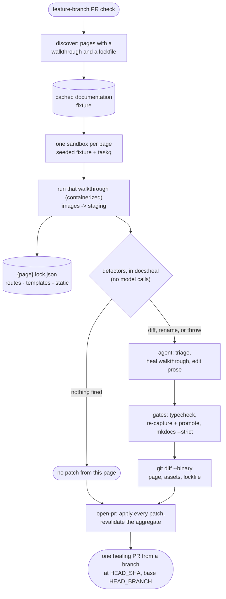

# Documentation Automation

> **Status: built and running, one page short.** Screenshot capture and prose updates
> are both in scope and ship together, not as separate phases. This document is now a
> description of a working pipeline rather than a proposal; the few things that remain
> unbuilt are named as such, in *Remaining work* at the end.
>
> **Infrastructure** — `yaffo_ui_tests/lib/user_doc_automation/`, 34 modules: capture
> mechanics (settle, framing, WebP encode, pixel comparison), the containerized capture
> worker and its host half, dependency observation, both detectors, the correctness
> gates, the agentic loop (evidence, triage, fix, tool loop, preflight, sandbox facts),
> and six entry points. The server-side observer is `yaffo/doc_observer.py`.
>
> **Content** — `yaffo_ui_tests/user_doc_automation/`: `spec.yaml` covering all 17 guide
> pages, and **15 walkthroughs capturing 30 committed screenshots**, each with its
> catalog (`{page}.json`) and lockfile (`{page}.lock.json`). Every walkthrough has been
> promoted at least once, so all 15 carry a watermark and a dependency fingerprint.
>
> **Entry points**, all working: `docs:capture` (deterministic capture, `--promote`
> writes into the guide, `--docker` containerizes, `--defer-errors` hands a thrown
> walkthrough to healing); `docs:generate` (writes a page and its walkthrough from the
> page's charter, gated on the two agreeing); `docs:heal` (triage and repair);
> `docs:detect` (dependency fingerprints plus quoted-string changes, no sandbox);
> `docs:validate` (guide and automation agree); `docs:heal:repo` (GitHub fan-out
> matrix). The reproducible documentation fixture is scripted as `docs:fixture:build`
> and served by `isolatedEnvironment:start:docs`.
>
> **CI** — `.github/workflows/documentation-auto-heal.yml` runs the whole thing on
> feature-branch PRs: discover → cached fixture build → per-page fan-out (capture, heal,
> patch) → one aggregated healing PR against the feature branch. It has produced merged
> PRs (#12).
>
> **Tests** — 224 Jest tests across 26 suites in
> `lib/user_doc_automation/__tests__/`, plus 30 pytest tests covering the differ and the
> observer.
>
> **Not built:** the `create-customize/automations` walkthrough — 1 of the 16 app-backed
> pages, still carrying a hand-made PNG. See *Remaining work*.
>
> Last updated: 2026-08-24

## Goal

Keep the published user guide (`docs/guide/**`, MkDocs Material, deployed by
`.github/workflows/docs.yml`) in step with the app, without a human remembering to
re-shoot screenshots after every UI change.

The documentation checks run against the head commit of a feature branch's PR. When
something has gone stale, the healer creates an auto-generated branch from that exact
commit and opens a second PR containing both regenerated screenshots and updated prose.
The healing PR targets the originating feature branch, not `master`; the automation
never pushes directly to either branch and never auto-merges.

The same entry point runs locally, so a stale shot can be fixed and reviewed
without waiting for CI.

## Scope

**In:** `docs/guide/**` — the 17 user-guide pages, both their **screenshots and
their prose**. Stale images and stale text are regenerated in the same PR rather than
staged as separate rollouts: a renamed control usually invalidates both the shot
showing it and the sentence naming it, so splitting them would produce two changes
that each look wrong in isolation.

**Out:** `docs/development/**`. Architecture prose is where a model most reliably
invents plausible-sounding falsehoods, and those docs change on a different rhythm.
They stay hand-written.

## Two artifacts, two different guarantees

This distinction drives the whole design and is worth stating before the pipeline.

**Screenshots are deterministic.** The committed artifact is the *shot spec*, not
the PNG. An image is a pure function of `(spec, container image, seeded fixture,
app commit)`. Same inputs, same bytes. When a shot breaks — a renamed selector, a
moved page — the agent repairs **the spec**, and the PR carries both the spec change
and the regenerated image. This mirrors the existing test framework: specs are the
source of truth, execution is deterministic, and healing edits code rather than
output. An agent that emitted images directly would produce artifacts nobody could
reproduce or audit.

**Prose is not deterministic.** No script generates markdown. The agent edits `.md`
files directly, so the same input can yield different wording. What replaces
reproducibility is *boundedness*: the input is limited to one page's dependency
diff, the edit is scoped to one page, and a human reviews the PR before it merges. Do
not blur these two under "the bot updates the script" — they carry different
guarantees, and *What the agent owns* sets out the boundary.

## Pipeline



The per-page watermark and dependency fingerprint are not a separate step: the gate's
re-capture runs with `--promote`, which is what rewrites that page's lockfile, so the
bumped `lastVerifiedSha` travels in the same patch as the prose and the images.

**Note where the detectors sit.** The original design put them *before* the sandbox, so
that a run with nothing stale would cost no boot. As built, CI fans out every page that
has a walkthrough and a lockfile, and the detectors run inside each page's `docs:heal`
against a capture that already happened. `heal_repo.ts` says why: dependency hashes are
cheap to compare during discovery, but visual drift is only knowable after a walkthrough
runs, and skipping capture on a hash match would blind the pipeline to exactly the
changes Detector A exists for. The cost of that choice is a sandbox boot per eligible
page per run — 15 of them today; the cache on the fixture is what keeps it affordable.
`docs:detect` is the cheap pre-filter and is available locally, but CI does not
currently gate on it.

## Local / CI parity

Capture is **containerized**: the official Playwright image, pinned to the
`@playwright/test` version in `package.json`, used identically on a laptop and on the
runner. `npm run docs:capture:docker`.

Without this, "runnable in both places" is not achievable. macOS and Linux have
different font stacks; different font metrics change text wrapping; changed wrapping
moves layout. Every CI run would detect a change from the last local commit and vice
versa, and the pixel diff would be pure noise.

Measured on `library-basics/browsing-filtering` against one sandbox:

| | `gallery-home` | `gallery-filter-sidebar` |
|---|---|---|
| container, run A vs run B | 0 px differ | 0 px differ |
| container vs macOS host | 1392×**777** vs 1392×**782** | 312×**1326** vs 312×**1359** |

Two container runs are byte-identical; the host renders the same page 5 px and 33 px
taller. That is the whole argument for the container, and it is why the Playwright
suite's `sandbox-exec`/`bwrap` confinement is not a substitute — that is about
*safety*, and this is about *reproducibility*. Docs capture needs both.

**Accepted trade-off:** committed screenshots are Linux-rendered, not macOS-rendered.
For a pipx-installed product documented on a web page this is judged acceptable; it is
the reason capture cannot simply run natively on a Mac.

### Where the boundary sits

Only the browser half runs in the container. It stops at PNG and writes `raw.json`;
the host reads it back and does WebP encoding, pixel comparison, and promotion.

The seam is forced by tooling: encoding and comparison use Pillow and NumPy from the
project virtualenv, which is not in the Playwright image and should not be added to it.
`runner.ts` splits accordingly — `captureWalkthroughs` (containerizable) and
`processResults` (host) — with `runWalkthroughs` composing both, so a plain
`docs:capture` and a `--docker` one run the same code.

The staged PNG's path is not carried in `raw.json`. It is a pure function of the
staging directory and the shot's target, so each side recomputes it against its own
paths rather than translating a container path back — the file is the same file either
way, reached through the shared mount.

### What the container is given

| | |
|---|---|
| repo | mounted **read-only** at `/app` |
| `.doc-staging` | the one writable mount — walkthroughs write nowhere else |
| `node_modules` | anonymous volume, so the image's Linux build masks the host's darwin one |
| network | *not* `none`: capture exists to drive a running app |
| environment | allowlist only (`env.ts`) — no provider key, no `DOCKER_HOST` |

`DOCKER_HOST` is excluded deliberately rather than incidentally: the daemon socket is
root on the host, so a walkthrough that could read it would make the container
pointless. It is snapshotted for the launcher before `scrubProcessEnv` runs and never
enters the capture environment.

The app stays on the host, reached at `host.docker.internal`. Two consequences:

* The sandbox must bind beyond loopback — `YAFFO_SANDBOX_HOST=0.0.0.0`, opt-in because
  it exposes the sandbox on the LAN. A container cannot see the host's loopback, and
  `--network host` on macOS joins the Linux VM rather than the Mac.
* `--add-host host.docker.internal:host-gateway` is added **only on Linux**. Docker
  Desktop and Rancher Desktop already resolve the alias to the Mac; overriding it with
  `host-gateway` points at the bridge gateway *inside the VM* and every connection is
  refused.

## Determining what is stale

Handing a model the commit diff and asking what to update fails on cost and
precision: most pushes touch nothing user-visible, the diff is unbounded, and the
same push can produce different answers on different runs. Staleness is instead
detected mechanically by independent **detectors**, and the model is invoked only on
what they flag. When none fire, the run makes no model call at all — which is what
makes a push-triggered job affordable. (As built this saves the *model* call, not the
sandbox boot; see the note under *Pipeline*.)

Both detectors are **diff-triggered**: they fire when something that was true becomes
false.

Scoping is a separate concern and deliberately not in this list: the observed
dependency set never *fires*, it is what a diff is intersected *against* to decide
which pages a change concerns. See *Scoping: the observed dependency set* below.

### Detector A — visual (ground truth for screenshots)

Re-capture, then compare against the committed image **pixel by pixel**. This is
observation rather than inference: if pixels moved, the UI moved. It catches changes
no code heuristic would predict, such as a theme token tweak or a changed icon.

> **Correction.** An earlier draft specified a *perceptual* hash, reusing the
> `imagehash` dependency from duplicate detection. That is wrong, and measurably so.
> Blanking a single 300×46 caption in the gallery shot — the smallest doc-relevant
> change there is — leaves `phash`, `average_hash`, and `dhash` all at **distance 0**
> while moving 668 pixels. A perceptual hash reduces 4.5 MP to a 64-bit signature of
> gross structure, so a text label sits far below its resolution. It is the right
> tool for "is this the same photograph", which is why duplicate detection uses it,
> and the wrong tool for "did this UI change".

Implemented in `lib/user_doc_automation/imagediff.py` (Pillow + NumPy, both already project
dependencies, so no npm package needing its own WebP decoder). It mirrors what
Playwright's `toHaveScreenshot` does via pixelmatch:

- a per-channel colour tolerance (`COLOR_THRESHOLD = 24`) to absorb encoder ringing
  around text;
- a flat budget of differing pixels (`MAX_DIFF_PIXELS = 100`), comfortably under the
  ~670 a one-word label change produces;
- ignore regions zeroed on the pixel copy only, never on the published image;
- differently sized images aligned at their top-left on a shared canvas, with pixels
  present in only one image counted as changed and `reason: "size"` retained;
- a magenta-on-dimmed **diff overlay** written beside the staged shot, so a reviewer
  sees where it moved rather than only that it did.

Measured: identical shots report 0 differing pixels, a changed caption reports 686 in
a 143×17 box, and the same change inside an ignore region reports 0.

This also sharpens why containerization is not optional. Cross-machine font
antialiasing perturbs *every glyph on the page*, far more than the ~0.015% a real
label change produces, so no threshold can separate "different runner" from "renamed
button". The noise has to be removed rather than tuned around.

**One hazard.** Comparison assumes both sides are first-generation WebP — captured as
PNG, encoded once. Re-encoding an existing WebP is second-generation lossy and smears
differences across the whole frame, which both hides real changes in the noise and
defeats ignore regions. Nothing in the pipeline should ever re-encode a committed
image.

Capture writes to a **staging directory**, never straight into `docs/guide/**`, so a
plain run can answer "is anything stale?" without having already changed something.
The flow is capture to staging → compare against committed → promote only what
changed, matching Playwright's own baseline/actual/diff triad. `--promote` is what
copies staged shots into the guide.

### Detector B — user-visible string diff (precise, prose-focused)

A page instructing the reader to click **Apply Filters** when the app no longer has
that control is *provably* stale. This is a set intersection — no sandbox, no model —
and it catches prose rot that screenshots miss entirely.

**Two catalogues, because the app renders text from two places**, and they diff
differently enough to warrant separate handling:

| Source | Strings | A rename looks like |
|---|---|---|
| `messages.pot` | 774 server-rendered | a msgid disappearing, with nothing linking it to its replacement |
| `static/locales/en.json` | 237 client-side | a **value change under a stable key**, so both sides are recoverable |

Only the English sources are read. The other six locales are downstream translations;
a change to `de.json` cannot make an English page wrong. That asymmetry is worth the
extra extractor: the JSON side can tell the agent *what to write instead*, where
gettext can only report a disappearance.

**Additions are ignored.** A new string is a new feature — an incompleteness question,
which scoping answers by flagging pages whose dependencies changed. This detector only
asks "does the guide quote something the app no longer says?"

**Matching is confined to emphasised spans** — `**Apply Filters**` and `` `dog` `` —
not the whole page. Measured across the guide: bare substring matching finds 162 hits,
emphasis finds 111, and nearly all the excess is words like *All*, *Year*, and *Move*
appearing in ordinary prose. A control written in bold is precisely the one a reader is
told to click, so the stricter rule is both more precise and better targeted.

Built as `lib/user_doc_automation/strings.ts`, with `diffCatalogues` kept pure and the
git reads confined to `changedStrings`. `npm run docs:detect` runs it standalone; the
same functions run inside `docs:heal` (see *The agentic loop*).

### The watermark

A bot-owned `lastVerifiedSha` per page, stored in that page's lockfile (see *Bot
state*) rather than in the markdown, which stays clean. It has one narrow job:

- **Bounds Detector B's catalogue comparison** so it can identify a quoted string that
  disappeared or changed. Dependency selection does not use Git history; it compares
  per-file content hashes stored in the same lockfile.

Written by `docs:capture --promote`, because that is the moment the guide starts
holding what the app produces — not at capture, which only stages. The capture records
the checkout's current `HEAD` itself; there is no caller-supplied SHA argument. A dirty
working tree makes the catalogue window approximate, but dependency fingerprints still
describe the exact files on disk that were captured.

**A page with no watermark is skipped only by Detector B, not reported wholly clean.**
Its dependency hashes can still be checked without a commit reference.

All 15 pages that have a walkthrough have now been promoted at least once, so each
carries a watermark and a dependency fingerprint (75–180 hashed files per page).
`docs:detect` reports exactly that today:

```text
✅ 15 page(s) checked — no relevant dependency or quoted-string changes.
2 page(s) skipped by quoted-string detection: no watermark yet (never promoted).
```

The two skipped pages are `create-customize/automations` (no walkthrough yet) and
`reference-maintenance/uninstalling` (no app surface, `walkthrough: false`).

## Scoping: the observed dependency set

Which source files back which page, so only affected pages are reviewed. Each successful
capture stores the SHA-256 of every observed and hand-declared dependency. The cheap
check hashes those files in the checked-out feature branch and compares the values
directly with the lockfile. A mismatch selects the page for regeneration without walking
Git history or requiring a workflow-supplied commit SHA.

A documentation-only healing merge changes neither the application files nor their
hashes, so it does not retrigger the page. A changed shared dependency such as
`base.html` legitimately selects every page that observed it.

**Scoping also covers incompleteness**, which is why there is no third detector for it.
An earlier draft proposed one: comparing a page's charter against the app's surface to
catch something new that was never documented, on the grounds that nothing goes *stale*
when the app grows a sixth Settings section. But that section is added by editing
`yaffo/templates/settings/index.html`, which is already in that page's dependency set —
so scoping flags the page, and Detector A fires as well because the shot changes.
Regenerating against the charter then covers the new section. A separate detector would
have found only what scoping and A had already surfaced.

Two limits worth naming, since they are what such a detector *would* have been for:

- **A pre-existing gap does not drift into view.** Something undocumented since before
  the automation existed changes no dependency and moves no pixels, so nothing flags it.
  That is a one-time backfill audit against the charters, not a recurring check.
- **A wholly new feature needing its own page is invisible.** No existing page depends
  on it, no existing shot shows it, and it has no charter to compare against. Deciding
  the guide needs a new page remains a human judgement.

## The observed-dependency lockfile

Committed at `user_doc_automation/{area}/{page}/{page}.lock.json`, in that page's own
folder (see *Bot state* for what else it holds).

The set of source files whose change could alter a given page, **produced as the
second output of that page's walkthrough** rather than hand-maintained. Because it is
generated by deterministically driving the app it cannot drift the way a hand-written
mapping does, and re-running the same walkthrough against the same commit yields the same
set.

The lockfile stores both the dependency paths and their SHA-256 content hashes. The path
defines scope; the hash answers whether that dependency still matches the successful
capture. Missing files hash as `null`, so deletion is a detectable change too.

### What to record

Recorded while the page's walkthrough runs, bucketed by run. Layers 1–3 are built —
the server side in `yaffo/doc_observer.py`, the client side in
`lib/user_doc_automation/observe.ts`:

| Layer | Mechanism | Yields |
|---|---|---|
| Routes | `after_request` records `request.endpoint`, resolved via `app.view_functions[ep].__module__` | `yaffo/routes/home.py` |
| Templates | wrap `app.jinja_env.loader`, record every `get_source` call | `templates/index.html`, `_sidebar.html`, `components/photo_card.html` |
| Static | Playwright `page.on('request')`, filtered to same-origin `/static/` | `static/media/gallery_video.js`, theme CSS |
| Logic | `coverage.py` scoped to `yaffo/` for the duration of the shot | `db/repositories/media_filter_repository.py`, `template_filters.py` |

Layers 1–3 cover what makes a *screenshot* change and are what shipped. Layer 4
catches a different class — logic that alters displayed *values* without touching any
template — and is noisy enough (filter to `yaffo/`, begin measurement after boot,
reset between runs) that it waits until the first real miss justifies it.

The misses are already visible, as entries in `also_depends_on`. `filter_config.py`
holds the canonical filter list and executes on every gallery render, but the only
route it registers is the *save* endpoint, which a read-only walkthrough never hits —
so layer 1 does not record it and someone had to declare it by hand. The same is true
of `common.py`, `models.py`, and `themes.py`. Each is an argument for layer 4, and each
should disappear from the spec when it arrives.

For `browsing-filtering` a run records 3 route modules, 21 templates, and 70 static
files. The observer is dev-only: `init_doc_observer` returns immediately unless
`YAFFO_DOC_OBSERVER=1`, so nothing is registered in a shipped configuration.

### Two implementation notes

**Do not use Flask's `template_rendered` signal.** It fires only for top-level
`render_template`; includes, imports, and inheritance parents render inside Jinja and
never emit it. Confirmed in practice: of the 21 templates a `browsing-filtering` run
records, the signal would have reported exactly one — `index.html`. Everything else,
`photo_card.html`, `_sidebar.html`, and all 14 filter partials, arrives only through
the loader.

Two traps in the loader approach, both hit during implementation:

- **Disable the template cache by assigning `jinja_env.cache = None`**, not
  `cache_size`. `cache_size` is read once at construction to build the cache;
  assigning it afterwards does nothing, and the second page to render `base.html`
  never re-hits the loader.
- **Anchor repo-relative paths on the package directory**, not by counting `.parent`
  hops. A virtualenv usually lives at the repo root, so a hop-counted root silently
  admits `venv/lib/.../flask/app.py` as a dependency of every page. Worse, when the
  checkout directory is itself named `yaffo`, a `startswith("yaffo/")` guard passes
  for the wrong reason and hides the bug.

**Attribution is by run, not by page.** Playwright sends two headers:
`X-Yaffo-Doc-Run` (a fresh id per walkthrough run) buckets the records, and
`X-Yaffo-Doc-Page` rides along as metadata. Reading a run **consumes** it
(`GET /__doc_observer__/<run_id>`), which is what removes the need for a reset call —
and a global reset is precisely what would make two concurrent runs clobber each
other. Static assets bucket naturally in the browser-side request log.

### Honest limits

- **It is reactive.** The lockfile records what was touched at the *last* capture, so
  a brand-new code path is absent until it has been captured once. This is acceptable
  because Detector A re-captures and pixel-diffs regardless: the lockfile is an
  optimization for scoping prose review, **not** the safety net. It should not be
  treated as one.
- **Shared files flag everything.** `base.html` is in every page's dependency set, so
  touching it flags all pages. That is correct behaviour, not noise — but it means a
  nav change triggers a full re-capture, which therefore has to stay cheap.
- **Some prose has no observable dependency.** `getting-started.md` documents
  `pipx install yaffo` and `yaffo setup`; no Playwright shot will ever touch
  `yaffo/setup.py`. `spec.yaml` therefore carries a hand-declared `also_depends_on:`
  list per page, merged with the observed set — the same idea as the `context:` blocks
  in the test specs, but confined to what driving the app cannot reach, so it stays
  small.
- **The observer holds state per process.** Under a single-process dev server that is
  fine. Served by multiple worker *processes*, each would hold its own buckets and a
  collect would return only whichever worker answered — a silently partial dependency
  set. Capture runs should keep the app single-process.

## Concurrency

Walkthroughs **cannot** run concurrently against one app instance, and the observer is
the least of the reasons.

The observer itself is safe: buckets are keyed by run id and consumed on read, so two
runs never share or clear each other's records. That was deliberate — an earlier
global `reset` endpoint would have had walkthrough B wipe A's in-flight records.

The blocker is that **the app has global mutable state and walkthroughs write it**.
`yaffo/routes/home.py::_resolve_library_view` persists `library_view` whenever the
URL's `view` disagrees with the saved value, so `/?view=grid` is not a read — it is a
write to a shared setting. Two concurrent walkthroughs, one pinning grid and one
timeline, would flip it under each other, possibly mid-render. The same applies to
anything else in `application_settings`: filter-group visibility, locale, theme,
thumbnail directory.

Fixing the observer alone would not make concurrency safe; it would make the failures
subtler, trading an obviously empty dependency set for intermittently wrong
screenshots.

**Shard by sandbox, not by thread.** N isolated instances, one walkthrough each: the
observer is per-process so buckets cannot collide, and app state is per-instance. The
seed cache already exists for this, and CI already fans out per-spec via
`list_specs.ts`. Within an instance, stay sequential.

This is also why pinning state *in the shot* is mandatory rather than stylistic. Even
run sequentially, one walkthrough leaves `library_view` set for whoever runs next —
the mechanism behind the Timeline surprise recorded under *What is built*.

## Spec, walkthroughs, and state

Three artifacts, split by **who writes them**. The split is the point: mixing
hand-authored intent with generated state makes every automated run look like a
content change in a file a human is trying to review.

### Intent lives in the markdown

A guide page already declares everything a shot spec would:

```markdown

```

That one line carries the shot's **identity** (the path), **what it should depict**
(the alt text), and **which page consumes it** (the file it sits in). The alt text is
a natural-language statement of intent — structurally the same thing as `goal:` in a
test spec. Nothing about a shot should be authored a second time anywhere else.

> This corrects an earlier draft of this plan, which placed alt text in a manifest
> "so a caption and its image cannot drift apart". That is backwards — duplicating alt
> text into a manifest is what *creates* the drift. Alt text should also be
> contextual: the same gallery shot is captioned differently on `getting-started.md`
> than on `browsing-filtering.md`.

**There are no shared images.** Every image belongs to exactly one page and lives at
`docs/guide/{area}/assets/{page}/`, even when two pages show the same view — each
page's walkthrough captures its own copy. `getting-started.md` and `browsing-filtering.md`
both show the Home grid, and each owns its own file.

That costs a handful of duplicated files, and buys three things: ownership is never
ambiguous, placement is a pure function of the page path rather than of how many
pages happen to reference an image, and the two copies are free to diverge when a tour
page wants a tighter crop than a reference page. A sharing rule would have made an
image's location depend on the *other* pages that reference it, so adding a reference
elsewhere could relocate a file and rewrite an unrelated page.

This also enables a cheap CI check worth running independently of everything else:
every reference resolves, every image on disk is referenced by exactly one page, and
every image sits in its own page's directory.
That check would have caught `faces-review.png`, which sat unreferenced for months.

### One walkthrough per page

`yaffo_ui_tests/user_doc_automation/{area}/{page}/{page}.ts`

The walkthrough is the deterministic driver for a page. **Every page has one**, including
pages that own no screenshots, because a walkthrough has two outputs and only the first is
optional:

1. **The screenshots that page owns** — captured to staging, then promoted if changed.
2. **That page's runtime dependency set** — the routes, templates, and static assets
   touched while driving the flows the page describes.

That second output is why a page like `organizing-photos` or `troubleshooting` still
gets a walkthrough: it owns no images, but its prose describes flows, and walking those
flows is the only way to learn which source files back them. A walkthrough that captures
nothing is still doing the job.

Determinism comes from the walkthrough being the committed artifact. The same walkthrough, the
same container, and the same seeded fixture produce the same images *and* the same
dependency set. Nothing about either output is inferred from a heuristic.

Only `reference-maintenance/uninstalling` has `walkthrough: false` — it is entirely a
terminal workflow with no app surface to drive.

Two of the 15 built walkthroughs capture nothing and exist purely for their dependency
set: `start-here/concepts` (180 hashed dependencies) and
`library-basics/organizing-photos` (162) — the two widest fingerprints in the tree,
which is the argument for the design working as intended. The remaining 13 capture 30
screenshots between them, from 1 each up to 5 for `getting-started` and
`assigning-faces`.

`create-customize/automations` is declared `walkthrough: true` but does not have one
yet — the only page where the spec and the tree disagree, and the reason
`docs:heal:repo` skips it. See *Remaining work*.

### Walkthroughs are generated, committed, and editable

`url`, the `clip` selector, the viewport, the row-completion rule, and the setup steps
are implementation details of the current templates — `.main-container-layout`,
`.photo-grid`, `.photo-card`. That is precisely the layer that breaks and needs
healing, so the bot owns it, the same way `generated_tests/*.spec.ts` is owned rather
than hand-written.

Given a page whose walkthrough is missing or whose owned shot has no capture step, the bot
explores the app with Playwright and filesystem tools — as the test generator already
does — and writes one. When a walkthrough breaks, it heals it. Walkthroughs stay committed and
human-editable: to show three gallery rows instead of two, edit the walkthrough. No spec
field is needed for it.

Three consequences:

- **Adding a screenshot is never a markdown-only edit.** The reference has to exist
  before the image does, and `mkdocs build --strict` fails on a missing image, so the
  reference, the walkthrough change, and the capture all land in the same PR.
- **Shot identity is the image path**, so renaming an image appears as delete + add.
- **A page's dependency set is only as good as its walkthrough's coverage.** A walkthrough that
  drives three of a page's five described flows records dependencies for three. This
  is the practical limit on scoping, and it argues for walkthroughs that walk the page's
  whole surface even where they capture nothing.

### Non-reproducible regions

Some content differs run to run for reasons that have nothing to do with the app
changing. `locations-map` is the live case: `ol.source.OSM()` in
`yaffo/static/locations/list.js` fetches basemap tiles over the network, so the
imagery under the markers is never twice the same.

Three ways to handle it, best first:

1. **Make it reproducible.** Serve a fixed tile set locally so the shot becomes
   ordinarily stable and needs no special handling anywhere. This is the right answer
   for OSM and removes the case entirely.
2. **Ignore a region.** The walkthrough declares `ignoreRegions: ['.ol-viewport']` — a
   selector, which is exactly the kind of implementation detail walkthroughs already own.
   The walkthrough resolves it to a box and emits it beside the image; the differ
   zeroes that rectangle before counting differing pixels. Implemented and verified:
   a change inside an ignore region reports 0 differing pixels.
3. **Exclude the shot.** Last resort, because it blinds the detector to *every* change on
   that page — a new panel or a restyled marker would go undetected forever.

Two constraints on option 2. **The published image must never be masked**: Playwright's
`mask` option paints over the element in the captured file, which would ship a
coloured box into the docs. The mask applies at diff time only, to a pixel copy.
And an element mask is coarse — masking `.ol-viewport` also hides the markers
OpenLayers draws from our own data, which are meaningful and stable. That coarseness
is the practical argument for fixing this with option 1.

**Option 2 is what actually shipped**, in five shots across five walkthroughs, and the
map is not the largest reason for it:

| Walkthrough | Ignored | Why |
|---|---|---|
| `locations` | `.ol-viewport` | live OSM tiles |
| `settings` | `.media-dir-path`, `#current-thumbnail-dir`, `#thumbnail-size` | host-dependent path spelling; thumbnail bytes vary by platform |
| `getting-started` | `.media-dir-path` | same |
| `duplicates` | `input[name=directory]` | same |
| `photo-details` | the folder row of file information | same |

The recurring cause is that macOS canonicalizes `/tmp` to `/private/tmp` while the Linux
container spells it `/tmp`, so the fixture's own path renders differently on the two
machines the pipeline is meant to agree on. The value stays **visible** in the published
image — a reader should see where their library lives — and is excluded from comparison
only. This is the one place where local and CI capture are not byte-identical by
construction, and ignoring the region is what bridges it.

**Most instability should not have to be declared at all.** The intended mechanism is
the double-capture flake check: capture twice, and a shot whose two captures disagree is
unstable by observation, whichever shot it turns out to be. That check is **not built**
(see *Remaining work*), so today instability is declared by hand or not caught at all. A
declaration is only worth adding for a known, permanent cause — and once the check
exists it earns its keep as a cross-check, since a shot declared unstable but measured
stable is a signal the declaration can go.

### The hand-authored spec

`yaffo_ui_tests/user_doc_automation/spec.yaml` — one entry per guide page, holding
only what is neither derivable from the docs nor generatable by the bot:

```yaml
pages:
  reference-maintenance/settings:
    covers: >-
      Every section of the Settings screen, in the order they appear on screen.
      A new section is a gap.
    walkthrough: true

  start-here/getting-started:
    covers: >-
      Install through first indexed photos ... A tour: it shows the same views
      the deeper pages cover, in its own shots.
    walkthrough: true
    also_depends_on:
      - yaffo/setup.py
      - yaffo/launcher.py
```

- **`covers`** is the page's charter: what it is *obliged* to cover, as distinct from
  what it currently says. This is the specification `docs:generate` writes against, and
  what regeneration measures a rewritten page by. Charters name an *enumerable* surface
  wherever one exists ("every section", "the built-in theme list") so there is something
  concrete to check the page against.
- **`walkthrough`** is a boolean: the module's path is derivable from the page id, so
  naming it would be redundant. `false` only where a page has no app surface at all and
  never will — currently just `reference-maintenance/uninstalling`, which is entirely a
  terminal workflow.
- **`also_depends_on`** is the escape hatch for prose with no observable dependency.
  `getting-started.md` documents `pipx install yaffo` and `yaffo setup`; no walkthrough will
  ever touch `yaffo/setup.py`. A page property, not a shot property, and small because
  it only covers what driving the app cannot reach.

There is deliberately no `owns` field. A page owns exactly the images it references,
and they all sit in its own assets directory, so ownership is read off the markdown.

Nothing shot-shaped survives in the spec, including non-reproducible content — see
*Non-reproducible regions* below.

**Validation.** The spec is checkable against the tree without running anything: every
page in the spec exists and vice versa, every referenced image exists and sits under
its own page's assets directory, no image is unreferenced, and every
`also_depends_on` path resolves. Implemented as `npm run docs:validate`, described
below.

### Validation

`npm run docs:validate` checks the guide and its automation against each other. It is
entirely mechanical — no sandbox, no model — so it is cheap enough to run on every push,
and it catches drift that otherwise accumulates in silence:

1. the spec and the guide describe the same set of pages;
2. every image reference resolves;
3. and points inside its own page's assets directory — there are no shared images, so a
   reference reaching elsewhere means the layout has drifted;
4. no walkthrough exists for a page marked `walkthrough: false`;
5. no captured image is left unreferenced — this is the check that would have caught
   `faces-review.png`, unreferenced in the repo for months;
6. every `also_depends_on` path exists;
7. and none of them is something the walkthrough already observes.

Check 4 is deliberately one-directional. A page marked `walkthrough: true` with no file
is not a validation failure but a work item: that is precisely the state
`docs:generate` consumes, and failing validation on it would make CI red for every page
not yet generated. `docs:heal:repo` reports it instead, by skipping the page and saying
why. Today the whole set is clean:

```text
✅ 17 pages, 31 images — no problems.
```

The 31st image is `automations-list.png`, the one remaining hand-made shot — referenced,
in the right directory, and therefore valid; it is simply not produced by anything.

### Bot state is never hand-edited

One committed snapshot per guide page, in that page's own folder:

```text
user_doc_automation/{area}/{page}/{page}.lock.json
```

So `docs/guide/library-basics/browsing-filtering.md` is described by
`user_doc_automation/library-basics/browsing-filtering/browsing-filtering.lock.json`.
It holds everything the automation knows about that page after its last successful
run, and is written by `docs:capture --promote` — only on promote, because the shot
hashes are a record of what the guide actually holds:

- **`lastVerifiedSha`** — the base used only by the quoted-string catalogue comparison.
  It is derived from the checkout automatically.
- **`observed`** — `routes` / `templates` / `static` / `urls`, the observed dependency
  set and the input to scoping, plus **`serverObserver`**: whether the observer answered,
  so an empty dependency set cannot be misread as "this page touched nothing".
- **`dependencyHashes`** — SHA-256 values for the observed dependencies plus
  `also_depends_on`; compared directly with the checked-out feature branch to select
  pages for regeneration. In practice 75–180 entries per page.
- **`shots`** — keyed by guide-relative path, each holding `width`, `height`, and the
  image's `sha256` *as the automation last wrote it*. Not for the diff, which always has
  both images and compares pixels, but to detect a committed screenshot changing
  **outside** the pipeline. "Someone replaced this by hand" is a different question from
  "is it stale", and a stored hash is the only thing that answers it. A page with no
  shots — `concepts`, `organizing-photos` — writes `shots: {}` and is still fully
  fingerprinted.

Older lockfiles without `dependencyHashes` select their pages once. The next successful
promotion writes the initial fingerprint snapshot, after which unchanged files compare
cleanly.

Three reasons for one file per page rather than a single shared state file:

- **Diffs stay legible.** A run that touches one page changes one small file, so the
  PR shows what actually moved instead of a churned blob.
- **Sharding is natural.** Walkthroughs shard by sandbox (see *Concurrency*), and
  per-page files mean parallel jobs write disjoint paths — no merge step, no lost
  updates.
- **It lives with the automation, not the site.** `docs/` is published; a bot-owned
  JSON blob there is both noise and a thing MkDocs has to be told to ignore.
- **It sits beside what it describes.** The lockfile, the walkthrough that produced
  it, that page's catalog, and its memories are one folder, so everything about a page
  moves, reviews, and is deleted together.

Written only by the automation. A human editing one by hand is corrupting a record of
what was observed, not configuring anything — the hand-authored knobs are in
`spec.yaml`.

## What the agent owns

The agent has autonomy over two artifacts per page: **the markdown** and **the
walkthrough** — the walkthrough being both the deterministic capture script and the
page's image catalogue. It may rewrite prose, add a section, rename or add or remove a
screenshot, and change how a shot is framed.

That breadth is deliberate. The output is a PR that a person reads before it merges,
and a reviewer is better placed than any automated rule to judge whether a change was
warranted or well written. Constraining the agent to, say, a two-word diff would only
stop it from doing the right thing when a renamed feature genuinely needs a new
heading.

Because the walkthrough owns the image catalogue, a new screenshot is one coherent
change rather than a three-way coordination problem: the markdown reference, the
walkthrough entry, and the captured file all land in the same commit. They have to —
`mkdocs build --strict` fails on a reference with no file behind it.

### Gates are for correctness, not taste

Automated checks exist to stop a broken PR, not an opinionated one. A change passes
when:

- `mkdocs build --strict` succeeds — every image reference resolves;
- the walkthrough typechecks;
- re-capturing against the edited walkthrough succeeds;
- every referenced image exists and every image on disk is referenced.

Nothing checks how many lines moved, whether headings changed, or whether the wording
is the wording a human would have picked. This mirrors the test healer, where
`typescript_validator` gates whether generated code is *valid* and nothing gates
whether it is *tasteful*.

Built as `gates.ts`, shared by generation and healing — which they were not at first.
Generation ran the walkthrough and checked what it produced; healing only typechecked
it, so a heal that reframed a shot onto the wrong element passed every gate it faced.
`runGates` now runs one ordered sequence for both: typecheck first because it is
cheapest and nothing downstream can run without it, then capture, then
`mkdocs build --strict`.

**The capture gate promotes, and the ordering is a requirement rather than a
preference.** `mkdocs --strict` treats a missing image as fatal, so a page that
references a *new* screenshot cannot build until that screenshot is in `docs/guide/` —
capturing to staging and then asking mkdocs to find it in the guide fails every time,
and passes only for pages whose images already existed, which is exactly how the gap
went unnoticed. The consequence is that a *rejected* answer has already written images,
so `revertPage` restores every tracked file it touched (the markdown, the walkthrough,
the lockfile, the catalog) and deletes the ones the run created. `memories/` is
deliberately exempt: notes an agent left are the one thing meant to survive a failed
attempt.

Two things the agent still does not do. It does not adopt a screenshot classified as
`application_regression` — a broken UI is reported, never documented. And where it
finds staleness it cannot confidently resolve, such as a described workflow that no
longer matches any observable flow, it says so in the PR body instead of guessing.

Every change lands as a PR from an auto-generated healing branch into the originating
feature branch and is reviewed. Nothing is auto-merged.

## The agentic loop

Three layers, deliberately the same shape as the UI-test framework — define, generate,
execute, heal — so there is one mental model rather than two.

### A docs diff is usually correct

The asymmetry that shapes everything else: in test automation a failure is
unambiguous, something is broken and wants fixing. Here the common case is the
opposite. The UI legitimately changed, and the right response is to **accept** the new
screenshot and check whether the prose around it still holds. What the test framework
treats as a failure is this pipeline's primary output.

So triage does not ask "why did this break", it asks "what kind of change is this".
Four classes, against the three in `lib/test_generator/heal_analysis.ts`:

| Class | Action |
|---|---|
| `intended_change` | Promote the shot, review the prose. **The happy path.** |
| `walkthrough_defect` | Selector gone, timeout, wrong state pinned, page moved. Fix the walkthrough and re-capture. The direct analogue of `test_code_defect`. |
| `application_regression` | The UI changed in a way that looks broken. **Report it; do not document it.** |
| `environment_instability` | Flake, non-reproducible region, fixture drift, or renderer noise. Promote a semantically unchanged, non-reframed variation affecting at most 0.1% of pixels; quarantine material content or state drift. |

The third class is the one a naive design omits, and it is the one that keeps the
automation honest. A bot that accepts every pixel change will eventually enshrine a
bug in the manual: if the gallery renders with broken thumbnails, the correct output
is a regression report, not a screenshot of broken thumbnails.

### Commands

All six are built. Each is `npm run <name>` from `yaffo_ui_tests/`.

| Test framework | Docs | Flags |
|---|---|---|
| `test`, `test:sandboxed` | **`docs:capture`** — deterministic run | `--promote` writes into the guide, `--docker` containerizes, `--defer-errors` lets a thrown walkthrough reach `docs:heal` instead of failing the run, bare arguments select pages |
| `generate` | **`docs:generate`** — writes a page's walkthrough from its charter | `--docker`; a page id, or every page still missing one |
| `test:heal` | **`docs:heal`** — act on what the detectors found | `--apply` writes, `--page <id>`, `--docker`, `--model <alias>` |
| — | **`docs:detect`** — dependency fingerprints plus Detector B, without a sandbox | `--base <sha>` overrides the per-page watermark |
| `validate:specs` | **`docs:validate`** — the guide and its automation agree | — |
| `test:heal:repo` | **`docs:heal:repo`** — emit eligible pages as a GitHub fan-out matrix | `--github` writes `$GITHUB_OUTPUT`; a page id restricts it |

Two supporting scripts complete the set: `docs:fixture:build` builds the reproducible
documentation fixture, and `isolatedEnvironment:start:docs` serves it with the observer
enabled and bound beyond loopback.

`--defer-errors` is worth calling out because it inverts the usual rule. A walkthrough
that throws is normally a hard failure, but in CI's *discovery* capture it is evidence —
a broken selector is exactly what healing exists to repair — so that one capture defers
errors and the verification captures inside the gates stay strict.

`docs:heal` exits 2 when a verdict is left unresolved and 1 when a fix failed its gates,
which is what makes the CI step's exit code meaningful. `docs:detect` exits 2 when it
flags a page.

Generate and heal stay separate for the same reason they are separate in the test
framework: different inputs. Generate works from *intent* — the markdown's image
references and their alt text, plus the page charter. Heal works from *evidence* — a
diff, or a walkthrough that threw.

### What triage receives

Keeping this packet small and bounded is what makes the step affordable and its output
reviewable. It is also what the plumbing built so far exists to produce.

- The before and after images **and the diff overlay**. The model has to look, not
  infer.
- Diff box, pixel count, and ratio, from `report.json`.
- The walkthrough source.
- The page markdown, plus its `covers` charter from `spec.yaml`.
- A **bounded** code diff: `git diff <lastVerifiedSha>..HEAD` scoped to that page's
  lockfile dependencies — never the whole repository.
- The controls this page names that the app has renamed, from Detector B —
  structured (`was`, and `now` where the catalogue allows), not a raw diff. An
  earlier version passed `git diff HEAD -- messages.pot`, which covered only half
  the sources, ignored the watermark, and left the model to work out for itself
  which strings had gone and whether the page quoted any.

Output: a classification and a line for the PR body — plus, on `intended_change`, the
edits themselves.

### Two ways in

A page reaches the agent through either detector or through a failed capture, and they
need different handling:

- **A changed screenshot** (Detector A) goes through triage first, because a pixel diff
  is ambiguous — intended, regression, or flake — and only the first is safe to adopt.
- **A renamed control** (Detector B) goes **straight to the fix turn**. There is no
  screenshot to classify and no ambiguity to resolve: the string is gone and the page
  quotes it. Triage would be a model call that could only agree.
- **A walkthrough that throws** also goes **straight to the fix turn**. The worker
  preserves the exception in `raw.json`, the host includes it in `report.json`, and the
  initial GitHub capture step continues into healing. The repair is accepted only when
  the full walkthrough re-captures successfully through the normal gates.

The second matters because that class of staleness is otherwise invisible. Renaming a
toast or a button label rendered client-side moves no pixels, so capture reports nothing
and, without this, the page is never looked at. Verified: renaming
`settings.applicationLanguage` in `en.json` produced `0 shot(s) new or changed` and
still flagged and fixed the Settings page.

This is why `applyFix` takes a plain `Session` rather than a `TriageSession` — the fix
turn never needed the verdict, only the live client.

### How the fix turn works

Triage and fix are **one model session**, as in `auto_heal_orchestrator.ts`: the client
stays alive after classifying, so the fix turn still has the screenshots and evidence
in context rather than re-sending three images.

**Tools are read-only; artifacts come back as results.** The agent gets the same three
providers as the test generator — filesystem, browser, and memory — but writes nothing
with them. `FilesystemMcpClient.getTools()` filters `WRITE_TOOLS` unconditionally, so
generated artifacts arrive as the model's answer and the orchestrator writes them.
`FixSchema` therefore mirrors `GeneratedTestResponseSchema`:
`files: [{filename, code, description}]` plus `explanation` and `confidence`.

Note the flag is a trap: `createFilesystemClient(dirs, {readonly: false})` looks like it
enables writing and does not. `callTool` honours it, `getTools` ignores it, so the model
is simply never offered a write tool — and an agent that has been told to edit will
report edits it had no way to make.

**Whole files, not patches.** Structured `{find, replace}` pairs were considered and
rejected: the guide is hard-wrapped at 80 columns, so a quoted sentence spans line
breaks, and substituting a word of different length leaves the paragraph needing a
reflow a single-sentence replacement cannot perform. A whole file lets the agent rewrap
— which is what a person would do. Partial content overwrites the rest with nothing, so
the prompt says so explicitly.

**Absolute paths, not a search.** The page and its walkthrough are named by absolute
path in the prompt. Without that the agent spends its turns on `search_files` and
`list_directory` orienting itself; supplying them cut a run from fourteen turns to five.

**The catalog is maintained, not written once.** After the gates pass, `{page}.json` is
updated with what was actually written — the same thing `auto_heal_orchestrator`'s
`updateJsonFile` does for a healed test. Both artifacts the agent owns are entries: the
walkthrough *and* the page markdown. Entries are keyed by repo-relative path (the two
live in different trees, so bare basenames will not do) and **upserted**, because a
page can get its first fix before anything ever generated a catalog entry for its
markdown. It runs only when no gate failed, so the catalog can never record content
that was then reverted.

The catalog records what the automation last produced, not what is on disk now. A human
editing the page afterwards leaves it describing the previous generation, which is the
honest thing for it to say.

### Reuse, and the one real gap

The agent is given the same three providers the test generator builds, for the same
reasons:

- **`mcp_filesystem_client.ts`** — read the page, its walkthrough, and its catalog.
- **`mcp_playwright_client.ts`** — the running sandbox, so the agent can check how
  something actually looks before describing it, or work out how a shot should be
  framed. It is documenting a live site, so it needs to see one.
- **`local_filesystem_memory_tool.ts`** — scoped to that page's `memories/`, the same
  way the generator scopes memory to a feature. Read first, so a run starts from what
  earlier runs learned; written when something is worth not rediscovering.

Also reused: `lib/model_clients/` (provider abstraction and `MODEL_ALIAS`),
`lib/test_generator/prompt/json_parser.ts` for tolerant JSON extraction, and
`lib/services/typescript_validator.ts` so a changed walkthrough must typecheck. The
two-phase triage-then-fix-in-one-session pattern from `auto_heal_orchestrator.ts` ports
unchanged.

**The gap that was closed: the conversation type was text-only.** The clients are built
on the Vercel AI SDK, whose user turns support image parts, but `UserMessage.content`
was typed `TextPart[]`, so triage could not see the overlay it was asked to classify.
Widened to `TextPart | FilePart`, with a `toImagePart` helper — a `file` part carrying
an `image/*` media type, since the SDK deprecated the older `image` part.

Closing it surfaced two more worth knowing:

- **Not every model can see.** DeepSeek's general models accept a request containing
  images, discard them, and answer from the surrounding text sounding just as
  confident. `MODEL_VISION_SUPPORT` records which models receive images and
  `visionModelFor` substitutes DeepSeek's vision model, routed through the
  OpenAI-compatible provider because `@ai-sdk/deepseek` strips image parts before
  sending. Triage refuses outright if the resolved model still cannot see.
- **Every turn with tools needs a loop.** Once tools are available the model will
  reasonably call one before answering, so a caller expecting JSON on the first
  response gets an empty string. `runToolLoop` drives both turns, and `parseAnswer`
  returns errors rather than throwing — `safeParse` guards the shape, but `JSON.parse`
  on prose or a truncated response throws, and a throw there would skip the validation
  gates and leave a half-written tree.

### Stop the agent searching for what the pipeline can just tell it

Two modules exist for one reason: a model handed a search problem will search, at
length, and the searching is where the turns go.

**`sandbox_facts.ts` — hand over the runtime state.** A generate run for
`library-basics/photo-details` was observed spending roughly forty rounds on a single
question: how to reach a media item that exists. It read route modules, templates,
`common.py`, lockfiles, `raw.json`, the fixture-seeding code, and finally its own API
logs — because the answer is runtime state and no file contains it. The fix is not a
better prompt about how to search; it is to ask the running app before the agent starts
and put the answer in the prompt. Two rules on what gets handed over:

- **Filenames, never ids.** Ids are assigned at index time and change on every reseed,
  so a walkthrough built on one documents whichever item lands at that number next time.
  Reporting an id even "for orientation" just puts the unstable value in front of the
  model. `mediaIdByFilename` is offered as a *lookup* instead, in both `goto` and
  `flows` — offering it in only one was a trap that a generated walkthrough hit.
- **Basenames, never absolute paths.** The fixture root is a temp directory; the leading
  path is precisely the sort of value that looks stable in a prompt and is not.
  The synthetic `1mb-example-video-file*` test patterns are filtered out too: a
  screenshot of one reads as a broadcast test card rather than a photo library.

**`preflight.ts` — prove the browser works before handing it over.** The Playwright MCP
server connects and advertises its 24 tools whether or not it can actually launch a
browser; the failure appears only in the *result* of the first navigate, and the server
reports it in the result body rather than by throwing. A model given that does not stop
— it improvises, and the forty-round run above is what improvising looks like. Preflight
navigates once, fails loudly with the command that fixes it, and refuses to start.

**`side_effects.ts` — stub what reaches outside the browser.** `/api/open-file` and
`/api/open-folder` shell out to `open`/`xdg-open`/`os.startfile` against the real file.
The guide documents both controls, so a `photo-details` walkthrough reasonably clicks
them — and every capture run then opens Preview windows on whoever is running it, or
spawns processes on a CI runner. They are stubbed to the same `{"success": true}` a real
call returns rather than aborted, so the UI still reaches the state the shot is meant to
show; aborting would surface an error toast and document a failure.

### Flake detection does not come free — yet

The test framework feeds `{feature}.history.json` — the last five results — to the
model for trend analysis. The per-page lockfile was meant to carry recent shot statuses
the same way, so that a shot reporting changed on every run is quarantined by
observation instead of by declaration (see *Non-reproducible regions*).

**This is not built.** The lockfile carries `shots` as a single hash per image — what
the automation last wrote — not a history, and nothing counts consecutive changes. It is
the one piece of the original design that the working pipeline still lacks, and it is
listed under *Remaining work*.

## The workflow

Built as `.github/workflows/documentation-auto-heal.yml`, following
`playwright-auto-heal.yml`'s bones: a `MODEL_ALIAS` variable, `contents: write` plus
`pull-requests: write` confined to the final job, and a discover → matrix → PR
structure. Three jobs plus a fixture-cache job.

**`discover`** runs `docs:heal:repo -- --github` to emit the page matrix, and computes
the fixture cache key from the fixture data, the seeding script, the indexing and
face/label pipelines, and `pyproject.toml` — so the expensive seed is rebuilt only when
something that changes its content changes.

**`seed-cache`** restores or builds the documentation fixture via `docs:fixture:build`,
caching `/tmp/yaffo-docs` and `/tmp/yaffo-assets`. A seeded data dir is portable only to
the absolute path it was built at, because the DB stores absolute media paths — the docs
fixture is built directly at its canonical location, so restoring it needs no repair.

**`heal`** fans out one runner per page (`max-parallel` from `vars.DOCS_MAX_PARALLEL`,
default 5), each with its own sandbox — which is what *Concurrency* requires, since
walkthroughs write shared app state. Per page it starts
`isolated_runner.ts --port 5002 --preseeded --docs` with `YAFFO_DOC_OBSERVER=1` and
`YAFFO_SANDBOX_HOST=0.0.0.0`, polls the base URL for up to 180s, runs `docs:validate`,
then `docs:capture:docker -- --defer-errors <page>`, then
`docs:heal -- --page <page> --apply --docker --model $MODEL_ALIAS`. It holds
`contents: read` and no write credential at all.

**`open-pr`** is the only job with write permission. It downloads every page's patch,
applies them, re-runs `npm run typecheck`, `docs:validate`, and `mkdocs build --strict`
over the *aggregate*, then pushes `auto-heal/docs-${RUN_ID}-${GITHUB_RUN_ATTEMPT}` and
opens one PR against `HEAD_BRANCH`, closing any older open `auto-heal/docs-*` PR on the
same base as superseded.

Points worth keeping in view:

- The trigger is `pull_request` against `master` (path-filtered to the app, the guide,
  the automation, and the fixture) plus `workflow_dispatch`, which requires both
  `head_branch` and `head_sha`. The checkout uses the feature branch's exact `HEAD_SHA`,
  never GitHub's synthesized merge commit.
- Concurrency is scoped to `HEAD_BRANCH` with `cancel-in-progress: true`, so a newer
  commit supersedes an in-flight check without touching unrelated branches.
- Fork PRs are excluded from both `heal` and `open-pr` by an explicit
  `head.repo.full_name == github.repository` guard, so no fork receives model secrets or
  write credentials.
- **Patches, not commits, cross the job boundary.** Each `heal` job produces
  `git diff --binary` over that page's markdown, assets, and automation folder —
  untracked files added with `--intent-to-add` first, so a brand-new screenshot is in the
  binary patch. Only `open-pr` can write to the repository. This is what lets 15 runners
  produce one reviewable PR without any of them holding a token.
- **Evidence is uploaded in the job that produced it**, because every run wipes the
  staging directory. The initial capture is preserved before healing starts; the heal
  artifact then preserves the complete latest capture directory after the repair and
  verification gates have run. All three uploads use `if: always()` so a partial
  failure still leaves whatever evidence it produced.
- The model's verdicts are rendered into the **job summary** from `triage.json` — one
  block per shot with classification, confidence, recommended action, whether it was
  repaired, and a collapsed rationale — so a reviewer can read what the model concluded
  without downloading an artifact.
- **The PR body carries the same evidence, plus what the run cost.** `open-pr`
  downloads every page's `docs-heal-*` artifact and assembles three sections: *Model
  usage* (the alias, and the summed `costEstimate.call.totalCost` across every logged API
  call, with the count of calls that actually reported usage); *Model reasoning* (a
  collapsed block per verdict, keyed by page and shot); and *Artifacts* (direct links to
  every non-expired `docs-capture-*`, `docs-heal-*`, and `docs-patch-*`, looked up
  through the Actions API because `upload-artifact` exposes its URL only inside the job
  that produced it — hence the `actions: read` permission). Only call costs are summed,
  never the cumulative session figure the logs also carry, so a tool-using session is
  not counted several times over.

### Workflow artifacts

Every matrix page uses a filesystem-safe `{id}` formed from its page path; for example,
`organize-review/duplicates` becomes `organize__review__duplicates`. A successful page
job can therefore produce these artifacts:

| Artifact | Retention | Contents |
|---|---:|---|
| `docs-capture-{id}` | 30 days | The **initial** `.doc-staging/captures/` tree: `raw.json`, `report.json`, candidate `.webp` files, and, for every detected change, the committed `.baseline.webp` plus magenta `.diff.png`. Also includes `reports/isolated-environment.log`. This is uploaded before the model runs, so it preserves the evidence that triggered healing. |
| `docs-patch-{id}` | 30 days | `{id}.patch`, a Git binary patch containing that page's proposed guide markdown, screenshots, walkthrough, catalog, lockfile, and page memories when those paths changed. The collector applies all non-empty page patches to build the aggregate PR. |
| `docs-heal-{id}` | 90 days | `triage.json`; timestamped `heal-logs/` containing the model API transcripts and per-call token/cost accounting; and the complete latest `captures/` tree, including `raw.json`, `report.json`, candidate screenshots, baselines, and diff overlays. After a repair reaches verification, these captures are the **post-heal** comparison and explain any screenshot the verification gate promoted. |

The initial and post-heal capture sets are deliberately separate. A walkthrough can
capture pixel-identical screenshots and then fail later in its flow; repairing that
failure runs a second capture during verification. If that second run detects even a
small visual change, its baseline, candidate, and overlay belong in `docs-heal-{id}`, not
in the already-uploaded `docs-capture-{id}`. The PR body links every artifact that was
actually created for the run.

### Staging layout

Staging is a **sibling** of `user_doc_automation/`, not a child, and that placement is
load-bearing. The generate agent's filesystem tool is granted `user_doc_automation/`,
and a run's API logs — full prompts, reasoning, and responses — are written into
staging. While it lived at `user_doc_automation/.staging` a run could read back its own
transcript, and one was caught doing it: *"the generate-logs filenames are
`0_deepseek_api.json` … Let me read one to understand what they contain. Maybe they have
prompts that reveal media IDs."* Nothing in staging is input to the agent; it is all
output about the agent. `paths.ts` is the single definition of both directories, and
`paths.test.ts` pins the sibling relationship.

A run writes only into `yaffo_ui_tests/.doc-staging/` (gitignored):

```text
.doc-staging/
├── captures/                                      wiped at the start of every run
│   ├── raw.json                                   what the container produced
│   ├── report.json                                every shot's status, diff, and deps
│   └── {area}/assets/{page}/
│       ├── {shot}.webp                            the candidate capture
│       ├── {shot}.baseline.webp                   committed image, only when changed
│       └── {shot}.diff.png                        magenta overlay, only when changed
├── triage.json                                    verdicts, for CI's job summary
├── generate-logs/{timestamp}/                     full prompts and responses
└── heal-logs/{timestamp}/                         the last 20 runs of each
```

Captures live in their own subdirectory for a reason that cost a debugging session:
a capture run **empties** its directory before starting, and while that directory was
staging itself, the run deleted its own in-flight log directory and the next API call
died with `ENOENT: … .doc-staging/generate-logs/1_gemini_api.json`. Log directories are
also per-run and timestamped rather than flat, because the API call counter restarts at
zero every run — with one flat directory a rerun silently overwrote the previous run's
`0_*.json`, and two people reading "call 9" were looking at different runs.

Paths under `captures/` mirror their destination under `docs/guide/`, so promoting is
a copy rather than a mapping. The overlay sits beside the shot it explains, and its
absence is itself information: no overlay means nothing moved.

## Layout

Infrastructure and content are separate trees, mirroring how the UI-test framework
already splits `lib/` from `specs/` and `generated_tests/`.

```text
yaffo_ui_tests/
├── lib/user_doc_automation/        infrastructure — hand-written, not generated
│   ├── docs_capture.ts             entry point: capture, compare, promote
│   ├── generate_cli.ts, generate.ts     entry point: write a missing walkthrough + page
│   ├── heal.ts                     entry point: triage what changed, then repair
│   ├── detect.ts                   entry point: Detector B + dependency hashes, no sandbox
│   ├── validate.ts                 entry point: guide and automation agree
│   ├── heal_repo.ts                entry point: the GitHub fan-out matrix
│   ├── capture_worker.ts           the browser half alone — what runs in the container
│   ├── docker.ts                   container argv, host alias, env boundary
│   ├── runner.ts                   captureWalkthroughs / processResults, split at the seam
│   ├── load.ts                     walkthrough discovery, shared host and container
│   ├── env.ts                      the capture environment allowlist
│   ├── paths.ts                    every path in one place, incl. the staging rule
│   ├── settle.ts, framing.ts       capture mechanics
│   ├── encode.ts, python.ts        WebP encoding via the venv's Pillow
│   ├── compare.ts, imagediff.py    pixel comparison and the diff overlay
│   ├── observe.ts                  client half of the dependency recorder
│   ├── dependency_changes.ts       lockfile hashes vs the working tree
│   ├── strings.ts                  the two string catalogues and their diff (Detector B)
│   ├── side_effects.ts             stub /api/open-file & open-folder for the run
│   ├── media_lookup.ts             resolve a media id from a stable filename
│   ├── sandbox_facts.ts            runtime facts handed to the agent up front
│   ├── preflight.ts                prove the browser tool works before the agent starts
│   ├── gates.ts                    the correctness gates, shared by generate and heal
│   ├── tool_loop.ts                drive a turn until the model stops calling tools
│   ├── evidence.ts, triage.ts, fix.ts   the agentic loop
│   ├── __tests__/                  26 Jest suites, 224 tests
│   └── types.ts, index.ts
├── .doc-staging/                   transient output, gitignored — see below
└── user_doc_automation/            authored and generated content
    ├── spec.yaml                   hand-authored: charters and extra dependencies
    ├── _support/                   the import surface generated walkthroughs use
    └── {area}/{page}/              one folder per guide page
        ├── {page}.ts               the walkthrough — generated, bot-maintained
        ├── {page}.json             page catalog: the generation payload
        ├── {page}.lock.json        fingerprint: dependencies and shot hashes
        └── memories/               investigation notes the agent keeps
```

**One folder per page** mirrors `generated_tests/{feature}/`, which holds the same
four things: the generated code, the `{feature}.json` catalog it came from, a run
history, and `memories/`. The area/page nesting comes from the guide itself, so
`docs/guide/library-basics/browsing-filtering.md` and its folder have the same shape.

The catalog carries the same payload the test generator writes —
`files: [{filename, code, description}]` plus narrative fields — with `pageContext`
standing in for `testContext`, holding the things worth not rediscovering: why a shot
pins `?view=grid`, that the sidebar's selects ignore `selectOption`.

Both artifacts the agent owns are entries: the walkthrough **and** the page markdown,
each keyed by repo-relative path because they live in different trees. The fix turn
keeps it in step — see *How the fix turn works*.

The `_support` directory is deliberately thin: it re-exports `defineWalkthrough` and
the shot types from `lib/`, so generated walkthroughs depend on a small stable local
path rather than reaching into the framework. This mirrors `generated_tests/_support`,
which plays the same role for generated specs.

## Running it

Build the fixture once, then serve it and capture. All from `yaffo_ui_tests/`:

```shell
npm run docs:fixture:build
```

```shell
npm run isolatedEnvironment:start:docs
```

```shell
npm run docs:capture
```

`isolatedEnvironment:start:docs` is the docs sandbox: it sets `YAFFO_DOC_OBSERVER=1` and
`YAFFO_SANDBOX_HOST=0.0.0.0` and serves the documentation fixture preseeded on port 5002,
so one script covers both the containerized and the local case. Add `--promote` to copy
changed shots into the guide, and a page id to run one walkthrough. Without `--promote`
nothing under `docs/` is touched.

For a reproducible capture — which is what CI runs, and what a promoted image should
come from — build the image once and add `--docker`:

```shell
npm run docker:build:docs-capture
```

```shell
npm run docs:capture:docker
```

Same walkthroughs, same output, same flags. The sandbox binds `0.0.0.0` because a
container cannot reach the host's loopback; see *Local / CI parity* above.

The cheap checks need no sandbox at all and are worth running before booting one:

```shell
npm run docs:validate && npm run docs:detect
```

> `scripts/capture_docs_screenshots.ts` is the superseded proof of concept: five
> shots for `getting-started.md`, predating the framework. Its five shots are now
> `start-here/getting-started/getting-started.ts` — `settings-overview`,
> `utilities-index-photos`, `gallery-home`, `gallery-filter-sidebar`, and
> `media-detail` — so the conversion is done and the script can be deleted. Nothing
> references it.

The capture techniques that mattered, in order of payoff:

1. **Clip to the meaningful element** (`.photo-viewer`, `.utility-page`, `.sidebar`)
   rather than capturing the page. Playwright's default full-page shot of a
   full-width app layout is mostly dead space — this is why the test-failure
   artifacts are unusable as documentation.
2. **`deviceScaleFactor: 2`.** The previous hand-made shots were 1x and render soft
   on a retina docs page.
3. **Cut grids at whole rows**, at the midpoint of the gap before the next row. A
   clip at an arbitrary height slices the last row of tiles in half, which is the
   most obvious tell that a screenshot was machine-made.
4. **A settle protocol**: `networkidle`, `document.fonts.ready`, every ``
   complete, animations and transitions disabled, focus blurred, toasts hidden.
5. **Pin page state in the shot.** One run came back in Timeline view because
   `library_view` is persisted server-side and the scrubber JS had flipped it; shots
   now request `/?view=grid` explicitly.

**Encoding.** WebP q88 is visually lossless on UI text and roughly a tenth the size
of PNG on shots containing photographs. Across the five shots: 8.3 MB → 0.85 MB.
Conversion shells out to the venv's Pillow, already a project dependency.

**Tests.** Two suites, one per language, both run in CI.

*Python — 30 tests.* `tests/user_doc_automation/test_imagediff.py` covers the
comparison: both ends of the sensitivity range (a caption change is caught, a
sub-tolerance colour shift and a sub-budget pixel count are not), ignore regions
suppressing a change without blinding the rest of the shot, reframing, and that the
overlay is written only when changed and highlights the right pixels.
`tests/yaffo/test_doc_observer.py` covers the observer — run isolation,
consume-on-read, eviction, the unattributed bucket, registration being a no-op
without the env flag, path filtering, and an end-to-end pass through `create_app`
asserting real routes and *included* templates are recorded with nothing from
site-packages.

*TypeScript — 224 tests across 26 suites* in `lib/user_doc_automation/__tests__/`, run
with `npm run test:unit`. One suite per module, covering every entry point
(`docs_capture`, `heal`, `detect`, `validate`, `heal_repo`, `generate_cli`), the
host/container seam (`runner`, `capture_worker`, `docker_execution`, `load`), the
guarantees that are easy to break silently (`paths` — including the staging sibling
rule, `environment` — the env allowlist, `strings_io`, `dependency_changes`), and the
agentic loop (`evidence`, `triage`, `fix`, `gates`, `tool_loop`, `preflight`,
`sandbox_collection`, `image_adapters`, `media_lookup`).

**A bug the pipeline found on its first real run.** `gallery-home` reported changed on
an unchanged machine with an unchanged fixture. The cause was not capture:
`yaffo/routes/home.py` built a card's people with a set comprehension, and set
iteration order follows `id()` hashing, so the person chips reshuffled on **every
request** — three consecutive requests to one process returned three different orders.
A user reloading Home saw the same thing. Fixed by sorting on name, matching what the
detail view already did. This is the class of defect the automation exists to catch,
and it would otherwise have produced a spurious PR on every run forever.

## The documentation fixture

The POC exposed that a docs-grade library is a different artifact from a test fixture,
and everything that was done by hand for it is now scripted. The composition lives in
`buildDocumentationFixture` in `lib/services/isolated_runner.ts` and runs as
`npm run docs:fixture:build`; CI caches its output keyed on the fixture data, the seed
script, and the indexing pipelines.

- **A real video, in the library.** The bennett fixture's only videos were the
  `1mb-example-video-file*.mp4` test-pattern pair, which dominated the gallery shot. A
  4.4s clip generated from the beach burst frames is now committed at
  `test_data/bennett/2021_gulf_beach_trip/2021-07-11_113104_boy-and-the-waves.mp4`, and
  the docs composition indexes videos **recursively** (`YAFFO_SEED_RECURSIVE_VIDEOS=1`)
  so it is picked up where it sits, while omitting the test-pattern pair entirely. The
  test pair stays where it is for the Playwright suite, which needs it.
  - Note retained: ffmpeg writes `creation_time` as UTC, so exiftool reported 16:31 for
    an 11:31 local capture. Anything regenerating that clip should write
    `DateTimeOriginal` via exiftool instead. See the naive-wall-clock discussion in
    `docs/development/video.md`.
- **Duplicates without polluting the gallery.** Duplicate review needs something to
  find, but duplicates inside `Family Photos` would appear in every other page's shots.
  The builder stages two pairs of real images in a sibling `Duplicate Scan Samples/`
  directory, outside the indexed library. The duplicates walkthrough points the utility
  at that directory explicitly; every other page still sees one canonical copy of each
  photo.
- **A presentable library path.** The fixture is built directly at
  `/tmp/yaffo-docs/Family Photos` (overridable with `YAFFO_DOCS_DATA_DIR`), the same
  path the container mounts and CI restores to — so Settings and the detail page show a
  plausible folder rather than an ephemeral sandbox directory or a username. `paths.ts`
  canonicalizes it, because macOS spells that root `/private/tmp` and the seeded DB
  stores resolved absolute paths.

The one thing this does not fix is the *spelling* of that path across platforms, which
is why five walkthroughs carry an `ignoreRegions` entry for it — see
*Non-reproducible regions*.

## Remaining work

Everything below is genuinely unbuilt, in rough order of how much it would cost to
leave alone.

- **The `create-customize/automations` walkthrough.** The last of the 16 app-backed
  pages. It is the only guide page still carrying a hand-made screenshot
  (`automations-list.png`, not a WebP), and `docs:heal:repo` skips it for exactly that
  reason: *"missing walkthrough; missing lockfile"*. Until it exists, the automations
  page is outside the pipeline entirely — no watermark, no dependency fingerprint,
  neither detector watching it. `npm run docs:generate -- create-customize/automations`
  is the intended route.
- **Flake insurance (the double-capture check).** A single flaky capture produces a
  spurious PR, and nothing currently prevents that. Capture flagged shots twice and
  require the difference to reproduce before acting. Less urgent than first thought —
  unchanged shots compare at exactly 0 differing pixels, not merely "close to 0" — but
  it is what would auto-quarantine an unstable shot without anyone having to declare it,
  and it is what *Flake detection* and *Non-reproducible regions* both assume. Needs the
  lockfile to carry per-shot status history, which it does not yet.
- **Caching OSM tiles.** `locations-map` is handled today by ignoring `.ol-viewport`,
  which also blinds the diff to the markers drawn from our own data. Serving a fixed
  tile set locally is the real fix; the open question is only whether to vendor tiles
  into the fixture or run a small caching proxy in the container.
- **Layer 4 of dependency observation** — `coverage.py` scoped to `yaffo/`, to catch
  logic that changes displayed values without touching a template. The misses are
  already visible as `also_depends_on` entries in `spec.yaml`; each should disappear
  when this lands. Deferred until a real miss justifies the noise.
- **Video shots and codecs.** Playwright's bundled Chromium lacks some proprietary
  codecs, so a shot of actual playback may need `channel: 'chrome'`. No walkthrough
  captures mid-playback today, so this has not been forced.
- **Per-shot library state.** Different shots want different states — Index Photos
  reads best with files pending, the gallery wants everything indexed. Partly addressed
  in practice: a shot's `setup` can drive the app into the state it needs through the
  UI, which is how `duplicates` runs a real scan before capturing its results. What is
  still missing is *fixture*-level state — files pending on disk — which would mean
  walkthroughs carrying DB or filesystem setup, a meaningful step up in complexity.
- **Delete `scripts/capture_docs_screenshots.ts`.** Fully superseded by
  `start-here/getting-started/getting-started.ts` and referenced by nothing.
